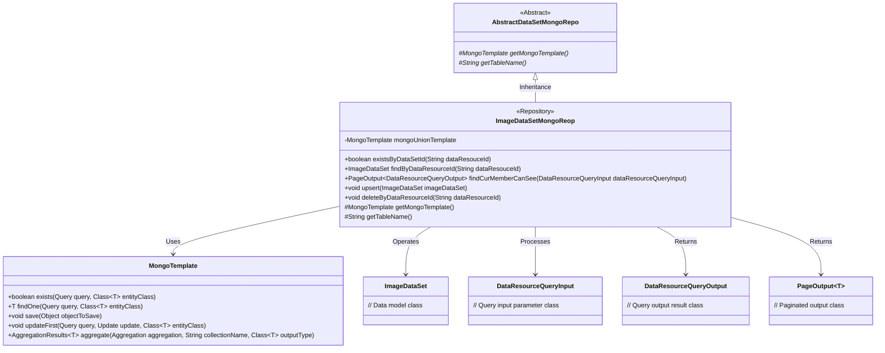
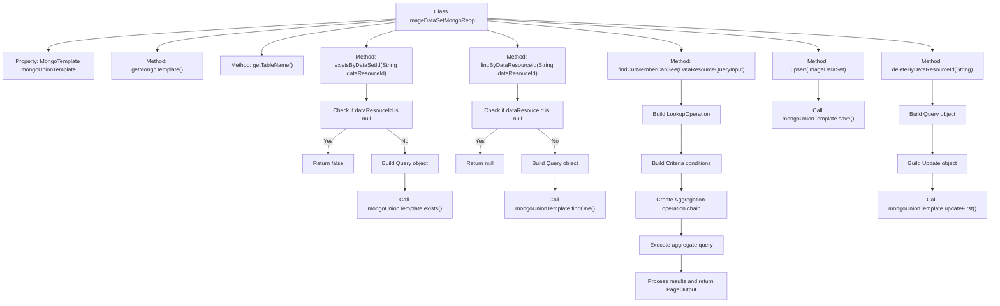

# Basic Information

|      |      |
|------|------|
| Name | ImageDataSetMongoReop |
| Language | .java |
| Code Path | WeFe/common/java/common-data-mongodb/src/main/java/com/welab/wefe/common/data/mongodb/repo/ImageDataSetMongoReop.java |
| Package Name | com.welab.wefe.common.data.mongodb.repo |
| Dependencies | ['com.welab.wefe.common.data.mongodb.constant.MongodbTable', 'com.welab.wefe.common.data.mongodb.dto.PageOutput', 'com.welab.wefe.common.data.mongodb.dto.dataresource.DataResourceQueryInput', 'com.welab.wefe.common.data.mongodb.dto.dataresource.DataResourceQueryOutput', 'com.welab.wefe.common.data.mongodb.dto.dataset.DataSetQueryOutput', 'com.welab.wefe.common.data.mongodb.entity.union.ImageDataSet', 'com.welab.wefe.common.data.mongodb.util.AddFieldsOperation', 'com.welab.wefe.common.data.mongodb.util.QueryBuilder', 'com.welab.wefe.common.data.mongodb.util.UpdateBuilder', 'com.welab.wefe.common.util.JObject', 'org.apache.commons.lang3.StringUtils', 'org.springframework.beans.factory.annotation.Autowired', 'org.springframework.data.domain.Sort', 'org.springframework.data.mongodb.core.MongoTemplate', 'org.springframework.data.mongodb.core.aggregation', 'org.springframework.data.mongodb.core.query.Criteria', 'org.springframework.data.mongodb.core.query.Query', 'org.springframework.data.mongodb.core.query.Update', 'org.springframework.stereotype.Repository', 'java.util.HashMap', 'java.util.List', 'java.util.Map'] |
| Brief Description | The ImageDataSetMongoRepo class inherits from AbstractDataSetMongoRepo and utilizes MongoTemplate to interact with MongoDB. It provides methods such as existsByDataSetId and findByDataResourceId for data querying, and findCurMemberCanSee for paginated retrieval of datasets visible to the current user, supporting conditional filtering and aggregation operations. It includes upsert for data persistence and deleteByDataResourceId for logical deletion functionality. |

# Description

The code defines a MongoDB repository class named `ImageDataSetMongoReop`, which inherits from `AbstractDataSetMongoRepo`. Its primary functionalities include: checking data existence via `dataResourceId`, querying data, paginating and querying image datasets visible to the current user, saving or updating data, and performing logical deletion of data. The class utilizes `MongoTemplate` for database operations, incorporating complex aggregation queries involving multi-table joins, conditional filtering, pagination, and sorting. The query logic accounts for various conditions such as public access levels and member permissions, returning paginated results.

# Class Summary

| Name   | Type  | Description |
|-------|------|-------------|
| ImageDataSetMongoReop | class | The ImageDataSetMongoRepo class inherits from AbstractDataSetMongoRepo and uses MongoTemplate to interact with MongoDB. It provides methods such as existsByDataSetId and findByDataResourceId for checking/querying data, and the findCurMemberCanSee method for paginated queries of visible datasets, supporting CRUD operations. |

## Class ImageDataSetMongoReop

|      |      |
|------|------|
| Access Modifier | @Repository;public |
| Type | class |
| Name | ImageDataSetMongoReop |
| Description | The ImageDataSetMongoRepo class inherits from AbstractDataSetMongoRepo and uses MongoTemplate to interact with MongoDB. It provides methods such as existsByDataSetId and findByDataResourceId for checking/querying data, and the findCurMemberCanSee method for paginated queries of visible datasets, supporting CRUD operations. |

### UML Class Diagram

This code defines a MongoDB repository class named `ImageDataSetMongoReop`, which inherits from the abstract class `AbstractDataSetMongoRepo`. The class provides CRUD operations for image datasets (ImageDataSet), including existence checks, querying by ID, paginated queries for visible datasets, upsert operations, and logical deletions. Core functionalities are implemented via `MongoTemplate`, where the `findCurMemberCanSee` method performs complex aggregation queries involving multi-table joins, conditional filtering, pagination, and sorting. The class diagram clearly illustrates inheritance relationships, dependencies, and key method signatures.

### Internal Method Call Graph

This code implements the ImageDataSetMongoReop class, which inherits from AbstractDataSetMongoRepo and is primarily used for handling MongoDB operations related to image datasets. It includes functionalities such as checking dataset existence, querying datasets by ID, querying datasets visible to the current user, inserting/updating datasets, and deleting datasets. The findCurMemberCanSee method implements complex aggregation queries involving multi-table joins, conditional filtering, pagination, and sorting, making it the core method of this class. All database operations are performed through mongoUnionTemplate, demonstrating encapsulation and abstraction of MongoDB.

### Field List

| Name  | Type  | Description |
|-------|-------|------|
| mongoUnionTemplate | MongoTemplate | Use @Autowired to automatically inject the MongoTemplate instance mongoUnionTemplate. |

### Method List

| Name  | Type  | Description |
|-------|-------|------|
| upsert | void | The method `upsert` saves or updates an `ImageDataSet` object to the MongoDB database. |
| deleteByDataResourceId | void | This method deletes the data resource based on the dataResourceId by constructing query conditions to update the status of the corresponding record to 1, and executes the update operation using the MongoDB template. |
| getMongoTemplate | MongoTemplate | Rewrite the getMongoTemplate method to return a mongoUnionTemplate instance. |
| findByDataResourceId | ImageDataSet | Query the image dataset based on the data resource ID. If the ID is empty, return null; otherwise, retrieve matching results via MongoDB. |
| getTableName | String | Method override, returns the MongoDB table name IMAGE_DATASET. |
| existsByDataSetId | boolean | Check if a dataset with the specified ID exists. Returns false if the ID is empty; otherwise, queries MongoDB and returns whether it exists. |
| findCurMemberCanSee | PageOutput<DataResourceQueryOutput> | The method `findCurMemberCanSee` queries data resources visible to the current user. It associates datasets and member tables through aggregation operations, filters data that is either public or visible to specified members, supports pagination and sorting, and returns paginated results. |

