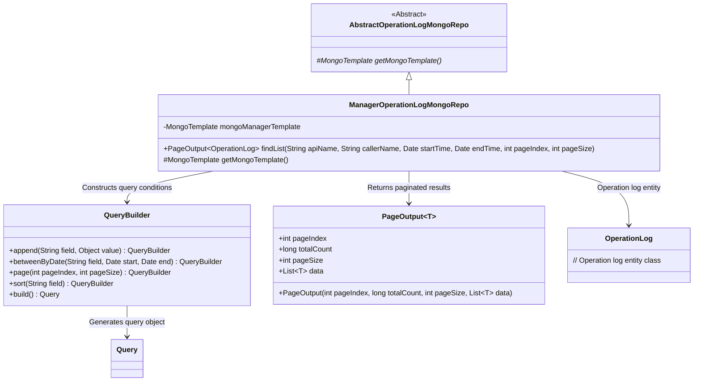
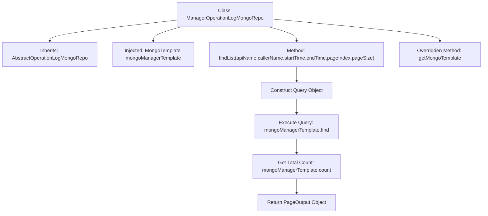

# Basic Information

|      |      |
|------|------|
| Name | ManagerOperationLogMongoRepo |
| Language | .java |
| Code Path | WeFe/common/java/common-data-mongodb/src/main/java/com/welab/wefe/common/data/mongodb/repo/ManagerOperationLogMongoRepo.java |
| Package Name | com.welab.wefe.common.data.mongodb.repo |
| Dependencies | ['com.welab.wefe.common.data.mongodb.dto.PageOutput', 'com.welab.wefe.common.data.mongodb.entity.common.OperationLog', 'com.welab.wefe.common.data.mongodb.util.QueryBuilder', 'org.springframework.beans.factory.annotation.Autowired', 'org.springframework.data.mongodb.core.MongoTemplate', 'org.springframework.data.mongodb.core.query.Query', 'org.springframework.stereotype.Repository', 'java.util.Date', 'java.util.List'] |
| Brief Description | The `ManagerOperationLogMongoRepo` class inherits from `AbstractOperationLogMongoRepo`, uses `MongoTemplate` to query operation logs, supports conditional pagination queries, and returns both the result list and total count. |

# Description

This is a MongoDB repository class named `ManagerOperationLogMongoRepo`, which extends `AbstractOperationLogMongoRepo`. It is marked as a Spring-managed repository component using the `@Repository` annotation. The class injects a `MongoTemplate` instance named `mongoManagerTemplate` for database operations. It primarily provides the `findList` method, supporting querying operation logs by API name, caller name, and time range, while implementing pagination and sorting by request time. The query results are encapsulated into a `PageOutput` object, which includes pagination information and a data list. The class also overrides the `getMongoTemplate` method to return the injected `mongoManagerTemplate` instance.

# Class Summary

| Name   | Type  | Description |
|-------|------|-------------|
| ManagerOperationLogMongoRepo | class | The `ManagerOperationLogMongoRepo` class inherits from `AbstractOperationLogMongoRepo`, utilizes `MongoTemplate` to query operation logs, supports conditional pagination retrieval, and returns both the result list and total count. |

## Class ManagerOperationLogMongoRepo

|      |      |
|------|------|
| Access Modifier | @Repository;public |
| Type | class |
| Name | ManagerOperationLogMongoRepo |
| Description | The `ManagerOperationLogMongoRepo` class inherits from `AbstractOperationLogMongoRepo`, utilizes `MongoTemplate` to query operation logs, supports conditional pagination retrieval, and returns both the result list and total count. |

### UML Class Diagram

This code demonstrates a MongoDB-based implementation of an operation log repository. ManagerOperationLogMongoRepo inherits from the abstract class AbstractOperationLogMongoRepo, uses QueryBuilder to construct complex query conditions, and employs MongoTemplate to execute paginated queries while returning PageOutput results. The class diagram clearly illustrates inheritance relationships, dependencies, and generic usage, where QueryBuilder is responsible for building query conditions, PageOutput encapsulates paginated results, and OperationLog represents the stored entity type. The overall design follows the Repository pattern, providing flexible operation log query capabilities.

### Internal Method Call Graph

This flowchart illustrates the core structure and execution flow of the ManagerOperationLogMongoRepo class. The class inherits from AbstractOperationLogMongoRepo and performs MongoDB operations via the injected mongoManagerTemplate. The main method findList constructs query conditions through QueryBuilder, retrieves OperationLog data in paginated form, and returns wrapped results. The overridden method getMongoTemplate provides access to the template instance. The entire process clearly demonstrates the data handling pipeline from query construction to result return.

### Field List

| Name  | Type  | Description |
|-------|-------|------|
| mongoManagerTemplate | MongoTemplate | Use @Autowired to automatically inject a MongoTemplate instance with the variable name mongoManagerTemplate. |

### Method List

| Name  | Type  | Description |
|-------|-------|------|
| findList | PageOutput<OperationLog> | The method queries the operation log list based on conditions, supports pagination and sorting, and returns paginated results. |
| getMongoTemplate | MongoTemplate | Rewrite the getMongoTemplate method to return an instance of mongoManagerTemplate. |

