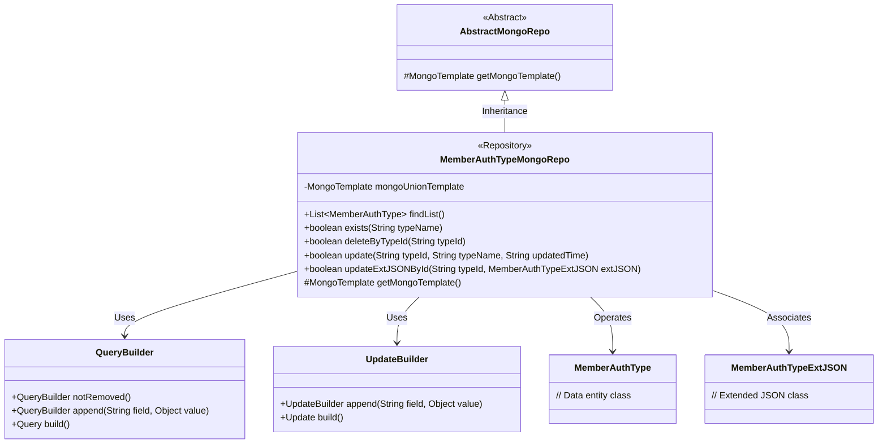
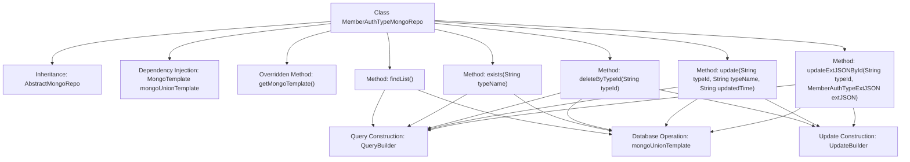

# Basic Information

|      |      |
|------|------|
| Name | MemberAuthTypeMongoRepo |
| Language | .java |
| Code Path | WeFe/common/java/common-data-mongodb/src/main/java/com/welab/wefe/common/data/mongodb/repo/MemberAuthTypeMongoRepo.java |
| Package Name | com.welab.wefe.common.data.mongodb.repo |
| Dependencies | ['com.mongodb.client.result.UpdateResult', 'com.welab.wefe.common.data.mongodb.entity.union.MemberAuthType', 'com.welab.wefe.common.data.mongodb.entity.union.ext.MemberAuthTypeExtJSON', 'com.welab.wefe.common.data.mongodb.util.QueryBuilder', 'com.welab.wefe.common.data.mongodb.util.UpdateBuilder', 'org.apache.commons.lang3.StringUtils', 'org.springframework.beans.factory.annotation.Autowired', 'org.springframework.data.mongodb.core.MongoTemplate', 'org.springframework.data.mongodb.core.query.Query', 'org.springframework.data.mongodb.core.query.Update', 'org.springframework.stereotype.Repository', 'java.util.List'] |
| Brief Description | The `MemberAuthTypeMongoRepo` class inherits from `AbstractMongoRepo`, utilizes `MongoTemplate` to perform database operations, and provides functionalities for querying, existence checking, deletion, updating, and extended JSON updates. |

# Description

This is a MongoDB data access class named MemberAuthTypeMongoRepo, which inherits from AbstractMongoRepo. It utilizes MongoTemplate for database operations, with primary functionalities including querying a list of undeleted MemberAuthType records, checking whether a specified type name exists, deleting records by type ID, updating type names and modification timestamps, as well as updating extended JSON data. All operations construct query and update conditions through QueryBuilder and UpdateBuilder, returning a boolean value indicating whether the operation was successful.

# Class Summary

| Name   | Type  | Description |
|-------|------|-------------|
| MemberAuthTypeMongoRepo | class | The `MemberAuthTypeMongoRepo` class inherits from `AbstractMongoRepo` and provides MongoDB operations for member authentication types, including querying, existence checking, deletion, updating, and extended JSON update functionality. |

## Class MemberAuthTypeMongoRepo

|      |      |
|------|------|
| Access Modifier | @Repository;public |
| Type | class |
| Name | MemberAuthTypeMongoRepo |
| Description | The `MemberAuthTypeMongoRepo` class inherits from `AbstractMongoRepo` and provides MongoDB operations for member authentication types, including querying, existence checking, deletion, updating, and extended JSON update functionality. |

### UML Class Diagram

Class Diagram Description: This diagram illustrates the structure of a MongoDB repository class `MemberAuthTypeMongoRepo`, which inherits from the abstract base class `AbstractMongoRepo` and contains CRUD operations for the `MemberAuthType` entity. It utilizes helper classes `QueryBuilder` and `UpdateBuilder` to construct query conditions and executes database operations via `MongoTemplate`. The diagram clearly demonstrates inheritance relationships, utility class dependencies, and entity class associations.

### Internal Method Call Graph

This code represents a Spring Data MongoDB Repository implementation class for managing MemberAuthType data. It provides basic CRUD operations including querying lists, checking existence, deletion, updates, and updating extended JSON fields. All methods construct query conditions through QueryBuilder and UpdateBuilder, ultimately executing database operations via mongoUnionTemplate. The class inherits from AbstractMongoRepo and overrides the getMongoTemplate method to return the injected mongoUnionTemplate instance. Each method includes necessary parameter validation and database operations, returning operation result statuses.

### Field List

| Name  | Type  | Description |
|-------|-------|------|
| mongoUnionTemplate | MongoTemplate | Automatically inject a MongoTemplate instance named mongoUnionTemplate using @Autowired. |

### Method List

| Name  | Type  | Description |
|-------|-------|------|
| deleteByTypeId | boolean | This method deletes data based on the typeId. It first checks whether the typeId is empty, and returns false if it is. When non-empty, it constructs query and update conditions, sets the status of matched records to 1, and returns whether the operation was successful. |
| findList | List<MemberAuthType> | Query the list of undeleted MemberAuthType, construct the query conditions using MongoDB templates, and return the results. |
| getMongoTemplate | MongoTemplate | Rewrite the getMongoTemplate method to return a mongoUnionTemplate instance. |
| exists | boolean | Check if there are member authorization records of the specified type name that exist and have not been deleted. |
| update | boolean | The method updates the typeName and updatedTime fields of the MemberAuthType class in MongoDB based on the typeId. If the typeId is empty, it returns false; otherwise, it returns whether the update operation was successful. |
| updateExtJSONById | boolean | The method `updateExtJSONById` updates the `extJson` field in MongoDB based on the `typeId` and returns whether the operation was successful. If parameter validation fails, it returns `false`. |

