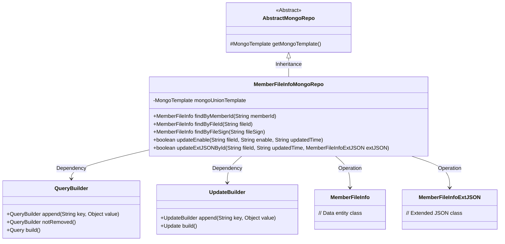
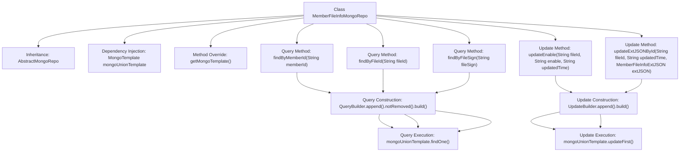

# Basic Information

|      |      |
|------|------|
| Name | MemberFileInfoMongoRepo |
| Language | .java |
| Code Path | WeFe/common/java/common-data-mongodb/src/main/java/com/welab/wefe/common/data/mongodb/repo/MemberFileInfoMongoRepo.java |
| Package Name | com.welab.wefe.common.data.mongodb.repo |
| Dependencies | ['com.mongodb.client.result.UpdateResult', 'com.welab.wefe.common.data.mongodb.entity.union.MemberFileInfo', 'com.welab.wefe.common.data.mongodb.entity.union.ext.MemberFileInfoExtJSON', 'com.welab.wefe.common.data.mongodb.util.QueryBuilder', 'com.welab.wefe.common.data.mongodb.util.UpdateBuilder', 'org.apache.commons.lang3.StringUtils', 'org.springframework.beans.factory.annotation.Autowired', 'org.springframework.data.mongodb.core.MongoTemplate', 'org.springframework.data.mongodb.core.query.Query', 'org.springframework.data.mongodb.core.query.Update', 'org.springframework.stereotype.Repository'] |
| Brief Description | The MemberFileInfoMongoRepo class inherits from AbstractMongoRepo, utilizes MongoTemplate to interact with MongoDB, and provides methods for querying MemberFileInfo by memberId, fileId, and fileSign, as well as functionality to update the enable and extJson fields. |

# Description

This is a MongoDB repository class named MemberFileInfoMongoRepo, which inherits from AbstractMongoRepo. It utilizes MongoTemplate for database operations and includes multiple query and update methods. Key functionalities encompass: querying MemberFileInfo records by memberId, fileId, or fileSign; updating the enable status and updatedTime fields of records; and modifying the extJson extended information along with the updatedTime field of records. All queries exclude records marked as deleted.

# Class Summary

| Name   | Type  | Description |
|-------|------|-------------|
| MemberFileInfoMongoRepo | class | The MemberFileInfoMongoRepo class inherits from AbstractMongoRepo, utilizes MongoTemplate to interact with the database, and provides methods for querying MemberFileInfo by memberId, fileId, and fileSign, as well as functionality to update the enable and extJson fields. |

## Class MemberFileInfoMongoRepo

|      |      |
|------|------|
| Access Modifier | @Repository;public |
| Type | class |
| Name | MemberFileInfoMongoRepo |
| Description | The MemberFileInfoMongoRepo class inherits from AbstractMongoRepo, utilizes MongoTemplate to interact with the database, and provides methods for querying MemberFileInfo by memberId, fileId, and fileSign, as well as functionality to update the enable and extJson fields. |

### UML Class Diagram

Class diagram description: This diagram illustrates that the MemberFileInfoMongoRepo class inherits from AbstractMongoRepo and operates MongoDB databases through MongoTemplate. It utilizes QueryBuilder to construct query conditions and UpdateBuilder to build update operations, primarily performing CRUD operations on the MemberFileInfo entity class. Key functionalities include querying by memberId/fileId/fileSign, as well as updating enable status and extJSON extended data. All database operations are executed via mongoUnionTemplate.

### Internal Method Call Graph

This code represents a MongoDB Repository class for managing database operations of the MemberFileInfo entity. It provides methods to query records by memberId, fileId, and fileSign, as well as methods to update the enable status and extJSON field of records. All queries are constructed using QueryBuilder with conditions to exclude deleted records, while update operations use UpdateBuilder to construct update content and return a boolean indicating operation success. The class inherits from AbstractMongoRepo and specifies the MongoTemplate instance to use by overriding the getMongoTemplate() method.

### Field List

| Name  | Type  | Description |
|-------|-------|------|
| mongoUnionTemplate | MongoTemplate | Using @Autowired to automatically inject a MongoTemplate instance named mongoUnionTemplate. |

### Method List

| Name  | Type  | Description |
|-------|-------|------|
| findByFileId | MemberFileInfo | The method retrieves undeleted MemberFileInfo records by fileId, constructing query conditions using MongoDB templates and QueryBuilder. |
| getMongoTemplate | MongoTemplate | Rewrite the getMongoTemplate method to return a mongoUnionTemplate instance. |
| findByMemberId | MemberFileInfo | Query undeleted MemberFileInfo records by memberId. Use MongoDB's QueryBuilder to construct the query conditions. |
| findByFileSign | MemberFileInfo | Query non-deleted member file information by file identifier, using MongoDB template to execute the query. |
| updateEnable | boolean | The method `updateEnable` updates the `enable` and `updatedTime` fields of a document based on the `fileId`. If `fileId` is empty, it returns `false`; otherwise, it performs the update and returns whether the operation was successful. |
| updateExtJSONById | boolean | The method updates the extJson and updatedTime fields in MongoDB based on the fileId. If the fileId is empty, it returns false; otherwise, it returns whether the update operation was successful. |

