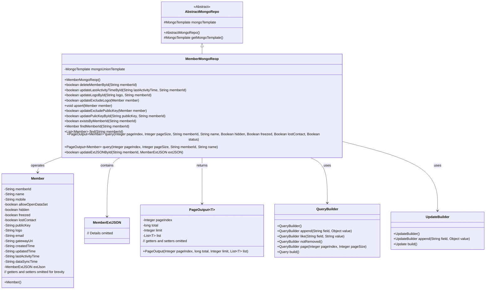

# Basic Information

|      |      |
|------|------|
| Name | MemberMongoReop |
| Language | .java |
| Code Path | WeFe/common/java/common-data-mongodb/src/main/java/com/welab/wefe/common/data/mongodb/repo/MemberMongoReop.java |
| Package Name | com.welab.wefe.common.data.mongodb.repo |
| Dependencies | ['com.mongodb.client.result.UpdateResult', 'com.welab.wefe.common.data.mongodb.dto.PageOutput', 'com.welab.wefe.common.data.mongodb.entity.union.Member', 'com.welab.wefe.common.data.mongodb.entity.union.ext.MemberExtJSON', 'com.welab.wefe.common.data.mongodb.util.QueryBuilder', 'com.welab.wefe.common.data.mongodb.util.UpdateBuilder', 'org.apache.commons.lang3.StringUtils', 'org.springframework.beans.factory.annotation.Autowired', 'org.springframework.data.mongodb.core.MongoTemplate', 'org.springframework.data.mongodb.core.query.Query', 'org.springframework.data.mongodb.core.query.Update', 'org.springframework.stereotype.Repository', 'java.util.ArrayList', 'java.util.List'] |
| Brief Description | The MemberMongoRepo class inherits from AbstractMongoRepo and utilizes MongoTemplate to interact with MongoDB. It provides CRUD functionalities for members, including deletion by ID, updating fields such as activity time, logo, and public key, as well as paginated queries and existence checks. |

# Description

The code defines a MongoDB repository class named `MemberMongoRepo`, which inherits from `AbstractMongoRepo`. It utilizes `MongoTemplate` for database operations, primarily handling CRUD functionalities for member data. Key methods include: deleting a member by ID, updating the last activity time, updating the logo, updating member information excluding the logo, updating member information excluding the public key, updating the public key, checking if a member exists, finding a member by ID, querying a paginated list of members, and updating extended JSON data, among others. All update operations return a boolean indicating whether the operation was successful. Query methods support conditional filtering and pagination features.

# Class Summary

| Name   | Type  | Description |
|-------|------|-------------|
| MemberMongoReop | class | The MemberMongoRepo class inherits from AbstractMongoRepo and utilizes MongoTemplate to interact with MongoDB. It provides CRUD functionality for members, including updating fields such as status, activity time, and logo. It also supports paginated queries and conditional filtering. |

## Class MemberMongoReop

|      |      |
|------|------|
| Access Modifier | @Repository;public |
| Type | class |
| Name | MemberMongoReop |
| Description | The MemberMongoRepo class inherits from AbstractMongoRepo and utilizes MongoTemplate to interact with MongoDB. It provides CRUD functionality for members, including updating fields such as status, activity time, and logo. It also supports paginated queries and conditional filtering. |

### UML Class Diagram

This code demonstrates a MongoDB repository class `MemberMongoReop`, which inherits from `AbstractMongoRepo` and provides CRUD operations for the `Member` entity. The class utilizes `QueryBuilder` and `UpdateBuilder` to construct query and update conditions, executing database operations via `MongoTemplate`. Key functionalities include member information CRUD, paginated queries, conditional updates, and handling edge cases such as null checks and status updates. The class diagram clearly illustrates the relationships and dependencies among the components.

### Internal Method Call Graph

```mermaid
graph TD
    A["Class MemberMongoRepo"]
    B["Property: MongoTemplate mongoUnionTemplate"]
    C["Method: getMongoTemplate()"]
    D["Method: deleteMemberById(memberId)"]
    E["Method: updateLastActivityTimeById(lastActivityTime, memberId)"]
    F["Method: updateLogoById(logo, memberId)"]
    G["Method: updateExcludeLogo(member)"]
    H["Method: upsert(member)"]
    I["Method: updateExcludePublicKey(member)"]
    J["Method: updatePublicKeyById(publicKey, memberId)"]
    K["Method: existsByMemberId(memberId)"]
    L["Method: findMemberId(memberId)"]
    M["Method: find(memberId)"]
    N["Method: query(pageIndex, pageSize, memberId, name...)"]
    O["Method: updateExtJSONById(memberId, extJSON)"]

    A --> B
    A --> C
    A --> D
    A --> E
    A --> F
    A --> G
    A --> H
    A --> I
    A --> J
    A --> K
    A --> L
    A --> M
    A --> N
    A --> O
```

This code is a Mermaid flowchart of the MemberMongoRepo class, illustrating its structure and main methods. The class inherits from AbstractMongoRepo, uses the @Repository annotation, and operates on MongoDB via MongoTemplate. Core functionalities include CRUD operations for member data, such as deleting members, updating activity time, updating logos, and performing updates while excluding specific fields. All methods follow a similar workflow: parameter validation → building query conditions → executing database operations → returning results. Special attention is given to null checks for memberId and using QueryBuilder to construct complex query conditions.

### Field List

| Name  | Type  | Description |
|-------|-------|------|
| mongoUnionTemplate | MongoTemplate | Use @Autowired to automatically inject the MongoTemplate instance mongoUnionTemplate. |

### Method List

| Name  | Type  | Description |
|-------|-------|------|
| upsert | void | The method `upsert` is used to insert or update member data: after verifying that the member ID is not empty, it queries the database. If the record exists, the original ID is retained, and the data is then saved. |
| updateLogoById | boolean | The method `updateLogoById` updates the user logo based on `memberId`. It first checks if `memberId` is not empty, then constructs the query and update conditions, and finally performs the MongoDB update operation and returns whether it was successful. |
| updateExcludePublicKey | boolean | This method updates the database record based on the member object, including fields such as member ID, name, phone number, etc., and returns whether the operation was successful. |
| deleteMemberById | boolean | Method to delete member by memberId: After verifying the ID is not empty, construct query and update conditions, set the member status to 1, and return whether the operation was successful. |
| query | PageOutput<Member> | This is a Java method designed for paginated querying of member information. It accepts parameters such as page number, page size, member ID, and name, then invokes an overloaded method to perform the query. |
| updateExcludeLogo | boolean | The method `updateExcludeLogo` updates member information by checking parameters, constructing query and update conditions, executing MongoDB update operations, and returning the result. |
| updatePulicKeyById | boolean | The method updates the public key based on the memberId. If the memberId is empty, it returns false; otherwise, it performs a MongoDB update operation and returns whether it was successful. |
| find | List<Member> | Query the Member list based on memberId. If it is not empty, query a single member; otherwise, query all undeleted members. Return the result list. |
| updateLastActivityTimeById | boolean | Update the last activity time based on the member ID. If the ID is empty, return false; otherwise, perform a MongoDB update operation and return whether it was successful. |
| existsByMemberId | boolean | Check if the member ID exists: Return false if the ID is empty; otherwise, query the undeleted member record in MongoDB and return the existence result. |
| query | PageOutput<Member> | Query member information method, supports pagination and conditional filtering including status, hidden, frozen, lost contact, etc., returns paginated results. |
| findMemberId | Member | Look up the member information corresponding to the member ID. If the ID is empty, return null; otherwise, query the undeleted member data through MongoDB and return it. |
| getMongoTemplate | MongoTemplate | Rewrite the getMongoTemplate method to return a mongoUnionTemplate instance. |
| updateExtJSONById | boolean | Update the extJSON field of the specified memberId in MongoDB and return whether the operation was successful. Returns false if parameter validation fails or the operation is not confirmed. |

