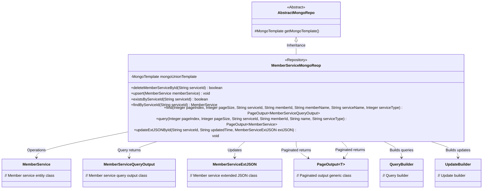

# Basic Information

|      |      |
|------|------|
| Name | MemberServiceMongoReop |
| Language | .java |
| Code Path | WeFe/common/java/common-data-mongodb/src/main/java/com/welab/wefe/common/data/mongodb/repo/MemberServiceMongoReop.java |
| Package Name | com.welab.wefe.common.data.mongodb.repo |
| Dependencies | ['com.mongodb.client.result.UpdateResult', 'com.welab.wefe.common.data.mongodb.constant.MongodbTable', 'com.welab.wefe.common.data.mongodb.dto.PageOutput', 'com.welab.wefe.common.data.mongodb.dto.member.MemberServiceQueryOutput', 'com.welab.wefe.common.data.mongodb.entity.union.MemberFileInfo', 'com.welab.wefe.common.data.mongodb.entity.union.MemberService', 'com.welab.wefe.common.data.mongodb.entity.union.ext.MemberServiceExtJSON', 'com.welab.wefe.common.data.mongodb.util.AddFieldsOperation', 'com.welab.wefe.common.data.mongodb.util.QueryBuilder', 'com.welab.wefe.common.data.mongodb.util.UpdateBuilder', 'org.apache.commons.lang3.StringUtils', 'org.springframework.beans.factory.annotation.Autowired', 'org.springframework.data.domain.Sort', 'org.springframework.data.mongodb.core.MongoTemplate', 'org.springframework.data.mongodb.core.aggregation', 'org.springframework.data.mongodb.core.query.Criteria', 'org.springframework.data.mongodb.core.query.Query', 'org.springframework.data.mongodb.core.query.Update', 'org.springframework.stereotype.Repository', 'java.util.HashMap', 'java.util.List', 'java.util.Map'] |
| Brief Description | The MemberServiceMongoRepo class inherits from AbstractMongoRepo and utilizes MongoTemplate to operate MongoDB. It provides CRUD functionalities for member services, including deletion, update, and query by ID, as well as paginated queries, supporting conditional filtering and aggregation operations. |

# Description

The code describes a MongoDB repository class named MemberServiceMongoReop, which inherits from AbstractMongoRepo. Its main functionalities include: deleting, querying, checking existence, and updating member service data via serviceId; supporting paginated queries for member service information, including associated queries for member names; providing conditional paginated queries and the ability to update extended JSON data. All operations are implemented through the auto-injected mongoUnionTemplate and include detailed query construction and aggregation operations.

# Class Summary

| Name   | Type  | Description |
|-------|------|-------------|
| MemberServiceMongoReop | class | MongoDB Member Service Repository Class, providing CRUD and pagination query functionalities, including conditional filtering and aggregation operations. |

## Class MemberServiceMongoReop

|      |      |
|------|------|
| Access Modifier | @Repository;public |
| Type | class |
| Name | MemberServiceMongoReop |
| Description | MongoDB Member Service Repository Class, providing CRUD and pagination query functionalities, including conditional filtering and aggregation operations. |

### UML Class Diagram

Class diagram description: This diagram illustrates the structure of the MongoDB-based member service repository class `MemberServiceMongoReop`, which inherits from the abstract class `AbstractMongoRepo`. It operates on the `MemberService` entity class via `MongoTemplate`, providing CRUD and complex aggregation query functionalities. The class includes paginated query returns with the generic `PageOutput` class, as well as dependencies with the query builder `QueryBuilder` and update builder `UpdateBuilder`, implementing a complete data access layer for member services.

### Internal Method Call Graph

```mermaid
graph TD
    A["Class MemberServiceMongoReop"]
    B["Property: MongoTemplate mongoUnionTemplate"]
    C["Method: getMongoTemplate()"]
    D["Method: deleteMemberServiceById(serviceId)"]
    E["Method: upsert(memberService)"]
    F["Method: existsByServiceId(serviceId)"]
    G["Method: findByServiceId(serviceId)"]
    H["Method: find(pageIndex,pageSize,...)"]
    I["Method: query(pageIndex,pageSize,...)"]
    J["Method: updateExtJSONById(serviceId,...)"]

    A --> B
    A --> C
    A --> D
    A --> E
    A --> F
    A --> G
    A --> H
    A --> I
    A --> J

    D --> K["QueryBuilder constructs query"]
    D --> L["UpdateBuilder constructs update"]
    D --> M["mongoUnionTemplate.updateFirst"]
    D --> N["Returns updateResult.wasAcknowledged()"]

    E --> O["mongoUnionTemplate.save"]

    F --> P["Checks serviceId null value"]
    F --> Q["QueryBuilder constructs query"]
    F --> R["mongoUnionTemplate.exists"]

    G --> S["Checks serviceId null value"]
    G --> T["QueryBuilder constructs query"]
    G --> U["mongoUnionTemplate.findOne"]

    H --> V["Builds LookupOperation"]
    H --> W["QueryBuilder constructs conditions"]
    H --> X["Aggregation operation chain"]
    H --> Y["Pagination/sorting processing"]
    H --> Z["Returns PageOutput"]

    I --> AA["QueryBuilder constructs conditions"]
    I --> AB["Pagination/sorting processing"]
    I --> AC["Returns PageOutput"]

    J --> AD["QueryBuilder constructs query"]
    J --> AE["UpdateBuilder constructs update"]
    J --> AF["mongoUnionTemplate.updateFirst"]
```

This code represents a MongoDB Repository implementation class, primarily providing CRUD operations for member services. The flowchart illustrates the class structure and invocation relationships of 7 core methods, including service deletion, save/update operations, existence checks, precise queries, complex aggregation queries, paginated queries, and extended JSON updates. All operations are executed via mongoUnionTemplate, using QueryBuilder and UpdateBuilder to construct query conditions. The find method implements multi-table joins and complex aggregation operations.

### Field List

| Name  | Type  | Description |
|-------|-------|------|
| mongoUnionTemplate | MongoTemplate | Automatically inject the MongoDB operation template mongoUnionTemplate. |

### Method List

| Name  | Type  | Description |
|-------|-------|------|
| find | PageOutput<MemberServiceQueryOutput> | The method `find` retrieves member service data through MongoDB aggregation queries, supporting pagination, fuzzy search, and multi-condition filtering, and returns paginated results. |
| query | PageOutput<MemberService> | Query member service paginated data, supporting filtering by service ID, member ID, name fuzzy matching, and service type, returning paginated results and total count. |
| findByServiceId | MemberService | Query the MemberService based on the serviceId. If the serviceId is empty, return null; otherwise, query through MongoDB and return the result. |
| updateExtJSONById | void | This method updates the MemberFileInfo record in MongoDB via the serviceId, modifying the extJson and updatedTime fields. The update operation is performed using the MongoUnionTemplate. |
| existsByServiceId | boolean | Check if the specified serviceId exists: return false if it is empty; otherwise, query whether a matching record exists in the MemberService collection in MongoDB. |
| deleteMemberServiceById | boolean | This method deletes member services by serviceId using MongoDB's updateFirst operation and returns whether the operation was successful. |
| getMongoTemplate | MongoTemplate | Override the parent class method and return a mongoUnionTemplate instance. |
| upsert | void | The method upsert uses mongoUnionTemplate to save the memberService object to the database. |

