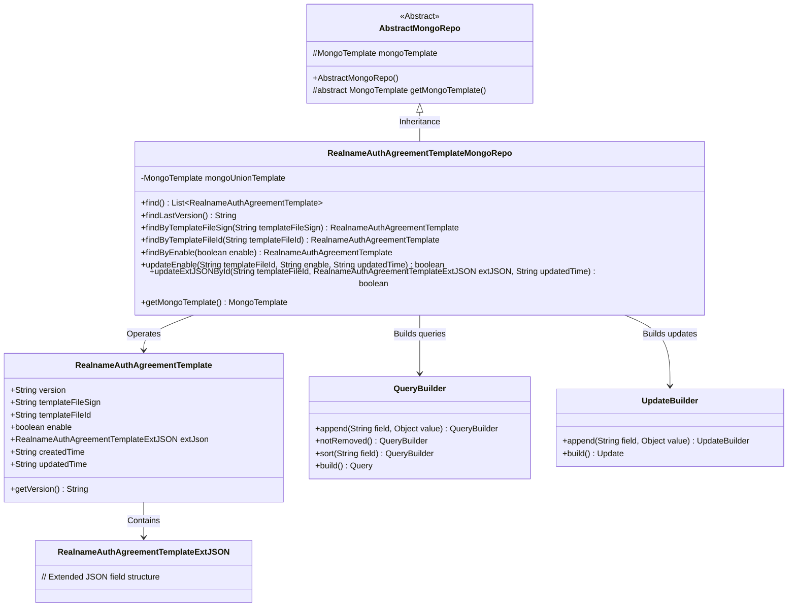

# Basic Information

|      |      |
|------|------|
| Name | RealnameAuthAgreementTemplateMongoRepo |
| Language | .java |
| Code Path | WeFe/common/java/common-data-mongodb/src/main/java/com/welab/wefe/common/data/mongodb/repo/RealnameAuthAgreementTemplateMongoRepo.java |
| Package Name | com.welab.wefe.common.data.mongodb.repo |
| Dependencies | ['com.mongodb.client.result.UpdateResult', 'com.welab.wefe.common.data.mongodb.entity.union.RealnameAuthAgreementTemplate', 'com.welab.wefe.common.data.mongodb.entity.union.ext.RealnameAuthAgreementTemplateExtJSON', 'com.welab.wefe.common.data.mongodb.util.QueryBuilder', 'com.welab.wefe.common.data.mongodb.util.UpdateBuilder', 'org.apache.commons.lang3.StringUtils', 'org.springframework.beans.factory.annotation.Autowired', 'org.springframework.data.mongodb.core.MongoTemplate', 'org.springframework.data.mongodb.core.query.Query', 'org.springframework.data.mongodb.core.query.Update', 'org.springframework.stereotype.Repository', 'java.util.List'] |
| Brief Description | The `RealnameAuthAgreementTemplateMongoRepo` class is used to manipulate real-name authentication agreement template data in MongoDB, providing functionalities such as querying and updating. It includes searching templates by version, file signature, ID, and activation status, as well as updating activation status and extended JSON data. |

# Description

This is a MongoDB repository class named RealnameAuthAgreementTemplateMongoRepo, which inherits from AbstractMongoRepo. It utilizes MongoTemplate for database operations, with its primary functionality being to query real-name authentication agreement template data. The provided methods include: querying all templates sorted by creation time, retrieving the latest version number, querying templates by file signature or ID, querying templates based on activation status, updating template activation status and extended JSON data. All update operations record the update time and return a boolean value indicating whether the operation was successful.

# Class Summary

| Name   | Type  | Description |
|-------|------|-------------|
| RealnameAuthAgreementTemplateMongoRepo | class | The RealnameAuthAgreementTemplateMongoRepo class is used to manipulate real-name authentication agreement template data in MongoDB, providing functionalities such as querying and updating, including operations like finding templates by conditions, retrieving the latest version, updating activation status, and extending JSON. |

## Class RealnameAuthAgreementTemplateMongoRepo

|      |      |
|------|------|
| Access Modifier | @Repository;public |
| Type | class |
| Name | RealnameAuthAgreementTemplateMongoRepo |
| Description | The RealnameAuthAgreementTemplateMongoRepo class is used to manipulate real-name authentication agreement template data in MongoDB, providing functionalities such as querying and updating, including operations like finding templates by conditions, retrieving the latest version, updating activation status, and extending JSON. |

### UML Class Diagram

This code demonstrates a MongoDB repository implementation class `RealnameAuthAgreementTemplateMongoRepo`, which inherits from `AbstractMongoRepo` and is primarily used for operating real-name authentication agreement template data. The class diagram clearly illustrates the relationships between core classes: the repository class constructs query and update conditions via `QueryBuilder` and `UpdateBuilder`, operates on the `RealnameAuthAgreementTemplate` entity class, which in turn contains the extended field structure `RealnameAuthAgreementTemplateExtJSON`. The implementation provides functionalities such as template querying, version retrieval, and conditional updates, reflecting a typical data access layer design pattern.

### Internal Method Call Graph

```mermaid
graph TD
    A["Class RealnameAuthAgreementTemplateMongoRepo"]
    B["Property: MongoTemplate mongoUnionTemplate"]
    C["Method: List<RealnameAuthAgreementTemplate> find()"]
    D["Method: String findLastVersion()"]
    E["Method: RealnameAuthAgreementTemplate findByTemplateFileSign()"]
    F["Method: RealnameAuthAgreementTemplate findByTemplateFileId()"]
    G["Method: RealnameAuthAgreementTemplate findByEnable()"]
    H["Method: boolean updateEnable()"]
    I["Method: boolean updateExtJSONById()"]
    J["Overridden Method: MongoTemplate getMongoTemplate()"]

    A --> B
    A --> C
    A --> D
    A --> E
    A --> F
    A --> G
    A --> H
    A --> I
    A --> J

    C --> C1["QueryBuilder.sort('createdTime')"]
    D --> D1["QueryBuilder.sort('createdTime')"]
    D --> D2["Check null return version"]
    E --> E1["QueryBuilder.append('templateFileSign')"]
    F --> F1["QueryBuilder.append('templateFileId')"]
    G --> G1["QueryBuilder.append('enable')"]
    H --> H1["Parameter validation"]
    H --> H2["QueryBuilder.append('templateFileId')"]
    H --> H3["UpdateBuilder set fields"]
    I --> I1["Parameter validation"]
    I --> I2["QueryBuilder.append('templateFileId')"]
    I --> I3["UpdateBuilder set extJson"]
```

This flowchart illustrates the complete structure of the RealnameAuthAgreementTemplateMongoRepo class, featuring 8 core methods and 1 property. All methods construct query conditions via QueryBuilder, with find() and findLastVersion() performing sorted queries by creation time while others execute precise queries through different fields. Update operations updateEnable() and updateExtJSONById() include parameter validation and UpdateBuilder-based update logic, ultimately executed via mongoUnionTemplate. The getMongoTemplate() method inherited from AbstractMongoRepo is overridden to return a specific template instance.

### Field List

| Name  | Type  | Description |
|-------|-------|------|
| mongoUnionTemplate | MongoTemplate | Automatically inject the MongoDB operation template mongoUnionTemplate. |

### Method List

| Name  | Type  | Description |
|-------|-------|------|
| updateEnable | boolean | The method `updateEnable` updates the `enable` and `updatedTime` fields based on the `templateFileId`. If `templateFileId` is empty, it returns `false`; otherwise, it performs a MongoDB update operation and returns whether it was successful. |
| find | List<RealnameAuthAgreementTemplate> | Query the list of real-name authentication agreement templates and return the results sorted by creation time. |
| findByEnable | RealnameAuthAgreementTemplate | Query undeleted real-name authentication agreement templates based on the enable parameter and return matching results. |
| updateExtJSONById | boolean | The method updates the extended JSON and update time in MongoDB by template ID, returning whether the operation was successful. Returns false if parameter validation fails. |
| findByTemplateFileId | RealnameAuthAgreementTemplate | Query non-deleted real-name authentication agreement templates by template file ID using MongoDB. |
| findByTemplateFileSign | RealnameAuthAgreementTemplate | This method queries MongoDB to retrieve undeleted real-name authentication agreement template records based on the templateFileSign parameter. |
| findLastVersion | String | This method queries the latest real-name authentication protocol template from MongoDB, sorts by creation time, and returns the version number of the first record. If no records exist, it returns null. |
| getMongoTemplate | MongoTemplate | Rewrite the getMongoTemplate method to return a mongoUnionTemplate instance. |

