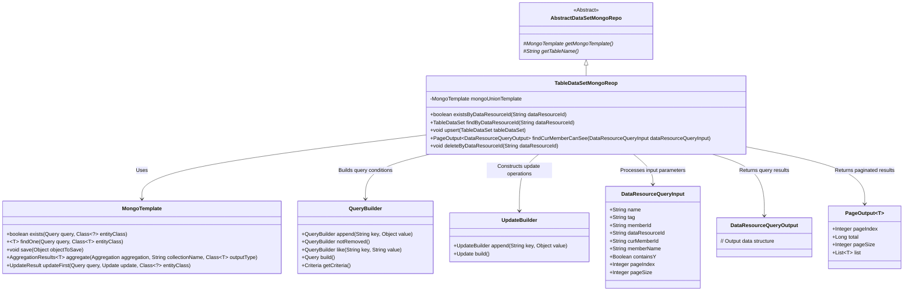
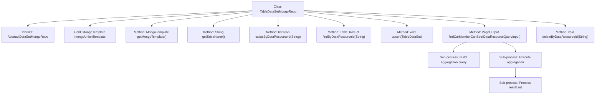

# Basic Information

|      |      |
|------|------|
| Name | TableDataSetMongoReop |
| Language | .java |
| Code Path | WeFe/common/java/common-data-mongodb/src/main/java/com/welab/wefe/common/data/mongodb/repo/TableDataSetMongoReop.java |
| Package Name | com.welab.wefe.common.data.mongodb.repo |
| Dependencies | ['com.welab.wefe.common.data.mongodb.constant.MongodbTable', 'com.welab.wefe.common.data.mongodb.dto.PageOutput', 'com.welab.wefe.common.data.mongodb.dto.dataresource.DataResourceQueryInput', 'com.welab.wefe.common.data.mongodb.dto.dataresource.DataResourceQueryOutput', 'com.welab.wefe.common.data.mongodb.dto.dataset.DataSetQueryOutput', 'com.welab.wefe.common.data.mongodb.entity.union.TableDataSet', 'com.welab.wefe.common.data.mongodb.util.AddFieldsOperation', 'com.welab.wefe.common.data.mongodb.util.QueryBuilder', 'com.welab.wefe.common.data.mongodb.util.UpdateBuilder', 'com.welab.wefe.common.util.JObject', 'org.apache.commons.lang3.StringUtils', 'org.springframework.beans.factory.annotation.Autowired', 'org.springframework.data.domain.Sort', 'org.springframework.data.mongodb.core.MongoTemplate', 'org.springframework.data.mongodb.core.aggregation', 'org.springframework.data.mongodb.core.query.Criteria', 'org.springframework.data.mongodb.core.query.Query', 'org.springframework.data.mongodb.core.query.Update', 'org.springframework.stereotype.Repository', 'java.util.HashMap', 'java.util.List', 'java.util.Map'] |
| Brief Description | The TableDataSetMongoRepo class inherits from AbstractDataSetMongoRepo and operates MongoDB using MongoTemplate. It provides methods such as existsByDataResourceId, findByDataResourceId, and upsert to manipulate table datasets. The findCurMemberCanSee method implements paginated retrieval of data visible to the current user through aggregation queries, supporting conditional filtering and sorting. The deleteByDataResourceId method performs logical deletion of data. |

# Description

This is a MongoDB data access class named TableDataSetMongoRepo, which inherits from AbstractDataSetMongoRepo. It utilizes MongoTemplate for database operations, primarily targeting the MongodbTable.Union.TABLE_DATASET table. The class implements various data operation methods: checking if a data resource ID exists (existsByDataResourceId), querying data by ID (findByDataResourceId), inserting or updating data (upsert), and deleting data (deleteByDataResourceId). The most complex method is findCurMemberCanSee, which implements paginated retrieval of datasets visible to the current user through aggregation queries, incorporating multi-table joins, conditional filtering, pagination, and sorting. The query conditions include name, tags, member ID, etc., while also considering data visibility levels and authorized member lists.

# Class Summary

| Name   | Type  | Description |
|-------|------|-------------|
| TableDataSetMongoReop | class | The TableDataSetMongoRepo class inherits from AbstractDataSetMongoRepo and utilizes MongoTemplate to interact with MongoDB. It provides methods such as existsByDataResourceId, findByDataResourceId, upsert, findCurMemberCanSee, and deleteByDataResourceId for querying, updating, and deleting table datasets. The findCurMemberCanSee method implements complex aggregation queries, supporting pagination and conditional filtering. |

## Class TableDataSetMongoReop

|      |      |
|------|------|
| Access Modifier | @Repository;public |
| Type | class |
| Name | TableDataSetMongoReop |
| Description | The TableDataSetMongoRepo class inherits from AbstractDataSetMongoRepo and utilizes MongoTemplate to interact with MongoDB. It provides methods such as existsByDataResourceId, findByDataResourceId, upsert, findCurMemberCanSee, and deleteByDataResourceId for querying, updating, and deleting table datasets. The findCurMemberCanSee method implements complex aggregation queries, supporting pagination and conditional filtering. |

### UML Class Diagram

This class diagram illustrates that TableDataSetMongoReop inherits from AbstractDataSetMongoRepo and relies on MongoTemplate for database operations. Key functionalities include data existence checks, queries, updates, and paginated queries. QueryBuilder and UpdateBuilder are used to construct query and update conditions, processing DataResourceQueryInput parameters and returning either DataResourceQueryOutput results or paginated PageOutput. The overall design demonstrates encapsulation of MongoDB operations and support for complex queries.

### Internal Method Call Graph

This code represents a MongoDB data access layer implementation class, primarily used for CRUD operations on table datasets (TableDataSet). Core functionalities include: checking existence by data resource ID, querying data, batch upsert operations, paginated queries for data visible to current users, and logical deletion. The most complex method is findCurMemberCanSee, which implements cross-table joins (MEMBER/DATA_RESOURCE), conditional filtering, pagination, and sorting through multi-stage aggregation queries, ultimately returning paginated results. All database operations are executed via mongoUnionTemplate and include data validity checks and logical deletion handling.

### Field List

| Name  | Type  | Description |
|-------|-------|------|
| mongoUnionTemplate | MongoTemplate | Using @Autowired to automatically inject a MongoTemplate instance named mongoUnionTemplate. |

### Method List

| Name  | Type  | Description |
|-------|-------|------|
| existsByDataResourceId | boolean | Check if the specified data resource ID exists. If the ID is empty, return false; otherwise, query the corresponding undeleted record in MongoDB and return the existence result. |
| findByDataResourceId | TableDataSet | Query the table dataset based on the data resource ID. If the ID is empty, return null; otherwise, construct the query conditions and return the matching results from MongoDB. |
| getMongoTemplate | MongoTemplate | Rewrite the getMongoTemplate method to return a mongoUnionTemplate instance. |
| getTableName | String | Rewrite the method to return the MongoDB dataset table name Union.TABLE_DATASET. |
| upsert | void | Java Method: Saving or Updating Table Data Sets Using MongoDB Template. |
| findCurMemberCanSee | PageOutput<DataResourceQueryOutput> | This method utilizes MongoDB aggregation queries to filter data resources visible to the current user based on input conditions and returns paginated results. It includes dataset association, member association, condition matching, pagination, and sorting processing. |
| deleteByDataResourceId | void | This method queries and updates a MongoDB record via dataResourceId, setting the status field to 1. The operation is performed using MongoUnionTemplate. |

