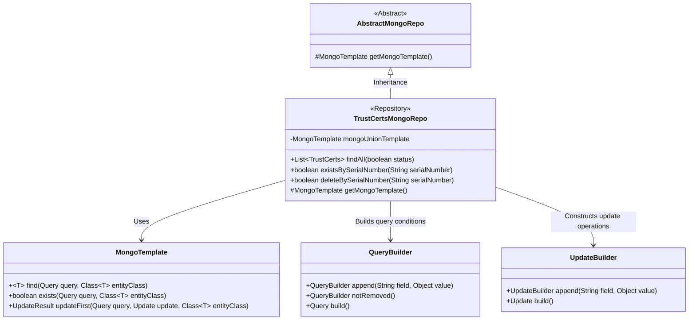
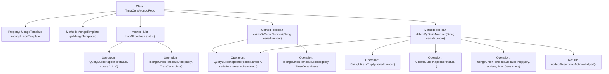

# Basic Information

|      |      |
|------|------|
| Name | TrustCertsMongoRepo |
| Language | .java |
| Code Path | WeFe/common/java/common-data-mongodb/src/main/java/com/welab/wefe/common/data/mongodb/repo/TrustCertsMongoRepo.java |
| Package Name | com.welab.wefe.common.data.mongodb.repo |
| Dependencies | ['com.mongodb.client.result.UpdateResult', 'com.welab.wefe.common.data.mongodb.entity.union.DataResourceDefaultTag', 'com.welab.wefe.common.data.mongodb.entity.union.TrustCerts', 'com.welab.wefe.common.data.mongodb.entity.union.UnionNode', 'com.welab.wefe.common.data.mongodb.entity.union.ext.UnionNodeExtJSON', 'com.welab.wefe.common.data.mongodb.util.QueryBuilder', 'com.welab.wefe.common.data.mongodb.util.UpdateBuilder', 'org.apache.commons.lang3.StringUtils', 'org.springframework.beans.factory.annotation.Autowired', 'org.springframework.data.mongodb.core.MongoTemplate', 'org.springframework.data.mongodb.core.query.Query', 'org.springframework.data.mongodb.core.query.Update', 'org.springframework.stereotype.Repository', 'java.util.List'] |
| Brief Description | The `TrustCertsMongoRepo` class inherits from `AbstractMongoRepo` and utilizes `MongoTemplate` to perform database operations. It provides functionalities to query all certificates, check existence by serial number, and delete records. Deletion is implemented by marking the status. |

# Description

TrustCertsMongoRepo is a MongoDB repository class that inherits from AbstractMongoRepo and is marked with the @Repository annotation. It injects a MongoTemplate instance named mongoUnionTemplate via @Autowired and overrides the getMongoTemplate method to return this instance. The class defines three core methods: findAll queries all TrustCerts records based on the status parameter; existsBySerialNumber checks whether a record with the specified serial number exists; deleteBySerialNumber implements logical deletion by updating the status field and returns whether the operation was successful. All queries are constructed using QueryBuilder with conditions that ensure undeleted records are retrieved.

# Class Summary

| Name   | Type  | Description |
|-------|------|-------------|
| TrustCertsMongoRepo | class | The `TrustCertsMongoRepo` class inherits from `AbstractMongoRepo` and utilizes `MongoTemplate` to perform database operations. It includes functionalities for querying all certificates, checking existence by serial number, and deletion, with query conditions constructed via `QueryBuilder`. |

## Class TrustCertsMongoRepo

|      |      |
|------|------|
| Access Modifier | @Repository;public |
| Type | class |
| Name | TrustCertsMongoRepo |
| Description | The `TrustCertsMongoRepo` class inherits from `AbstractMongoRepo` and utilizes `MongoTemplate` to perform database operations. It includes functionalities for querying all certificates, checking existence by serial number, and deletion, with query conditions constructed via `QueryBuilder`. |

### UML Class Diagram

This class diagram illustrates the structure of TrustCertsMongoRepo and its related classes. TrustCertsMongoRepo inherits from AbstractMongoRepo and relies on MongoTemplate for database operations. It utilizes QueryBuilder to construct query conditions and UpdateBuilder to build update operations, providing methods such as findAll, existsBySerialNumber, and deleteBySerialNumber for querying and manipulating TrustCerts data. The diagram clearly depicts the relationships between these classes and their primary methods.

### Internal Method Call Graph

This code illustrates a MongoDB repository class TrustCertsMongoRepo, which extends AbstractMongoRepo. Its primary functionalities include querying all certificates matching a specified status, checking the existence of a serial number, and performing logical deletion of certificates with a given serial number. The MongoTemplate instance is injected via @Autowired. Core operations involve constructing query conditions, executing database operations, and processing return results. The flowchart clearly depicts the class structure, method invocation relationships, and data operation flows, particularly highlighting the multi-step operations in the deleteBySerialNumber method, which includes null checks and status updates.

### Field List

| Name  | Type  | Description |
|-------|-------|------|
| mongoUnionTemplate | MongoTemplate | Use @Autowired to automatically inject the MongoTemplate instance mongoUnionTemplate. |

### Method List

| Name  | Type  | Description |
|-------|-------|------|
| existsBySerialNumber | boolean | Check whether a certificate with the specified serial number exists, query undeleted records, and return a boolean result. |
| findAll | List<TrustCerts> | Query the list of TrustCerts with specified status. Use MongoDB templates to construct queries based on the status parameter (1 or 0) and return the results. |
| getMongoTemplate | MongoTemplate | Rewrite the method to return the MongoDB template instance mongoUnionTemplate. |
| deleteBySerialNumber | boolean | This method deletes records by serial number, first checks that the serial number is not empty, constructs the query and update conditions, executes the MongoDB update operation, and returns whether it was successful. |

