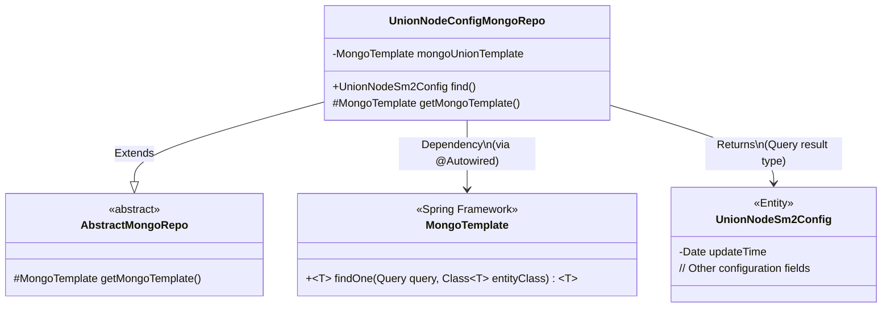
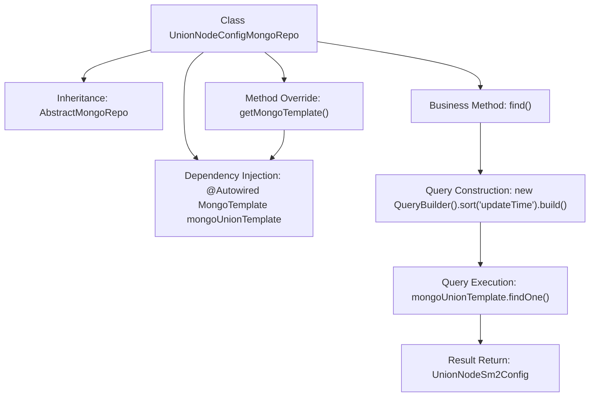

# Basic Information

|      |      |
|------|------|
| Name | UnionNodeConfigMongoRepo |
| Language | .java |
| Code Path | WeFe/common/java/common-data-mongodb/src/main/java/com/welab/wefe/common/data/mongodb/repo/UnionNodeConfigMongoRepo.java |
| Package Name | com.welab.wefe.common.data.mongodb.repo |
| Dependencies | ['com.welab.wefe.common.data.mongodb.entity.union.UnionNodeSm2Config', 'com.welab.wefe.common.data.mongodb.util.QueryBuilder', 'org.springframework.beans.factory.annotation.Autowired', 'org.springframework.data.mongodb.core.MongoTemplate', 'org.springframework.stereotype.Repository'] |
| Brief Description | UnionNodeConfigMongoRepo is a MongoDB repository class that inherits from AbstractMongoRepo. It utilizes mongoUnionTemplate for database operations and provides a find method to query UnionNodeSm2Config sorted by updateTime. |

# Description

This is a MongoDB repository class named UnionNodeConfigMongoRepo, which inherits from the AbstractMongoRepo base class. It is marked as a Spring-managed repository component via the @Repository annotation. The class injects a MongoTemplate instance named mongoUnionTemplate and returns this instance by overriding the getMongoTemplate method. It primarily provides a find method for querying data of type UnionNodeSm2Config, which sorts the results by the updateTime field and returns the first record. The entire class focuses on handling MongoDB operations for the UnionNodeSm2Config entity.

# Class Summary

| Name   | Type  | Description |
|-------|------|-------------|
| UnionNodeConfigMongoRepo | class | UnionNodeConfigMongoRepo is a MongoDB repository class that inherits from AbstractMongoRepo. It utilizes mongoUnionTemplate for database operations and provides a find method to query UnionNodeSm2Config sorted by updateTime. |

## Class UnionNodeConfigMongoRepo

|      |      |
|------|------|
| Access Modifier | @Repository;public |
| Type | class |
| Name | UnionNodeConfigMongoRepo |
| Description | UnionNodeConfigMongoRepo is a MongoDB repository class that inherits from AbstractMongoRepo. It utilizes mongoUnionTemplate for database operations and provides a find method to query UnionNodeSm2Config sorted by updateTime. |

### UML Class Diagram

This code demonstrates a Spring Data MongoDB repository implementation where UnionNodeConfigMongoRepo extends the abstract base class AbstractMongoRepo and injects a MongoTemplate instance via @Autowired. The core functionality queries the UnionNodeSm2Config entity through the find() method, sorting by updateTime and returning a single result. The class diagram clearly illustrates inheritance relationships, dependency injection, and return type associations, conforming to typical design patterns for MongoDB data access layers.

### Internal Method Call Graph

This flowchart illustrates the complete structure and workflow of the UnionNodeConfigMongoRepo class. The class inherits from AbstractMongoRepo, injects a MongoTemplate instance via @Autowired, and overrides the parent class's getMongoTemplate method. The core business method find() constructs a sorted query using QueryBuilder, executes findOne operation via mongoTemplate, and returns a UnionNodeSm2Config type result. The entire process clearly presents the complete call chain from dependency injection to query execution, demonstrating a typical repository pattern implementation of Spring Data MongoDB.

### Field List

| Name  | Type  | Description |
|-------|-------|------|
| mongoUnionTemplate | MongoTemplate | Use @Autowired to automatically inject the MongoTemplate instance mongoUnionTemplate. |

### Method List

| Name  | Type  | Description |
|-------|-------|------|
| getMongoTemplate | MongoTemplate | Rewrite the getMongoTemplate method to return a mongoUnionTemplate instance. |
| find | UnionNodeSm2Config | Query the UnionNodeSm2Config collection in MongoDB, sort by updateTime, and return the first record. |

