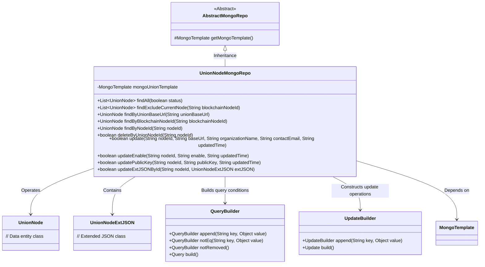

# Basic Information

|      |      |
|------|------|
| Name | UnionNodeMongoRepo |
| Language | .java |
| Code Path | WeFe/common/java/common-data-mongodb/src/main/java/com/welab/wefe/common/data/mongodb/repo/UnionNodeMongoRepo.java |
| Package Name | com.welab.wefe.common.data.mongodb.repo |
| Dependencies | ['com.mongodb.client.result.UpdateResult', 'com.welab.wefe.common.data.mongodb.entity.union.UnionNode', 'com.welab.wefe.common.data.mongodb.entity.union.ext.UnionNodeExtJSON', 'com.welab.wefe.common.data.mongodb.util.QueryBuilder', 'com.welab.wefe.common.data.mongodb.util.UpdateBuilder', 'org.apache.commons.lang3.StringUtils', 'org.springframework.beans.factory.annotation.Autowired', 'org.springframework.data.mongodb.core.MongoTemplate', 'org.springframework.data.mongodb.core.query.Query', 'org.springframework.data.mongodb.core.query.Update', 'org.springframework.stereotype.Repository', 'java.util.List'] |
| Brief Description | The UnionNodeMongoRepo class inherits from AbstractMongoRepo and provides CRUD operations for UnionNode, including querying by status, URL, node ID, etc., as well as update and delete functionalities. |

# Description

The UnionNodeMongoRepo is a MongoDB repository class that inherits from AbstractMongoRepo and is used to manage database operations for the UnionNode entity. It performs queries and updates through the injected MongoTemplate. Key functionalities include: finding all nodes by status, querying while excluding specified nodes, and locating individual nodes via different attributes (such as baseUrl, blockchainNodeId, nodeId). Update operations support modifying node basic information, activation status, public key, and extended JSON data. Deletion is implemented by marking the status. All operations include non-null validation and soft-delete checks.

# Class Summary

| Name   | Type  | Description |
|-------|------|-------------|
| UnionNodeMongoRepo | class | The `UnionNodeMongoRepo` class inherits from `AbstractMongoRepo` and provides CRUD operations for `UnionNode`, including queries by status, URL, node ID, etc., as well as update and delete functionalities. It uses `MongoTemplate` to implement data access. |

## Class UnionNodeMongoRepo

|      |      |
|------|------|
| Access Modifier | @Repository;public |
| Type | class |
| Name | UnionNodeMongoRepo |
| Description | The `UnionNodeMongoRepo` class inherits from `AbstractMongoRepo` and provides CRUD operations for `UnionNode`, including queries by status, URL, node ID, etc., as well as update and delete functionalities. It uses `MongoTemplate` to implement data access. |

### UML Class Diagram

This code demonstrates a MongoDB data access layer implementation class UnionNodeMongoRepo, which inherits from the AbstractMongoRepo abstract class. The class performs CRUD operations through MongoTemplate, primarily managing the UnionNode entity and its extended attributes UnionNodeExtJSON. It uses QueryBuilder and UpdateBuilder to construct query conditions and update operations respectively, including status queries, exclusion of specific node queries, multi-field updates, and other functionalities. All database operations incorporate logical deletion checks (notRemoved) and return operation result statuses. The class diagram clearly illustrates the inheritance, dependency, and association relationships between components.

### Internal Method Call Graph

```mermaid
graph TD
    A["Class UnionNodeMongoRepo"]
    B["Property: MongoTemplate mongoUnionTemplate"]
    C["Method: MongoTemplate getMongoTemplate()"]
    D["Method: List<UnionNode> findAll(boolean status)"]
    E["Method: List<UnionNode> findExcludeCurrentNode(String blockchainNodeId)"]
    F["Method: UnionNode findByUnionBaseUrl(String unionBaseUrl)"]
    G["Method: UnionNode findByBlockchainNodeId(String blockchainNodeId)"]
    H["Method: UnionNode findByNodeId(String nodeId)"]
    I["Method: boolean deleteByUnionNodeId(String nodeId)"]
    J["Method: boolean update(String nodeId, String baseUrl, String organizationName, String contactEmail, String updatedTime)"]
    K["Method: boolean updateEnable(String nodeId, String enable, String updatedTime)"]
    L["Method: boolean updatePublicKey(String nodeId, String publicKey, String updatedTime)"]
    M["Method: boolean updateExtJSONById(String nodeId, UnionNodeExtJSON extJSON)"]

    A --> B
    A --> C
    A --> D
    A --> E
    A --> F
    A --> G
    A --> H
    A --> I
    A --> J
    A --> K
    A --> L
    A --> M
```

This code defines a MongoDB repository class named `UnionNodeMongoRepo`, which extends `AbstractMongoRepo` and is primarily used for CRUD operations on the `UnionNode` collection. The class includes multiple query and update methods, such as finding all nodes by status, querying while excluding a specified node, retrieving a single node by URL or ID, as well as updating node information, public keys, and extended JSON. All methods execute MongoDB operations through `mongoUnionTemplate` and utilize `QueryBuilder` and `UpdateBuilder` to construct query and update conditions.

### Field List

| Name  | Type  | Description |
|-------|-------|------|
| mongoUnionTemplate | MongoTemplate | Using @Autowired to automatically inject a MongoTemplate instance named mongoUnionTemplate. |

### Method List

| Name  | Type  | Description |
|-------|-------|------|
| deleteByUnionNodeId | boolean | This method deletes a federated node by nodeId, first checking that nodeId is not empty, then constructing the query conditions and updating the status to 1, and finally returning whether the operation was successful. |
| findByNodeId | UnionNode | The method queries non-deleted UnionNodes by nodeId, constructs query conditions using MongoDB templates, and returns the result. |
| findByBlockchainNodeId | UnionNode | This method queries the MongoDB for the UnionNode object corresponding to the specified blockchain node ID, excluding records marked as deleted. |
| findByUnionBaseUrl | UnionNode | The method queries MongoDB for UnionNode records with the specified baseUrl that have not been deleted. |
| findExcludeCurrentNode | List<UnionNode> | Find the list of valid federation nodes excluding specified nodes. Use a MongoDB query to filter out nodes that are not the current node, not deleted, and enabled. |
| findAll | List<UnionNode> | Query the list of UnionNodes in MongoDB with matching status, where the parameter status is set to 1 if true, otherwise 0. |
| update | boolean | The method `update` updates a MongoDB record based on `nodeId`, including the fields `baseUrl`, `organizationName`, `contactEmail`, and `updatedTime`. If `nodeId` is empty, it returns `false`; otherwise, it performs the update and returns whether the operation was successful. |
| getMongoTemplate | MongoTemplate | Rewrite the getMongoTemplate method to return a mongoUnionTemplate instance. |
| updateEnable | boolean | The method `updateEnable` updates the `enable` and `updatedTime` fields of a `UnionNode` in MongoDB based on the `nodeId`, returning whether the operation was successful. It performs non-null validation on parameters and executes the update using a MongoDB template. |
| updatePublicKey | boolean | Method for updating node public key: After verifying that nodeId is not empty, construct the query and update conditions, then update the specified node's public key and timestamp in MongoDB, returning whether the operation was successful. |
| updateExtJSONById | boolean | The method `updateExtJSONById` updates the `extJson` field of a `UnionNode` in MongoDB by its `nodeId`. When the parameters are non-empty, it performs the update and returns whether the operation was successful. |

