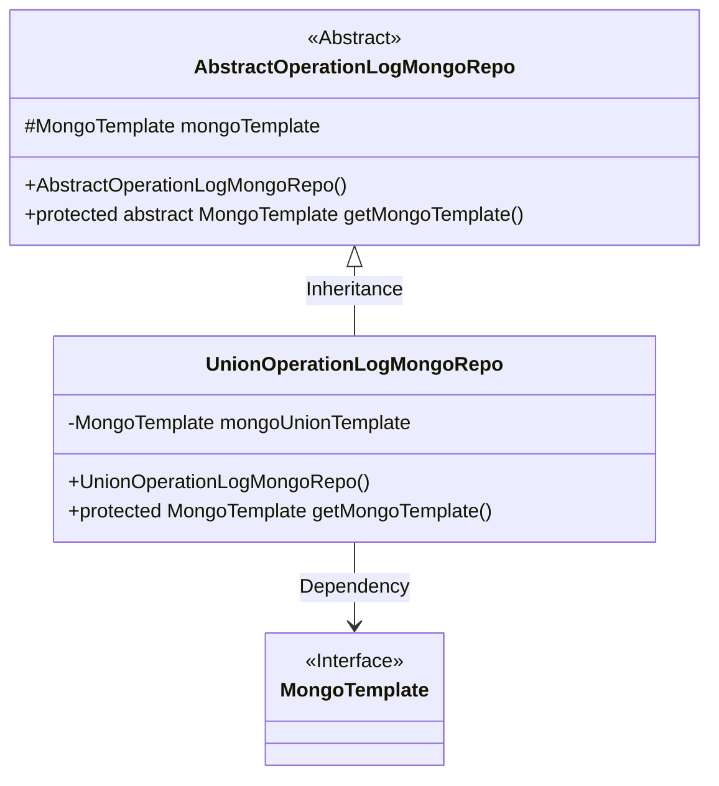
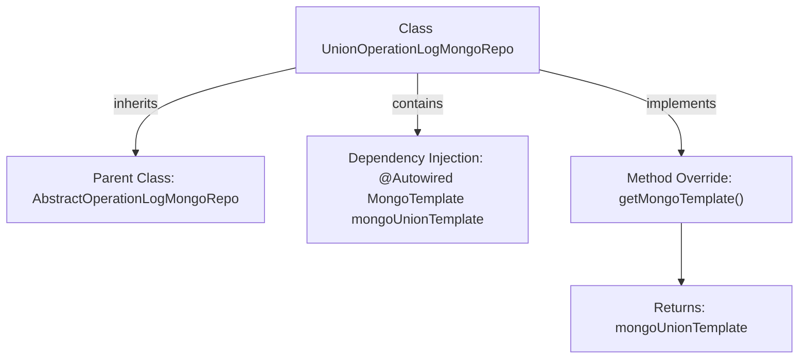

# Basic Information

|      |      |
|------|------|
| Name | UnionOperationLogMongoRepo |
| Language | .java |
| Code Path | WeFe/common/java/common-data-mongodb/src/main/java/com/welab/wefe/common/data/mongodb/repo/UnionOperationLogMongoRepo.java |
| Package Name | com.welab.wefe.common.data.mongodb.repo |
| Dependencies | ['org.springframework.beans.factory.annotation.Autowired', 'org.springframework.data.mongodb.core.MongoTemplate', 'org.springframework.stereotype.Repository'] |
| Brief Description | The UnionOperationLogMongoRepo class inherits from AbstractOperationLogMongoRepo, injects mongoUnionTemplate via @Autowired, and overrides the getMongoTemplate method to return this template. |

# Description

This is a MongoDB repository class named UnionOperationLogMongoRepo, which extends the AbstractOperationLogMongoRepo abstract class. The class is annotated with @Repository to identify it as a Spring-managed repository component. It automatically injects a MongoTemplate instance named mongoUnionTemplate via @Autowired and overrides the parent class's getMongoTemplate method to return this injected mongoUnionTemplate instance. This class is primarily used for handling MongoDB database operations related to union operation logs.

# Class Summary

| Name   | Type  | Description |
|-------|------|-------------|
| UnionOperationLogMongoRepo | class | The `UnionOperationLogMongoRepo` class inherits from `AbstractOperationLogMongoRepo`, uses the `@Repository` annotation, injects `mongoUnionTemplate` via `@Autowired`, and overrides the `getMongoTemplate` method to return this template. |

## Class UnionOperationLogMongoRepo

|      |      |
|------|------|
| Access Modifier | @Repository;public |
| Type | class |
| Name | UnionOperationLogMongoRepo |
| Description | The `UnionOperationLogMongoRepo` class inherits from `AbstractOperationLogMongoRepo`, uses the `@Repository` annotation, injects `mongoUnionTemplate` via `@Autowired`, and overrides the `getMongoTemplate` method to return this template. |

### UML Class Diagram

This code demonstrates the implementation structure of a MongoDB repository layer. UnionOperationLogMongoRepo inherits from the abstract class AbstractOperationLogMongoRepo and implements the abstract method for obtaining MongoTemplate. It injects a MongoDB operation template named mongoUnionTemplate via @Autowired, which overrides the parent class method to return the template in the subclass. The class diagram clearly reflects the inheritance relationship and dependency injection pattern, conforming to the typical repository implementation approach of Spring Data MongoDB.

### Internal Method Call Graph

This flowchart depicts the structure of the UnionOperationLogMongoRepo class. It inherits from AbstractOperationLogMongoRepo, injects a MongoTemplate-type mongoUnionTemplate via the @Autowired annotation, and overrides the parent class's getMongoTemplate method to return the injected mongoUnionTemplate instance. The entire process illustrates key relationships of class inheritance, dependency injection, and method overriding, demonstrating a typical implementation of the template pattern in Spring Data MongoDB.

### Field List

| Name  | Type  | Description |
|-------|-------|------|
| mongoUnionTemplate | MongoTemplate | Automatically inject the MongoDB operation template mongoUnionTemplate. |

### Method List

| Name  | Type  | Description |
|-------|-------|------|
| getMongoTemplate | MongoTemplate | Rewrite the getMongoTemplate method to return a mongoUnionTemplate instance. |

