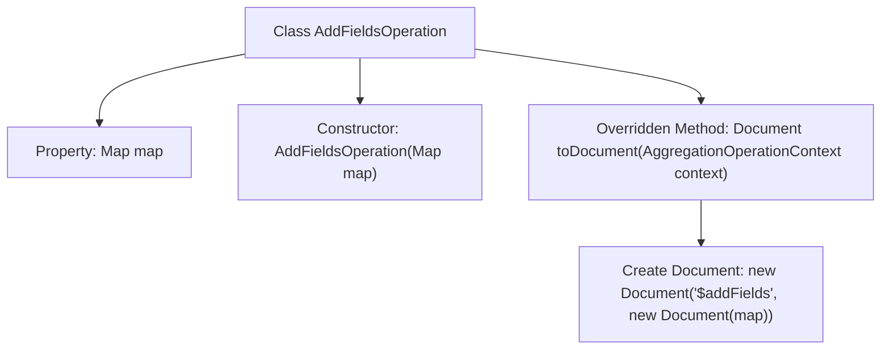

# Basic Information

|      |      |
|------|------|
| Name | AddFieldsOperation |
| Language | .java |
| Code Path | WeFe/common/java/common-data-mongodb/src/main/java/com/welab/wefe/common/data/mongodb/util/AddFieldsOperation.java |
| Package Name | com.welab.wefe.common.data.mongodb.util |
| Dependencies | ['org.bson.Document', 'org.springframework.data.mongodb.core.aggregation.AggregationOperation', 'org.springframework.data.mongodb.core.aggregation.AggregationOperationContext', 'java.util.Map'] |
| Brief Description | The AddFieldsOperation class implements the AggregationOperation interface, accepts a Map parameter through its constructor, and generates a MongoDB aggregation document containing the $addFields operation in the toDocument method. |

# Description

This is a class named AddFieldsOperation that implements the AggregationOperation interface. The class is used to add new fields in aggregation operations. It contains a member variable called "map" of type Map, which stores field names and their corresponding values. The constructor takes a Map parameter and initializes the member variable. The overridden toDocument method converts the map into the Document format required by the MongoDB aggregation pipeline operator $addFields, ultimately returning a Document object containing the $addFields operation and the corresponding field mappings.

# Class Summary

| Name   | Type  | Description |
|-------|------|-------------|
| AddFieldsOperation | class | The AddFieldsOperation class implements the AggregationOperation interface, accepts a Map parameter through its constructor, and the toDocument method returns a MongoDB document containing the $addFields operation. |


## Class AddFieldsOperation

|      |      |
|------|------|
| Access Modifier | public |
| Type | class |
| Name | AddFieldsOperation |
| Description | The AddFieldsOperation class implements the AggregationOperation interface, accepts a Map parameter through its constructor, and the toDocument method returns a MongoDB document containing the $addFields operation. |


### UML Class Diagram

```mermaid
classDiagram
    class AddFieldsOperation {
        -Map~String, Object~ map
        +AddFieldsOperation(Map~String, Object~ map)
        +Document toDocument(AggregationOperationContext aggregationOperationContext)
    }

    <<Interface>> AggregationOperation {
        +Document toDocument(AggregationOperationContext aggregationOperationContext)
    }

    AddFieldsOperation ..|> AggregationOperation : implements
```

This class diagram illustrates the structure where the AddFieldsOperation class implements the AggregationOperation interface. AddFieldsOperation contains a private Map-type field named map, initialized via a constructor, and implements the toDocument method required by the interface. The method takes an AggregationOperationContext parameter and returns a Document object. The implementation relationship between the class and interface is denoted by a solid line with a hollow triangle arrowhead, conforming to UML standards.


### Internal Method Call Graph



This code flowchart illustrates the structure of the AddFieldsOperation class, which implements the AggregationOperation interface and is primarily used to add new fields in aggregation operations. The class contains a Map-type property 'map', initialized through its constructor, and overrides the toDocument method. This method creates a MongoDB document object containing the "$addFields" operator and map data. The entire process clearly reflects the workflow from class construction to generating aggregation operation documents.

### Field List

| Name  | Type  | Description |
|-------|-------|------|
| map | Map<String, Object> | Declare a private variable named map, of type Map, with String keys and Object values. |

### Method List

| Name  | Type  | Description |
|-------|-------|------|
| toDocument | Document | Overriding Java methods to convert a map into a MongoDB $addFields operation document. |


