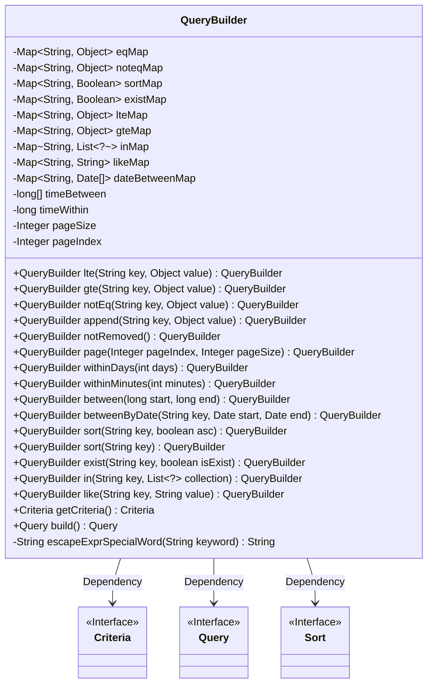
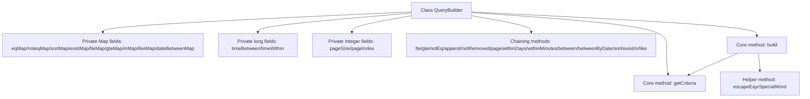

# Basic Information

|      |      |
|------|------|
| Name | QueryBuilder |
| Language | .java |
| Code Path | WeFe/common/java/common-data-mongodb/src/main/java/com/welab/wefe/common/data/mongodb/util/QueryBuilder.java |
| Package Name | com.welab.wefe.common.data.mongodb.util |
| Dependencies | ['org.apache.commons.lang3.StringUtils', 'org.springframework.data.domain.Sort', 'org.springframework.data.mongodb.core.query.Criteria', 'org.springframework.data.mongodb.core.query.Query', 'java.util'] |
| Brief Description | The QueryBuilder class is used to construct query conditions, supporting operations such as equality, inequality, range, sorting, and pagination, ultimately generating Criteria and Query objects. |

# Description

QueryBuilder is a utility class for constructing query conditions, supporting various query operators as well as pagination and sorting functionalities. It includes multiple Maps for storing different types of query conditions, such as equal to, not equal to, greater than or equal to, less than or equal to, existence checks, fuzzy matching, range queries, etc. The class provides method chaining capabilities, including lte, gte, notEq, append, sort, exist, in, like, etc., for setting query conditions. It also supports time range queries and pagination functionality through the page method to set the page number and size per page. The final query conditions are generated via the getCriteria method, while the build method constructs the complete query object. Additionally, it includes a helper method escapeExprSpecialWord for escaping special characters.

# Class Summary

| Name   | Type  | Description |
|-------|------|-------------|
| QueryBuilder | class | The QueryBuilder class is used to construct query conditions, supporting operations such as equals, not equals, range, sorting, pagination, etc., ultimately generating Criteria and Query objects. |

## Class QueryBuilder

|      |      |
|------|------|
| Access Modifier | public |
| Type | class |
| Name | QueryBuilder |
| Description | The QueryBuilder class is used to construct query conditions, supporting operations such as equals, not equals, range, sorting, pagination, etc., ultimately generating Criteria and Query objects. |

### UML Class Diagram

This code defines a `QueryBuilder` class for constructing complex query conditions. The class stores various types of query conditions (such as equal, not equal, range, sorting, etc.) through multiple Maps and provides chainable methods to add these conditions. Ultimately, these conditions are converted into a `Criteria` object and built into a `Query` object for return. The class diagram illustrates the main member variables and methods of `QueryBuilder`, as well as its dependency relationships with the `Criteria`, `Query`, and `Sort` interfaces.

### Internal Method Call Graph

This flowchart illustrates the complete structure of the QueryBuilder class, which includes 9 different types of Map fields for storing query conditions, 2 time-related long fields, and 2 pagination control fields. Through 15 chaining methods, query conditions are constructed, and the Query object is ultimately generated via the build method. This process relies on the getCriteria method to formulate query criteria and calls escapeExprSpecialWord to handle special characters. All methods return "this" to enable method chaining, supporting various conditional combination queries as well as pagination and sorting functionalities.

### Field List

| Name  | Type  | Description |
|-------|-------|------|
| sortMap = new LinkedHashMap<>() | Map<String, Boolean> | Define an ordered map variable `sortMap` with keys of type string and values of type boolean. |
| pageIndex | Integer | The private integer variable pageIndex is used to represent the page number index. |
| inMap = new LinkedHashMap<>() | Map<String, List<?>> | Define a private LinkedHashMap variable named inMap, with String as the key type and a generic List as the value type. |
| dateBetweenMap = new LinkedHashMap<>() | Map<String, Date[]> | The private variable `dateBetweenMap` uses a `LinkedHashMap` to store mappings of string keys to date array values. |
| timeBetween = new long[2] | long[] | Declare a long-type array timeBetween with a length of 2, used to store two time interval values. |
| timeWithin | long | Private long integer variable, recording the time interval. |
| existMap = new LinkedHashMap<>() | Map<String, Boolean> | The private LinkedHashMap variable existMap has String as the key and Boolean as the value. |
| lteMap = new LinkedHashMap<>() | Map<String, Object> | Declare a private variable named lteMap of type LinkedHashMap with String as the key and Object as the value. |
| pageSize | Integer | Private integer variable used to define the page size. |
| gteMap = new LinkedHashMap<>() | Map<String, Object> | Create an ordered key-value map where the keys are strings and the values are objects. |
| likeMap = new LinkedHashMap<>() | Map<String, String> | Declare an ordered key-value pair collection `likeMap` with both key and value types as `String`. |
| eqMap = new LinkedHashMap<>() | Map<String, Object> | Private LinkedHashMap variable eqMap with String keys and Object values. |
| noteqMap = new LinkedHashMap<>() | Map<String, Object> | Define an ordered key-value mapping `noteqMap`, where the keys are strings and the values are objects. |

### Method List

| Name  | Type  | Description |
|-------|-------|------|
| betweenByDate | QueryBuilder | This method is used to construct a date range query. It accepts a key name, start date, and end date, stores the date pair in a mapping, and returns the current builder instance. |
| gte | QueryBuilder | The method `gte` in `QueryBuilder` stores the key-value pair into `gteMap` and returns the current instance. |
| exist | QueryBuilder | This method adds an `exist` method to the `QueryBuilder` class, which accepts a key name and a boolean parameter, stores them in the `existMap`, and returns the current object instance. |
| withinMinutes | QueryBuilder | The method `withinMinutes` sets the query time range to the specified number of minutes before the current time and returns a `QueryBuilder` instance to enable method chaining. |
| notEq | QueryBuilder | This method is the not-equal condition builder for the QueryBuilder class, which accepts key-value pair parameters and stores them in the noteqMap, returning the current object to support method chaining. |
| sort | QueryBuilder | This is a Java method that sorts query results by specified keys, ascending by default. |
| lte | QueryBuilder | This is a method of the QueryBuilder class, used to add a less-than-or-equal condition to the query. The method accepts key-value pair parameters, stores them in the lteMap, and returns the current object instance to support method chaining. |
| sort | QueryBuilder | This method adds a sorting rule to the query builder, where the parameter `key` specifies the sorting field and `asc` controls ascending or descending order. It returns the current object to support method chaining. |
| withinDays | QueryBuilder | The method `withinDays` sets the query time range to the current time minus the specified number of days, returning a `QueryBuilder` instance for method chaining. |
| between | QueryBuilder | This method sets the time range, accepts start and end time parameters, updates the internal array, and returns the current object instance. |
| like | QueryBuilder | This method adds a LIKE condition to the QueryBuilder class, accepting key-value pair parameters and storing them in the likeMap, then returns the current object to support method chaining. |
| getCriteria | Criteria | This method constructs and returns a Criteria object by iterating through multiple Maps (eqMap, existMap, etc.) to set various conditions, including equals, exists, not equals, range, fuzzy matching, etc. It handles null values and special cases for strings, ultimately returning the combined query conditions. |
| build | Query | Construct a query object that includes conditions, sorting, and pagination logic. The default page size is 10, and it supports ascending and descending order sorting. |
| escapeExprSpecialWord | String | This function is used to escape special regex characters in a string by adding a backslash when encountered. Supported escape characters include \, $, (), *, +, ., [], ?, ^, {}, |, etc. If the input is non-empty, it processes and returns the result. |
| notRemoved | QueryBuilder | This method adds a condition to the QueryBuilder to filter records with a status of 0 (not removed) and returns the current object to support method chaining. |
| append | QueryBuilder | The method `append` receives key-value pairs, stores them in `eqMap`, and returns the current `QueryBuilder` instance, supporting chained calls. |
| in | QueryBuilder | This is a Java method named `in`, belonging to the `QueryBuilder` class. It takes a string `key` and a generic list `collection` as parameters, stores `key` and `collection` in `inMap`, and returns the current `QueryBuilder` instance to support method chaining. |
| page | QueryBuilder | Define the pagination method, set the page number and page size, default empty or negative page numbers to 0, and return the current object. |

