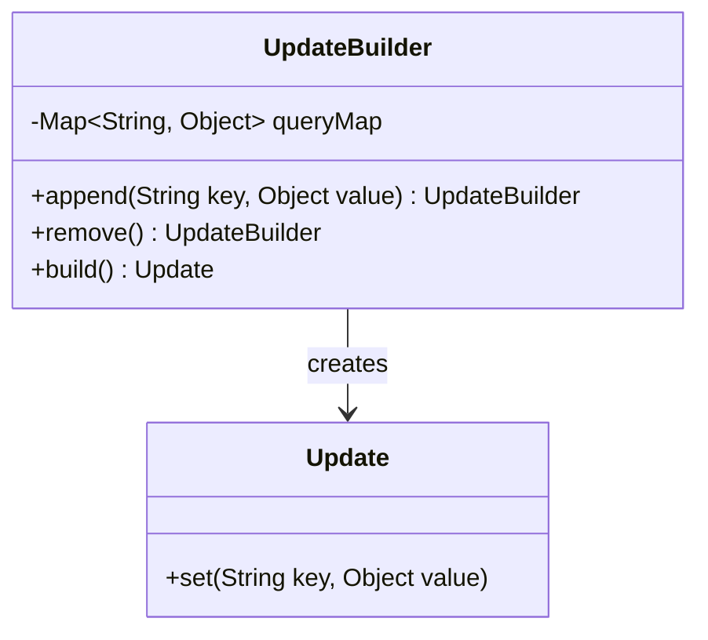
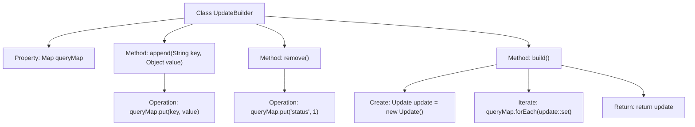

# Basic Information

|      |      |
|------|------|
| Name | UpdateBuilder |
| Language | .java |
| Code Path | WeFe/common/java/common-data-mongodb/src/main/java/com/welab/wefe/common/data/mongodb/util/UpdateBuilder.java |
| Package Name | com.welab.wefe.common.data.mongodb.util |
| Dependencies | ['org.springframework.data.mongodb.core.query.Update', 'java.util.HashMap', 'java.util.Map'] |
| Brief Description | The UpdateBuilder class is used to construct update operations. It adds key-value pairs via the append method, sets the state to 1 with the remove method, and generates and returns an Update object through the build method. |

# Description

The UpdateBuilder is a class designed for constructing update operations, which internally maintains a queryMap to store key-value pairs. It provides an append method to add key-value pairs, a remove method to set the state to 1, and a build method to convert the contents of the queryMap into an Update object and return it. It adopts a chaining call design, supporting continuous operations.

# Class Summary

| Name   | Type  | Description |
|-------|------|-------------|
| UpdateBuilder | class | The UpdateBuilder class is used to construct update operations. It adds key-value pairs via the append method, sets the state to 1 with the remove method, and generates and returns an Update object through the build method. |

## Class UpdateBuilder

|      |      |
|------|------|
| Access Modifier | public |
| Type | class |
| Name | UpdateBuilder |
| Description | The UpdateBuilder class is used to construct update operations. It adds key-value pairs via the append method, sets the state to 1 with the remove method, and generates and returns an Update object through the build method. |

### UML Class Diagram

This class diagram illustrates the relationship between the `UpdateBuilder` and `Update` classes. `UpdateBuilder` is an implementation of the builder pattern, containing a private `Map`-type member `queryMap` to store key-value pairs. It provides `append()` and `remove()` methods to modify its state and creates an `Update` object via the `build()` method. The `Update` class receives data from the builder through its `set()` method. This design achieves separation between object construction and representation, supports method chaining, and is suitable for scenarios requiring step-by-step construction of complex objects.

### Internal Method Call Graph

This flowchart illustrates the structure and workflow of the UpdateBuilder class. The class implements update operation construction through chained calls, with its core functionality relying on an internal Map to store key-value pairs. The append method adds regular fields, the remove method marks deletion status, and the build method ultimately transfers the Map contents to an Update object. The flowchart clearly presents the complete process from field addition to final Update object construction, embodying the core concept of the Builder pattern.

### Field List

| Name  | Type  | Description |
|-------|-------|------|
| queryMap = new HashMap<>() | Map<String, Object> | Define a private HashMap variable named queryMap, with keys of type String and values of type Object. |

### Method List

| Name  | Type  | Description |
|-------|-------|------|
| append | UpdateBuilder | The method `append` takes key-value pairs, stores them in `queryMap`, and returns the current `UpdateBuilder` instance, supporting chained calls. |
| remove | UpdateBuilder | The remove method of UpdateBuilder sets the status to 1 and returns its own instance. |
| build | Update | This method creates an Update object, iterates through the queryMap and sets the key-value pairs into the update, finally returning the update object. |

