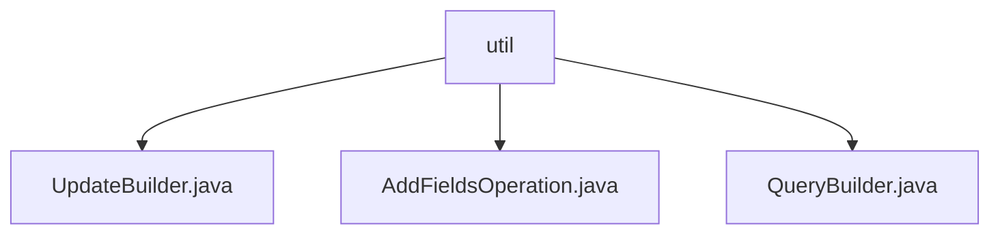

# Basic Information

|      |      |
|------|------|
| Name | util |
| Language | .java |
| Code Path | WeFe/common/java/common-data-mongodb/src/main/java/com/welab/wefe/common/data/mongodb/util |
| Package Name | docs.common.java.common-data-mongodb.src.main.java.com.welab.wefe.common.data.mongodb.util |
| Brief Description | The UpdateBuilder class is used to construct update operations and supports chained calls. The AddFieldsOperation class implements aggregation operations to add new fields. The QueryBuilder class builds query conditions, supporting various operators as well as pagination and sorting. |

# Description

## Overview  
This module is a toolkit for MongoDB operations, with its core responsibilities being constructing query conditions, update operations, and adding aggregation fields. The interface specification adopts a chainable design, such as UpdateBuilder supporting append/remove/build operations, and QueryBuilder providing condition combinations like lte/gte. Key data structures include the multi-condition Map of QueryBuilder, the queryMap of UpdateBuilder, and the field mapping Map of AddFieldsOperation. The only external dependency is the MongoDB Java driver. For example, AddFieldsOperation converts a Map into the $addFields pipeline format.  

## Primary Business Scenarios  
The module supports complex query construction (e.g., range filtering + pagination), dynamic field updates (similar to an event bus pattern), and field injection in aggregation stages. Typical applications include: using QueryBuilder to combine multi-condition queries with pagination; chaining field update states via UpdateBuilder; adding computed fields in aggregation pipelines with AddFieldsOperation. API types cover CRUD operations, such as escapeExprSpecialWord handling special character escaping.

### Package Internal Structure View

This flowchart illustrates the class structure relationships within the util package of the common-data-mongodb module in the WeFe project. The parent node "util" contains three child nodes: UpdateBuilder, AddFieldsOperation, and QueryBuilder. These three class files belong to MongoDB database operation utility classes, designed for constructing update operations, add fields operations, and query operations respectively. This structure clearly reflects the functional division of MongoDB utility classes.

# File List

| Name   | Type  | Description |
|-------|------|-------------|
| [UpdateBuilder.java](UpdateBuilder.md) | file | The UpdateBuilder class is used to construct update operations. It adds key-value pairs via the append method, sets the state to 1 with the remove method, and generates and returns an Update object through the build method. |
| [AddFieldsOperation.java](AddFieldsOperation.md) | file | The `AddFieldsOperation` class implements the `AggregationOperation` interface, accepts a `Map` parameter through its constructor, and generates a MongoDB aggregation document containing the `$addFields` operation in the `toDocument` method. |
| [QueryBuilder.java](QueryBuilder.md) | file | The QueryBuilder class is used to construct query conditions, supporting operations such as equals, not equals, range, sorting, and pagination, ultimately generating Criteria and Query objects. |

