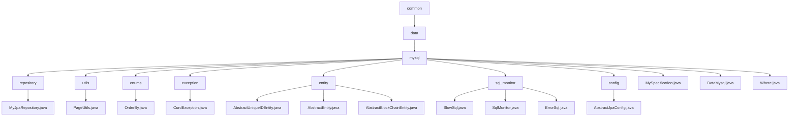

# Basic Information

|      |      |
|------|------|
| Name | common |
| Language | .java |
| Code Path | WeFe/common/java/common-data-mysql/src/main/java/com/welab/wefe/common |
| Package Name | docs.common.java.common-data-mysql.src.main.java.com.welab.wefe.common |
| Brief Description | MyJpaRepository provides default methods for pagination queries and string processing. PageUtils handles pagination for single objects. The OrderBy enum defines sorting directions. CurdException is a custom exception. The entity class inheritance system manages common fields. The SQL monitoring module captures slow SQL and errors. The abstract JPA configuration class creates entity manager factories and data sources. MySpecification implements dynamic query condition construction. DataMysql is the base class for database operations. The Where class chains to build query conditions. |

# Description

## Overview  
This module is a MySQL data access layer implemented around JPA, with its core responsibility being to provide standardized CRUD operations and dynamic query capabilities. The interface specification consists of three layers: the base repository interface (MyJpaRepository extending native JPA interfaces), the condition builder (Where/MySpecification), and the pagination utility (PageUtils). Key data structures include the pagination object (Pageable), sorting enumeration (OrderBy), and condition items (Where.Item). External dependencies are limited to JPA and the Druid data source. For example, MyJpaRepository automatically handles pagination parameter validation through the getPageable method.  

The module also implements SQL monitoring (similar to AOP aspects) and an entity base class inheritance hierarchy. SQL monitoring captures slow queries (threshold: 100ms) and erroneous SQL, recording statistical information via SlowSql/ErrorSql. Entity base classes (e.g., AbstractUniqueIDEntity) provide globally unique IDs (UUID) and timestamp management. For instance, AbstractBlockChainEntity extends log time fields to support blockchain scenarios.  

## Key Business Scenarios  
The module is suitable for scenarios requiring dynamic queries and standardized data management, akin to an enhanced version of Spring Data JPA. A typical workflow involves: constructing conditions through Where chaining (e.g., contains for fuzzy matching), generating dynamic Predicates with MySpecification, and executing paginated queries (e.g., getPageableForAtQuery) via MyJpaRepository. The interaction pattern uniformly combines conditions through method chaining, such as Where.equal().groupBy().build().  

SQL monitoring implements end-to-end tracing through FilterEventAdapter, with business processes including: timing before execution, and updating statistics upon detecting slow queries/failures. The entity inheritance hierarchy supports rapid extension, such as blockchain entities inheriting from AbstractBlockChainEntity to automatically acquire log time fields. It fully covers closed-loop requirements from condition building (supporting 10+ operators) to paginated queries and monitoring analysis. For example, PageUtils uniformly handles single-object pagination, while CurdException encapsulates business exceptions.

### Package Internal Structure View

This flowchart illustrates the hierarchical structure of the common-data-mysql module in the WeFe project. Starting from the root directory 'common', it expands to subdirectories 'data' and 'mysql', then further branches into submodules such as 'repository', 'utils', and 'enums'. Each submodule contains corresponding Java class files, e.g., 'repository' includes MyJpaRepository.java, 'utils' includes PageUtils.java, etc. The overall structure clearly reflects the component classification of the MySQL data access layer, encompassing foundational utilities, exception handling, entity definitions, and SQL monitoring functional modules.

# File List

| Name   | Type  | Description |
|-------|------|-------------|
| [data](data/_module.md) | package | MyJpaRepository provides default methods for pagination queries and string processing. PageUtils handles pagination for single objects. The OrderBy enum defines sorting directions. CurdException is a custom exception. The entity class inheritance system manages common fields. The SQL monitoring module captures slow SQL and errors. The abstract JPA configuration class creates entity manager factories and data sources. MySpecification implements dynamic query condition construction. DataMysql is the base class for database operations. The Where class builds query conditions in a chainable manner. |

