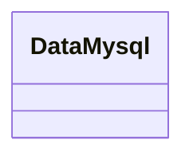
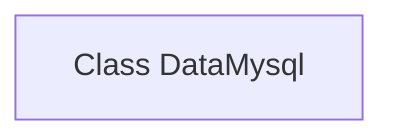

# Basic Information

|      |      |
|------|------|
| Name | DataMysql |
| Language | .java |
| Code Path | WeFe/common/java/common-data-mysql/src/main/java/com/welab/wefe/common/data/mysql/DataMysql.java |
| Package Name | com.welab.wefe.common.data.mysql |
| Dependencies | [] |
| Brief Description | The class DataMysql is used for handling MySQL database operations. |

# Description

This is a Java public class definition named DataMysql, which represents a data operation class related to MySQL databases. The class is currently an empty implementation, containing no member variables or methods, but provides a foundational framework structure for future extensions such as MySQL database connections, queries, updates, and other operations. As a component of the data access layer, this class is typically invoked by other business logic classes to achieve database interaction functionality.

# Class Summary

| Name   | Type  | Description |
|-------|------|-------------|
| DataMysql | class | The class DataMysql is used for handling MySQL database operations. |

## Class DataMysql

|      |      |
|------|------|
| Access Modifier | public |
| Type | class |
| Name | DataMysql |
| Description | The class DataMysql is used for handling MySQL database operations. |

### UML Class Diagram

This code defines an empty class named DataMysql, which currently contains no attributes or methods. Judging from the class name, it may be related to MySQL database operations, but the current implementation is merely a framework structure without reflecting specific functionalities. Subsequent development may require adding member methods such as database connection and query execution, as well as attributes like connection parameters, to achieve complete data access functionality.

### Internal Method Call Graph

This flowchart depicts an empty class structure named DataMysql. The diagram contains only a single node representing the class declaration, without displaying any attributes or methods since no class members were defined in the original code. The diagram accurately reflects the current state of the code—an empty class framework that has not yet implemented any functionality, providing a foundational structure for adding database operations in the future.

### Field List

| Name  | Type  | Description |
|-------|-------|------|

### Method List

| Name  | Type  | Description |
|-------|-------|------|

