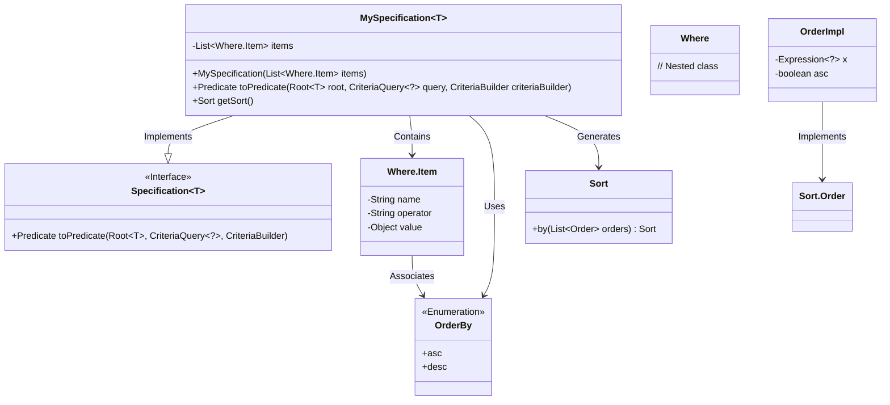
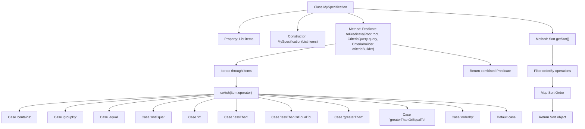

# Basic Information

|      |      |
|------|------|
| Name | MySpecification |
| Language | .java |
| Code Path | WeFe/common/java/common-data-mysql/src/main/java/com/welab/wefe/common/data/mysql/MySpecification.java |
| Package Name | com.welab.wefe.common.data.mysql |
| Dependencies | ['com.welab.wefe.common.data.mysql.enums.OrderBy', 'org.hibernate.query.criteria.internal.OrderImpl', 'org.springframework.data.domain.Sort', 'org.springframework.data.jpa.domain.Specification', 'javax.persistence.criteria', 'java.util.ArrayList', 'java.util.Date', 'java.util.List', 'java.util.stream.Collectors'] |
| Brief Description | The MySpecification class implements the Specification interface, dynamically generating query conditions based on the items list. It supports operations such as inclusion, grouping, equality, inequality, range, sorting, and converts them into JPA Predicate. |

# Description

The code defines a generic class `MySpecification` that implements the `Specification` interface, designed for constructing dynamic query conditions. The class contains a list of `Where.Item` initialized via its constructor. The core logic resides in the `toPredicate` method, which generates corresponding query conditions based on different operators (e.g., `contains`, `equal`, `notEqual`, `in`, `lessThan`, `greaterThan`, etc.), supporting functionalities like string fuzzy matching, grouping, and sorting. The `getSort` method extracts sorting information and creates a `Sort` object. Overall, it enables flexible condition combination and sorting capabilities.

# Class Summary

| Name   | Type  | Description |
|-------|------|-------------|
| MySpecification | class | The MySpecification class implements the JPA Specification interface, supporting various query conditions (including containment, equality, grouping, sorting, etc.). It constructs dynamic query predicates through the toPredicate method, and the getSort method returns sorting rules. |

## Class MySpecification

|      |      |
|------|------|
| Access Modifier | public |
| Type | class |
| Name | MySpecification |
| Description | The MySpecification class implements the JPA Specification interface, supporting various query conditions (including containment, equality, grouping, sorting, etc.). It constructs dynamic query predicates through the toPredicate method, and the getSort method returns sorting rules. |

### UML Class Diagram

This class diagram illustrates the core structure of the generic `MySpecification` class implementing the `Specification` interface. The class stores query conditions via a `Where.Item` list, dynamically constructs JPA predicates in the `toPredicate` method based on operator types (e.g., contains/equal/in), and supports grouping (groupBy) and sorting (orderBy) functionalities. The `getSort` method specifically handles sorting logic by converting conditions into Spring Data's `Sort` object. The overall design enables flexible conditional query composition while maintaining compatibility with JPA specifications and Spring Data.

### Internal Method Call Graph

This code implements a generic JPA Specification class for dynamically building query conditions. Key features include: 1) Processing various query operators (e.g., contains/equal/in) via the toPredicate method to construct corresponding Predicate combinations; 2) Extracting sorting conditions through the getSort method to generate Sort objects. The flowchart clearly illustrates the class structure, core method logic, and operator processing branches, particularly showcasing the handling flow for 12 different query operators. This design supports flexible condition combinations and is suitable for complex query scenarios.

### Field List

| Name  | Type  | Description |
|-------|-------|------|
| items = new ArrayList<>() | List<Where.Item> | Declare a private list variable named items to store objects of type Where.Item, initialized as an empty ArrayList. |

### Method List

| Name  | Type  | Description |
|-------|-------|------|
| toPredicate | Predicate | The code implements a dynamic conditional query builder that supports operations such as inclusion, grouping, equality, inequality, range, sorting, etc., and ultimately returns a combined conditional predicate. |
| getSort | Sort | This method filters out items with the operator "orderBy" through stream processing, generates ascending or descending sort objects based on enumeration values, and ultimately returns a Sort instance containing all sorting conditions. |

