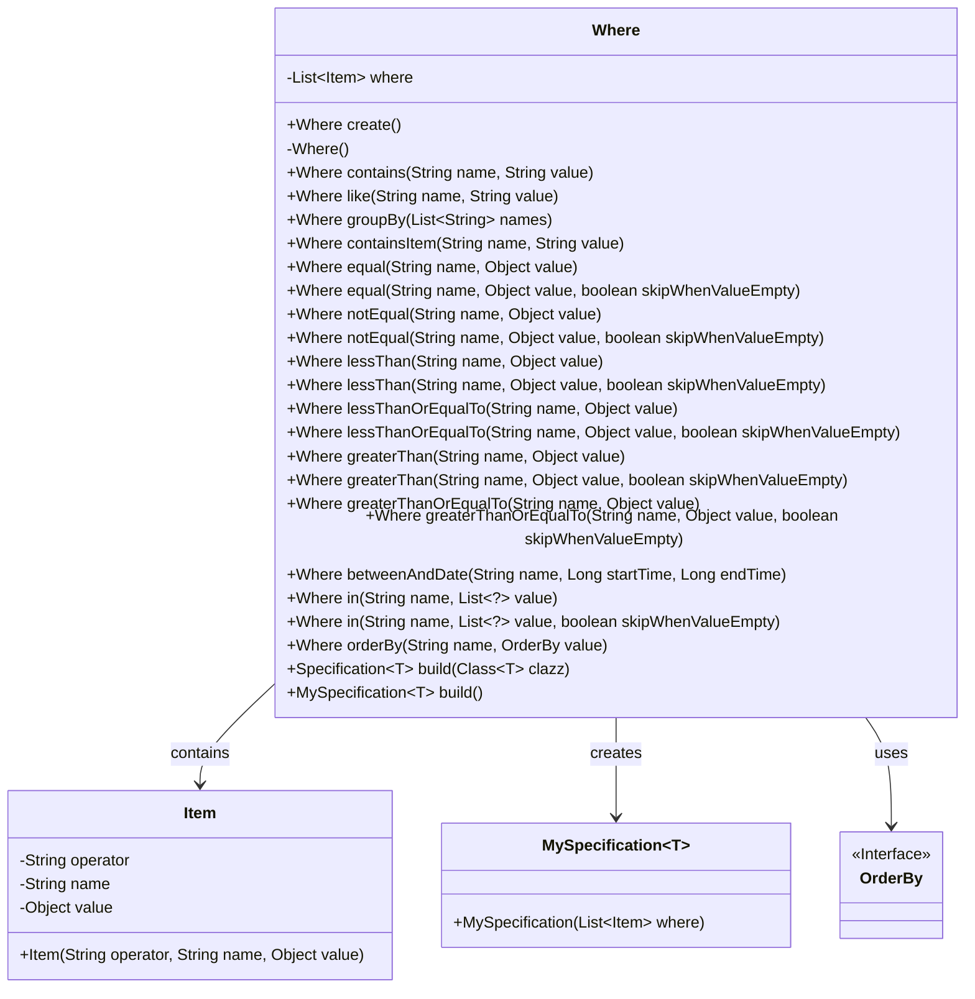

# Basic Information

|      |      |
|------|------|
| Name | Where |
| Language | .java |
| Code Path | WeFe/common/java/common-data-mysql/src/main/java/com/welab/wefe/common/data/mysql/Where.java |
| Package Name | com.welab.wefe.common.data.mysql |
| Dependencies | ['com.welab.wefe.common.data.mysql.enums.OrderBy', 'com.welab.wefe.common.util.StringUtil', 'org.springframework.data.jpa.domain.Specification', 'java.util.ArrayList', 'java.util.Date', 'java.util.List'] |
| Brief Description | The Where class is used to construct SQL conditional queries, supporting operations such as inclusion, equality, inequality, greater than, less than, grouping, and sorting, while automatically skipping null value conditions. |

# Description

The Where class is a utility class for constructing query conditions, providing method chaining to concatenate SQL conditions. Its main functionalities include creating conditions for containment, fuzzy matching, equality, inequality, less than, less than or equal to, greater than, greater than or equal to, date ranges, grouping, sorting, and more. It supports null-value skipping logic, stores conditions in an internal list, and ultimately generates a Specification object through the build method. The Item inner class encapsulates the operator, field name, and value.

# Class Summary

| Name   | Type  | Description |
|-------|------|-------------|
| Where | class | The Where class is used to construct dynamic SQL conditions, supporting operations such as inclusion, equality, inequality, greater than, less than, grouping, and sorting. It automatically skips null values and ultimately generates a Specification object. |

## Class Where

|      |      |
|------|------|
| Access Modifier | public |
| Type | class |
| Name | Where |
| Description | The Where class is used to construct dynamic SQL conditions, supporting operations such as inclusion, equality, inequality, greater than, less than, grouping, and sorting. It automatically skips null values and ultimately generates a Specification object. |

### UML Class Diagram

This code defines a `Where` class for constructing SQL query conditions. It uses method chaining (such as `equal`, `like`, `in`, etc.) to add various query criteria, which are stored in a list of `Item` objects. The `Where` class can generate `MySpecification` objects for final query construction. The class supports conditional skipping (when values are empty), multiple comparison operations, and sorting functionality, making it a flexible query condition builder.

### Internal Method Call Graph

```mermaid
graph TD
    A["Class Where"]
    B["Static method: create()"]
    C["Private property: List<Item> where"]
    D["Private constructor: Where()"]
    E["Method: contains(String name, String value)"]
    F["Method: like(String name, String value)"]
    G["Method: groupBy(List<String> names)"]
    H["Method: containsItem(String name, String value)"]
    I["Method: equal(String name, Object value)"]
    J["Method: notEqual(String name, Object value)"]
    K["Method: lessThan(String name, Object value)"]
    L["Method: lessThanOrEqualTo(String name, Object value)"]
    M["Method: greaterThan(String name, Object value)"]
    N["Method: greaterThanOrEqualTo(String name, Object value)"]
    O["Method: betweenAndDate(String name, Long startTime, Long endTime)"]
    P["Method: in(String name, List<?> value)"]
    Q["Method: orderBy(String name, OrderBy value)"]
    R["Method: build()"]
    S["Nested class: Item"]

    A --> B
    A --> C
    A --> D
    A --> E
    A --> F
    A --> G
    A --> H
    A --> I
    A --> J
    A --> K
    A --> L
    A --> M
    A --> N
    A --> O
    A --> P
    A --> Q
    A --> R
    A --> S
```

This code defines a Where class for constructing SQL query conditions. It provides various methods to add different types of query conditions (such as equal, like, in, etc.) and supports null checks for condition values. All conditions are stored in a list of Item objects, and the final Specification object can be generated via the build method. The class is designed using the Builder pattern, supports method chaining, and includes a nested Item class to store information about individual query conditions.

### Field List

| Name  | Type  | Description |
|-------|-------|------|
| where = new ArrayList<>() | List<Item> | Declare a private list variable named where to store Item objects, initialized as an empty ArrayList. |

### Method List

| Name  | Type  | Description |
|-------|-------|------|
| lessThan | Where | This is a Java method named `lessThan`, used to add a less-than condition to the query criteria. If `skipWhenValueEmpty` is true and the `value` is null or an empty string, the condition is skipped. Otherwise, the condition is added to the where list. The method returns the current object to support method chaining. |
| equal | Where | This method adds an equality condition item to the where list when the conditions are met. If skipWhenValueEmpty is true and the value is empty or an empty string, it skips the addition and directly returns the current object. |
| lessThanOrEqualTo | Where | The method `lessThanOrEqualTo` is used to add a condition: if `value` is not null and not an empty string, it adds the condition where the field `name` is less than or equal to `value` to the query. The parameter `skipWhenValueEmpty` controls whether to skip empty values. |
| lessThanOrEqualTo | Where | The method `lessThanOrEqualTo` accepts name and value parameters, invokes the method of the same name with the third parameter defaulting to true, and returns a Where object. |
| greaterThanOrEqualTo | Where | The method `greaterThanOrEqualTo` is used to add a greater-than-or-equal-to condition to the query. If `skipWhenValueEmpty` is true and the value is empty or an empty string, it will be skipped. Otherwise, the condition is added to the query list and the current object is returned. |
| groupBy | Where | The method `groupBy` accepts a list of strings `names`. If `names` is empty, it skips the operation; otherwise, it adds the grouping condition to `where` and returns the current object. |
| in | Where | The method `in` accepts a list of names and values, invokes the overloaded method, and enables the condition by default. |
| betweenAndDate | Where | The method `betweenAndDate` filters data based on a time range: if `startTime` is valid, it selects records with dates greater than or equal to it; if `endTime` is valid, it selects records with dates less than or equal to it, and finally returns the current object. |
| equal | Where | This is a public method named equal, which takes a string name and an object value as parameters, calls another equal method, and passes a third parameter true. |
| like | Where | The method `like` is used for conditional queries. When the value is not empty, it adds the `name` and `value` to the where collection as a like condition and returns the current object. |
| containsItem | Where | The method `containsItem` checks that `value` is not null, then adds an `Item` condition with the specified `name` and `value` to `where`, and returns the current object. |
| create | Where | This is a static factory method used to create and return a new instance of the Where class. The method is named create and takes no parameters. |
| notEqual | Where | The method `notEqual` is used to add a not-equal condition to the query. If `skipWhenValueEmpty` is true and the value is empty or an empty string, it will be skipped. Otherwise, the condition is added to the where list. Returns the current object to support method chaining. |
| greaterThanOrEqualTo | Where | The method `greaterThanOrEqualTo` takes name and value parameters, calls the method of the same name, and passes a third parameter `true`. |
| greaterThan | Where | The method `greaterThan` takes name and value parameters, calls the method of the same name, and enables condition checking by default. |
| lessThan | Where | The method `lessThan` accepts name and value parameters, invokes the overloaded method `lessThan`, and passes `true` as the third parameter. |
| notEqual | Where | The method `notEqual` takes name and value parameters, invokes the overloaded method, and enables condition checking by default. |
| contains | Where | The method `contains` checks that the value is not null, then adds the inclusion condition to the where list and returns the current object. |
| greaterThan | Where | The method `greaterThan` adds a greater-than condition when the criteria are met; otherwise, it returns itself. Parameters include the field name, value, and a flag indicating whether to skip null values. |
| in | Where | The method `in` is used to construct query conditions: if `skipWhenValueEmpty` is true and `value` is empty or an empty list, it will be skipped; otherwise, `name` and `value` will be added to the condition list with the "in" operator. Returns the current object to support chained calls. |
| orderBy | Where | This is a Java method used to add sorting criteria. If the sorting value is null, it returns the current object; otherwise, it adds the sorting field name and method to the where condition and returns the current object. |
| build | Specification<T> | This is a generic method used to construct a Specification object, which accepts a Class type parameter and returns Specification<T>. The method internally calls the parameterless build() for implementation. |
| build | MySpecification<T> | Construct a method that returns a MySpecification object with conditions. |

