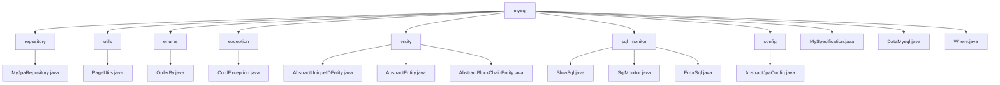

# Basic Information

|      |      |
|------|------|
| Name | mysql |
| Language | .java |
| Code Path | WeFe/common/java/common-data-mysql/src/main/java/com/welab/wefe/common/data/mysql |
| Package Name | docs.common.java.common-data-mysql.src.main.java.com.welab.wefe.common.data.mysql |
| Brief Description | MyJpaRepository provides default methods for pagination queries and string processing. PageUtils handles pagination for single objects. The OrderBy enum defines sorting directions. CurdException serves as a custom exception. The entity class inheritance system manages common fields. The SQL monitoring module captures slow SQL and errors. The abstract JPA configuration class creates an entity manager factory and data source. MySpecification implements dynamic query condition construction. DataMysql serves as the base class for database operations. The Where class builds query conditions in a chainable manner. |

# Description

## Overview  
This module is a MySQL data access layer implemented around JPA, with its core responsibility being to provide standardized CRUD operations and dynamic query capabilities. The interface specification consists of three layers: the base repository interface (MyJpaRepository extending native JPA interfaces), the condition builder (Where/MySpecification), and the pagination utility (PageUtils). Key data structures include the pagination object (Pageable), sorting enumeration (OrderBy), and condition items (Where.Item). External dependencies are limited to JPA and the Druid data source. For example, MyJpaRepository automatically handles pagination parameter validation via the getPageable method.

The module also implements SQL monitoring (similar to AOP aspects) and an entity base class inheritance hierarchy. SQL monitoring captures slow queries (threshold: 100ms) and erroneous SQL, recording statistical information through SlowSql/ErrorSql. Entity base classes (e.g., AbstractUniqueIDEntity) provide globally unique IDs (UUID) and timestamp management. For instance, AbstractBlockChainEntity extends log time fields to support blockchain scenarios.

## Key Business Scenarios  
The module is suitable for scenarios requiring dynamic queries and standardized data management, akin to an enhanced version of Spring Data JPA. A typical workflow involves: chaining conditions via Where (e.g., contains for fuzzy matching), generating dynamic Predicates with MySpecification, and executing paginated queries (e.g., getPageableForAtQuery) via MyJpaRepository. The interaction pattern uniformly combines conditions through method chaining, such as Where.equal().groupBy().build().

SQL monitoring achieves end-to-end tracing through FilterEventAdapter, with business processes including: timing before execution, and updating statistics upon detecting slow queries/failures. The entity inheritance hierarchy supports rapid extension, e.g., blockchain entities inheriting AbstractBlockChainEntity automatically gain log time fields. It fully covers closed-loop requirements from condition building (supporting 10+ operators) to paginated queries and monitoring analysis. For example, PageUtils standardizes single-object pagination, while CurdException encapsulates business exceptions.

### Package Internal Structure View

This flowchart illustrates the Java code structure of the common-data-mysql module in the WeFe project. The root node "mysql" contains 8 subdirectories and 3 standalone files, with each subdirectory housing specific implementation classes. Key functional modules include data access layer components (repository), utility classes (utils), enumerations (enums), exception handling (exception), entity classes (entity), SQL monitoring (sql_monitor), and configuration classes (config).

# File List

| Name   | Type  | Description |
|-------|------|-------------|
| [MySpecification.java](MySpecification.md) | file | The MySpecification class implements the Specification interface, dynamically generating query conditions based on the items list. It supports operations such as inclusion, grouping, equality, inequality, range, sorting, and converts them into JPA Predicate. |
| [DataMysql.java](DataMysql.md) | file | The class DataMysql is used for handling MySQL database operations. |
| [Where.java](Where.md) | file | The Where class is used to construct SQL conditional queries, supporting operations such as inclusion, equality, inequality, greater than, less than, grouping, and sorting, while automatically skipping null value conditions. |
| [config](config/_module.md) | package | The AbstractJpaConfig class provides JPA configuration, including methods for creating an entity manager factory and data source, with support for custom Druid data source filters. |
| [sql_monitor](sql_monitor/_module.md) | package | The SlowSql class records slow SQL statistics, including SQL statements and execution time, while maintaining the fastest SQL instance. The SqlMonitor class monitors SQL execution, capturing slow and failed SQLs, with configurable thresholds and limits. The ErrorSql class logs SQL error details, including error messages and capture counts. |
| [entity](entity/_module.md) | package | AbstractUniqueIDEntity is an abstract base class that inherits from AbstractEntity and uses UUID to generate primary keys. AbstractEntity includes fields for creation and update times. AbstractBlockChainEntity inherits from AbstractUniqueIDEntity and adds a logTime field to record timestamps. |
| [exception](exception/_module.md) | package | Custom exception class `CurdException`, which extends `Exception`, contains a `message` attribute and a constructor, and overrides `getMessage` to return the `message`. |
| [enums](enums/_module.md) | package | The OrderBy enumeration defines two sorting methods: ascending (asc) and descending (desc). |
| [utils](utils/_module.md) | package | The PageUtils class provides two static methods to convert a single object or Optional object into a paginated object, facilitating unified ID queries. |
| [repository](repository/_module.md) | package | Customize JPA repository interfaces to provide default methods for paginated queries and string fuzzy matching, supporting dynamic sorting and parameter validation. |

