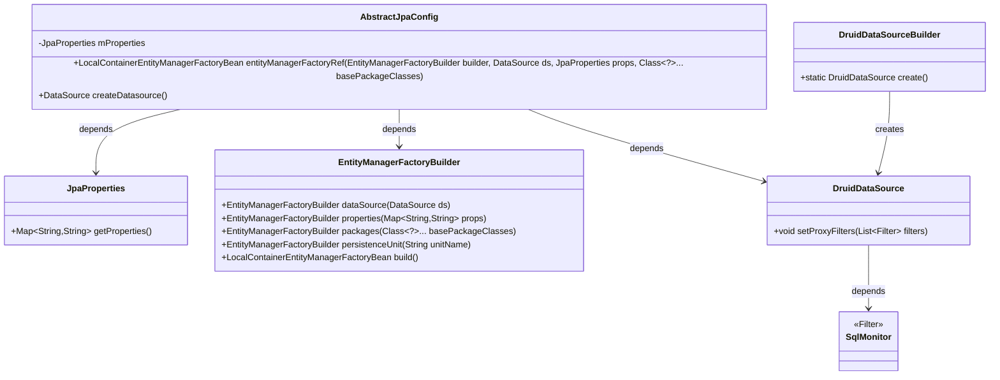
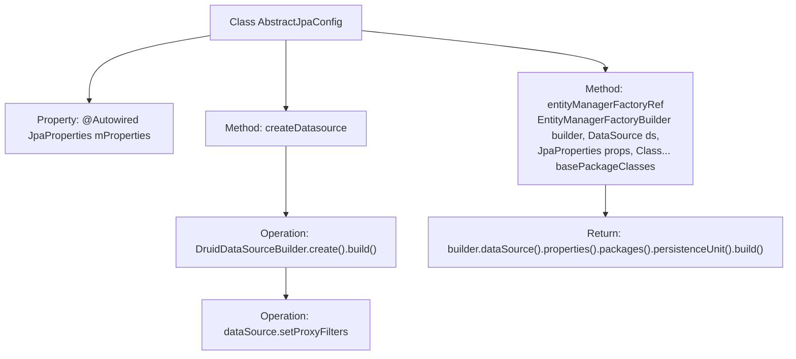

# Basic Information

|      |      |
|------|------|
| Name | AbstractJpaConfig |
| Language | .java |
| Code Path | WeFe/common/java/common-data-mysql/src/main/java/com/welab/wefe/common/data/mysql/config/AbstractJpaConfig.java |
| Package Name | com.welab.wefe.common.data.mysql.config |
| Dependencies | ['com.alibaba.druid.pool.DruidDataSource', 'com.alibaba.druid.spring.boot.autoconfigure.DruidDataSourceBuilder', 'com.welab.wefe.common.data.mysql.sql_monitor.SqlMonitor', 'org.springframework.beans.factory.annotation.Autowired', 'org.springframework.boot.autoconfigure.orm.jpa.JpaProperties', 'org.springframework.boot.orm.jpa.EntityManagerFactoryBuilder', 'org.springframework.orm.jpa.LocalContainerEntityManagerFactoryBean', 'javax.sql.DataSource', 'java.util.Collections'] |
| Brief Description | The AbstractJpaConfig class provides JPA configuration, including methods for creating entity manager factories and data sources, with support for custom Druid data source filters. |

# Description

This is an abstract JPA configuration class containing two core methods. First, the entityManagerFactoryRef method creates an entity manager factory Bean, accepting a builder, data source, JPA properties, and entity class package path as parameters. It configures the data source, properties, and persistence unit before returning. Second, the createDatasource method creates a Druid data source instance and adds an SQL monitoring filter. The class automatically injects a JPA property configuration object.

# Class Summary

| Name   | Type  | Description |
|-------|------|-------------|
| AbstractJpaConfig | class | The `AbstractJpaConfig` class contains JPA configurations, providing methods to create entity manager factories and data sources. The data source utilizes Druid with an added SQL monitoring filter. |

## Class AbstractJpaConfig

|      |      |
|------|------|
| Access Modifier | public |
| Type | class |
| Name | AbstractJpaConfig |
| Description | The `AbstractJpaConfig` class contains JPA configurations, providing methods to create entity manager factories and data sources. The data source utilizes Druid with an added SQL monitoring filter. |

### UML Class Diagram

This class diagram illustrates the core structure of AbstractJpaConfig and its dependencies. AbstractJpaConfig retrieves configuration properties via JpaProperties, utilizes EntityManagerFactoryBuilder to construct an entity manager factory, and creates a data source with SqlMonitor filters through DruidDataSourceBuilder. The diagram clearly demonstrates the collaboration between components, including key interaction flows such as configuration injection, factory pattern construction, and data source customization.

### Internal Method Call Graph

This code flowchart illustrates the structure of the AbstractJpaConfig class and its key method invocation relationships. The class contains an auto-wired JpaProperties property and two core methods: entityManagerFactoryRef for constructing a JPA entity manager factory through builder pattern configuration of data source, properties, and persistence unit; createDatasource method creates a Druid data source and adds SQL monitoring filters. The flowchart clearly presents the data source creation process (including Druid construction and filter setup) and the chained construction flow of the entity manager factory, reflecting the typical structure of a Spring Data JPA configuration class.

### Field List

| Name  | Type  | Description |
|-------|-------|------|
| mProperties | JpaProperties | Automatically inject the JpaProperties attribute object. |

### Method List

| Name  | Type  | Description |
|-------|-------|------|
| entityManagerFactoryRef | LocalContainerEntityManagerFactoryBean | Create a LocalContainerEntityManagerFactoryBean, configure the data source, JPA properties, and entity class package path, and specify the persistence unit as "pu1". |
| createDatasource | DataSource | Create a Druid data source and add a custom SqlMonitor filter. |

