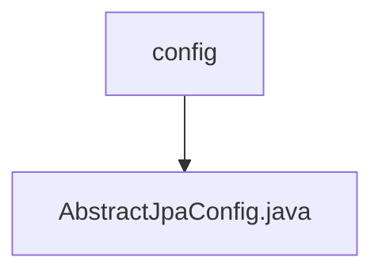

# Basic Information

|      |      |
|------|------|
| Name | config |
| Language | .java |
| Code Path | WeFe/common/java/common-data-mysql/src/main/java/com/welab/wefe/common/data/mysql/config |
| Package Name | docs.common.java.common-data-mysql.src.main.java.com.welab.wefe.common.data.mysql.config |
| Brief Description | The AbstractJpaConfig class provides JPA configuration, including methods for creating an entity manager factory and data source, with support for custom Druid data source filters. |

# Description

This is an abstract JPA configuration class containing two core methods. First, the entityManagerFactoryRef method creates an entity manager factory Bean, accepting parameters such as a builder, data source, JPA properties, and entity class package path. It configures the data source, properties, and persistence unit before returning. Second, the createDatasource method creates a Druid data source instance and adds an SQL monitoring filter. The class automatically injects a JPA property configuration object.

### Package Internal Structure View

This flowchart illustrates the configuration directory structure of the common-data-mysql module in the WeFe project. The config directory contains an AbstractJpaConfig.java file, which handles JPA-related database configurations. This represents a typical Spring Boot project configuration structure, demonstrating the implementation approach of data access layer configurations in a layered architecture.

# File List

| Name   | Type  | Description |
|-------|------|-------------|
| [AbstractJpaConfig.java](AbstractJpaConfig.md) | file | The AbstractJpaConfig class provides JPA configuration, including methods for creating entity manager factories and data sources, with support for custom Druid data source filters. |

