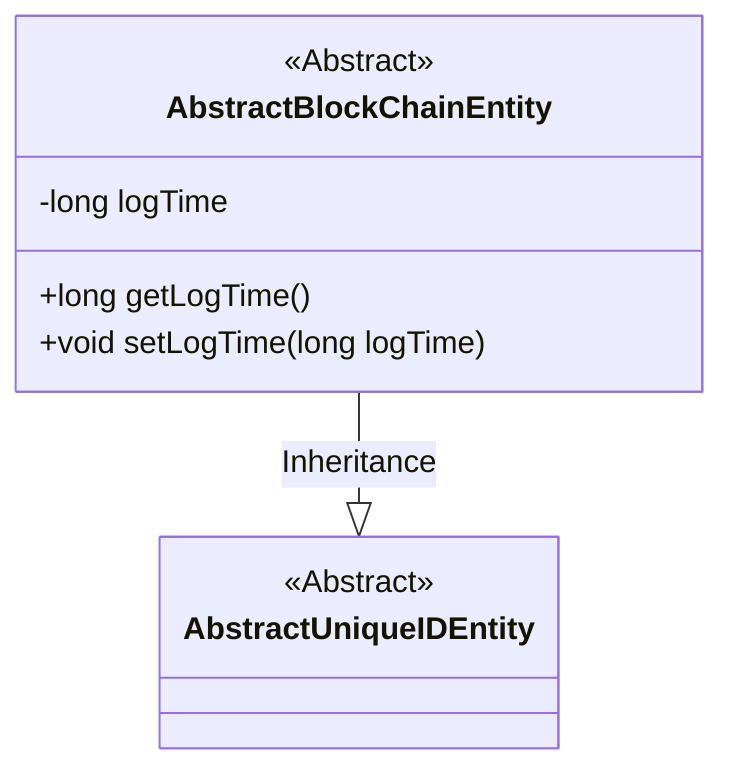
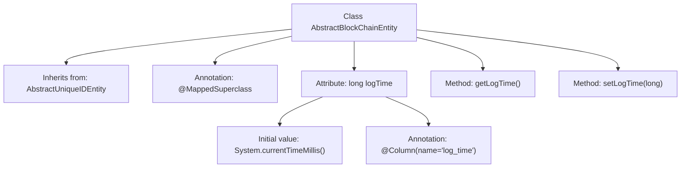

# Basic Information

|      |      |
|------|------|
| Name | AbstractBlockChainEntity |
| Language | .java |
| Code Path | WeFe/common/java/common-data-mysql/src/main/java/com/welab/wefe/common/data/mysql/entity/AbstractBlockChainEntity.java |
| Package Name | com.welab.wefe.common.data.mysql.entity |
| Dependencies | ['javax.persistence.Column', 'javax.persistence.MappedSuperclass'] |
| Brief Description | Abstract blockchain entity class, inheriting from the unique ID entity, containing a log timestamp field and access methods. |

# Description

AbstractBlockChainEntity is an abstract base class that inherits from AbstractUniqueIDEntity and is annotated with the @MappedSuperclass annotation. It includes a field of type long named logTime, with a default value of the current system time, which is mapped to the log_time column in the database table via the @Column annotation. The class provides getLogTime and setLogTime methods for accessing and modifying the value of the logTime field.

# Class Summary

| Name   | Type  | Description |
|-------|------|-------------|
| AbstractBlockChainEntity | class | AbstractBlockChainEntity extends AbstractUniqueIDEntity, containing the logTime field along with getter/setter methods, with a default value of the current timestamp. |

## Class AbstractBlockChainEntity

|      |      |
|------|------|
| Access Modifier | @MappedSuperclass;public |
| Type | class |
| Name | AbstractBlockChainEntity |
| Description | AbstractBlockChainEntity extends AbstractUniqueIDEntity, containing the logTime field along with getter/setter methods, with a default value of the current timestamp. |

### UML Class Diagram

This class diagram illustrates the hierarchical relationship where AbstractBlockChainEntity inherits from AbstractUniqueIDEntity. As an abstract base class, AbstractBlockChainEntity contains the logTime field for recording timestamps along with its accessor methods, and is designated as a parent class for JPA entities via the @MappedSuperclass annotation. This design provides foundational timestamp functionality for blockchain-related entities while preserving the unique identifier characteristics of the parent class.

### Internal Method Call Graph

This code demonstrates an abstract base class AbstractBlockChainEntity that inherits from AbstractUniqueIDEntity, marked with the @MappedSuperclass annotation to indicate it as a JPA entity superclass. The class contains a logTime attribute for recording timestamps, default-initialized to the current system time, and mapped to the database's log_time field via the @Column annotation. Getter/setter methods are provided to access and modify this attribute, reflecting the design of basic timestamp functionality in entity classes.

### Field List

| Name  | Type  | Description |
|-------|-------|------|
| logTime = System.currentTimeMillis() | long | The database field log_time is mapped to a long integer private variable logTime, with the default value being the current system timestamp. |

### Method List

| Name  | Type  | Description |
|-------|-------|------|
| setLogTime | void | This is a Java method used to set the log time. The method is named setLogTime, which takes a long-type parameter logTime and assigns it to the member variable logTime of the class. |
| getLogTime | long | Methods for obtaining log time, returning the value of the long integer variable logTime. |

