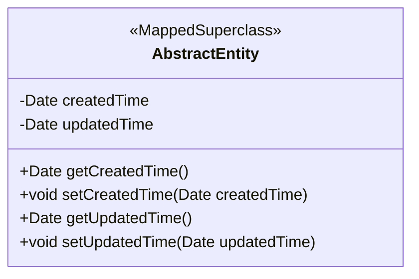
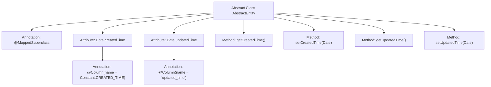

# Basic Information

|      |      |
|------|------|
| Name | AbstractEntity |
| Language | .java |
| Code Path | WeFe/common/java/common-data-mysql/src/main/java/com/welab/wefe/common/data/mysql/entity/AbstractEntity.java |
| Package Name | com.welab.wefe.common.data.mysql.entity |
| Dependencies | ['com.welab.wefe.common.constant.Constant', 'javax.persistence.Column', 'javax.persistence.MappedSuperclass', 'java.util.Date'] |
| Brief Description | The abstract base class AbstractEntity defines fields for creation time and update time, providing getter and setter methods. |

# Description

AbstractEntity is an abstract base class annotated with the @MappedSuperclass annotation, designed for inheritance by entity classes. It includes two date-type fields: createdTime records the creation time, with its column name specified by the Constant.CREATED_TIME constant; updatedTime records the update time, and its column name is directly defined as updated_time. Both fields default to the current time. The class provides standard getter and setter methods for accessing and modifying these two field values.

# Class Summary

| Name   | Type  | Description |
|-------|------|-------------|
| AbstractEntity | class | The abstract class AbstractEntity defines fields for creation time and update time, including getter and setter methods. |

## Class AbstractEntity

|      |      |
|------|------|
| Access Modifier | @MappedSuperclass;public abstract |
| Type | class |
| Name | AbstractEntity |
| Description | The abstract class AbstractEntity defines fields for creation time and update time, including getter and setter methods. |

### UML Class Diagram

This code defines an abstract base class named `AbstractEntity`, annotated with `@MappedSuperclass`, indicating it serves as a parent class for JPA entity classes. It contains two private Date-type fields, `createdTime` and `updatedTime`, representing creation time and update time, respectively. These fields are mapped to database table columns via the `@Column` annotation. The class provides getter and setter methods for these four fields, allowing child classes to inherit these fundamental attributes. This design pattern is commonly used in scenarios where entity classes need to track creation and modification times, achieving code reuse through inheritance.

### Internal Method Call Graph

This flowchart illustrates the structure of the AbstractEntity abstract class, which contains two Date-type attributes (createdTime and updatedTime) annotated with @Column, along with their corresponding getter/setter methods. As a base class marked with @MappedSuperclass, it provides shared timestamp field management functionality for entities. The createdTime uses a constant to configure the column name, while updatedTime directly uses a string configuration, demonstrating a typical design pattern for JPA entity classes.

### Field List

| Name  | Type  | Description |
|-------|-------|------|
| updatedTime = new Date() | Date | The database field updated_time is mapped to the Date type, with the default value set to the current time. |
| createdTime = new Date() | Date | Database field mapping: createdTime corresponds to CREATED_TIME, with the default value being the current time. |

### Method List

| Name  | Type  | Description |
|-------|-------|------|
| getUpdatedTime | Date | Methods to obtain the update time, returning an updatedTime object. |
| setUpdatedTime | void | Set the update time to the specified date object. |
| setCreatedTime | void | The method for setting the creation time assigns the parameter value to the object's createdTime property. |
| getCreatedTime | Date | Methods to obtain the creation time, returning a value of type Date. |

