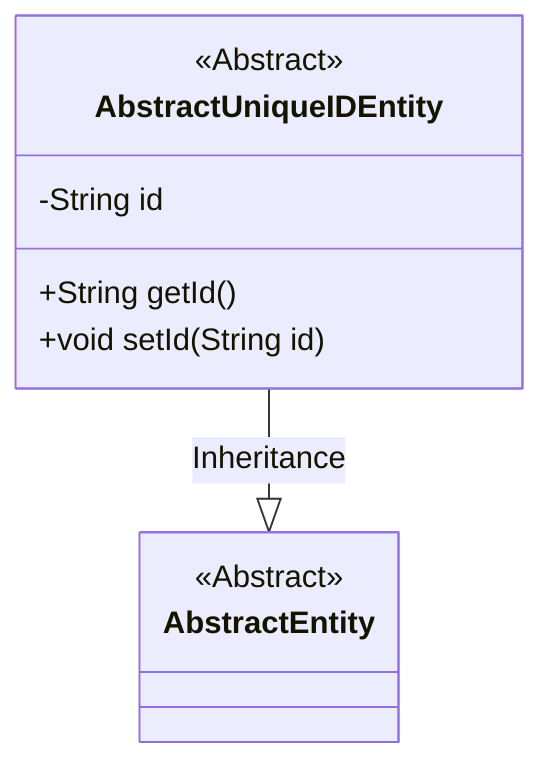
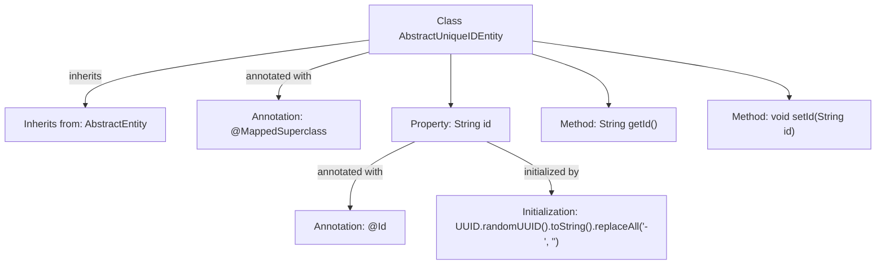

# Basic Information

|      |      |
|------|------|
| Name | AbstractUniqueIDEntity |
| Language | .java |
| Code Path | WeFe/common/java/common-data-mysql/src/main/java/com/welab/wefe/common/data/mysql/entity/AbstractUniqueIDEntity.java |
| Package Name | com.welab.wefe.common.data.mysql.entity |
| Dependencies | ['javax.persistence.Id', 'javax.persistence.MappedSuperclass', 'java.util.UUID'] |
| Brief Description | The abstract entity class AbstractUniqueIDEntity extends AbstractEntity, generates hyphen-free unique IDs using UUID, and provides getter and setter methods. |

# Description

The code defines an abstract base class named AbstractUniqueIDEntity, which inherits from AbstractEntity. The class is annotated with @MappedSuperclass, indicating it serves as a parent class for other entity classes. The core field id is marked as the primary key with the @Id annotation, and its initial value is randomly generated via UUID with hyphens removed. The class provides getId and setId methods for accessing and modifying the id field. This design implements the functionality of generating and managing globally unique identifiers.

# Class Summary

| Name   | Type  | Description |
|-------|------|-------------|
| AbstractUniqueIDEntity | class | The abstract entity class AbstractUniqueIDEntity extends AbstractEntity, using UUID to generate unique IDs without hyphens, and provides getter and setter methods. |

## Class AbstractUniqueIDEntity

|      |      |
|------|------|
| Access Modifier | @MappedSuperclass;public |
| Type | class |
| Name | AbstractUniqueIDEntity |
| Description | The abstract entity class AbstractUniqueIDEntity extends AbstractEntity, using UUID to generate unique IDs without hyphens, and provides getter and setter methods. |

### UML Class Diagram

Class Diagram Description: This diagram illustrates an inheritance relationship where AbstractUniqueIDEntity is a subclass of AbstractEntity, designed to provide globally unique ID functionality for entities. AbstractUniqueIDEntity contains a private field 'id' and corresponding getter/setter methods, with the 'id' being generated via UUID and stripped of hyphens. This abstract base class is intended for inheritance by entity classes requiring unique identifiers.

### Internal Method Call Graph

This code defines an abstract base class AbstractUniqueIDEntity, which inherits from AbstractEntity and is annotated with @MappedSuperclass. The class contains an id property annotated with @Id, which is initialized using UUID generation with hyphens removed. It provides getId() and setId() methods to access and modify the id property. This class primarily serves as foundational functionality for providing globally unique identifiers to other entity classes.

### Field List

| Name  | Type  | Description |
|-------|-------|------|
| id = UUID.randomUUID().toString().replaceAll("-", "") | String | Entity ID field, generated using UUID with hyphens removed. |

### Method List

| Name  | Type  | Description |
|-------|-------|------|
| getId | String | This method returns an id value of string type. |
| setId | void | Methods for setting the object ID: assign the parameter id to the id property of the object. |

