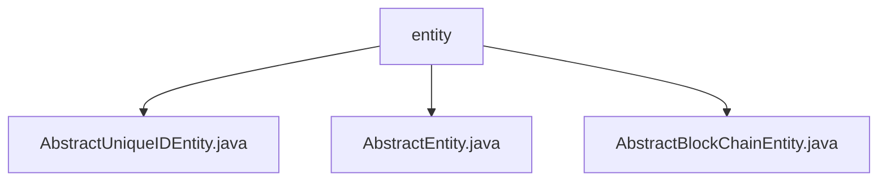

# Basic Information

|      |      |
|------|------|
| Name | entity |
| Language | .java |
| Code Path | WeFe/common/java/common-data-mysql/src/main/java/com/welab/wefe/common/data/mysql/entity |
| Package Name | docs.common.java.common-data-mysql.src.main.java.com.welab.wefe.common.data.mysql.entity |
| Brief Description | AbstractUniqueIDEntity is an abstract base class that inherits from AbstractEntity and uses UUID to generate primary keys. AbstractEntity includes fields for creation and update times. AbstractBlockChainEntity inherits from AbstractUniqueIDEntity and adds a logTime field to record timestamps. |

# Description

## Overview  
This module provides a JPA-based entity class inheritance hierarchy, with its core responsibility being the standardized management of common fields (such as unique IDs and timestamps). The interface specification consists of three layers of abstraction: `AbstractEntity` defines basic timestamp fields (`createdTime`/`updatedTime`), `AbstractUniqueIDEntity` extends it with a globally unique ID (UUID format), and `AbstractBlockChainEntity` adds blockchain log timestamps (`logTime`). Key data structures include UUID primary keys and timestamps (of `Date`/`long` type). It has no external dependencies. For example, `AbstractUniqueIDEntity` ensures ID uniqueness by using hyphen-stripped UUIDs.  

## Primary Business Scenarios  
The module is suitable for scenarios requiring standardized data models, similar to the ORM template pattern. A typical workflow involves subclasses inheriting base fields (e.g., auto-generated IDs and auto-recorded timestamps) while focusing on business field development. For instance, blockchain entities can inherit `AbstractBlockChainEntity` to directly obtain log timestamp functionality. Interaction patterns uniformly operate fields via getters/setters, such as `setLogTime()` for modifying blockchain timestamps. It fully covers the foundational metadata management needs of entity classes.

### Package Internal Structure View

This flowchart illustrates the core structure of the MySQL data entity layer, which includes three abstract base class files: AbstractUniqueIDEntity, AbstractEntity, and AbstractBlockChainEntity. All reside under the `entity` directory and provide foundational support for data persistence. This design pattern reflects the inheritance feature in object-oriented programming, facilitating unified management of common attributes and behaviors across entity classes.

# File List

| Name   | Type  | Description |
|-------|------|-------------|
| [AbstractUniqueIDEntity.java](AbstractUniqueIDEntity.md) | file | The abstract entity class AbstractUniqueIDEntity extends AbstractEntity, using UUID to generate a unique ID without hyphens, and provides getter and setter methods. |
| [AbstractEntity.java](AbstractEntity.md) | file | The abstract base class AbstractEntity defines fields for creation time and update time, providing getter and setter methods. |
| [AbstractBlockChainEntity.java](AbstractBlockChainEntity.md) | file | Abstract blockchain entity class, inheriting from the unique ID entity, containing a log time field and access methods. |

