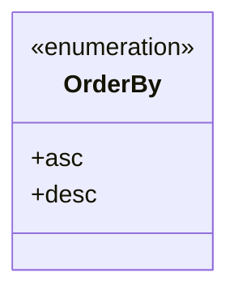
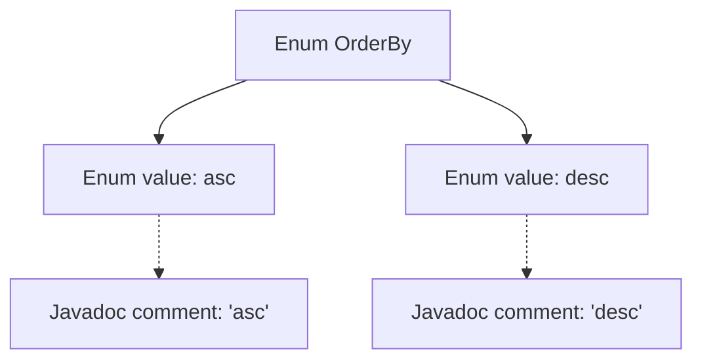

# Basic Information

|      |      |
|------|------|
| Name | OrderBy |
| Language | .java |
| Code Path | WeFe/common/java/common-data-mysql/src/main/java/com/welab/wefe/common/data/mysql/enums/OrderBy.java |
| Package Name | com.welab.wefe.common.data.mysql.enums |
| Dependencies | [] |
| Brief Description | The OrderBy enumeration defines two sorting methods: ascending (asc) and descending (desc). |

# Description

This is an enumeration type named OrderBy, which contains two enum values: asc for ascending order and desc for descending order. Each enum value has corresponding comments explaining its meaning. The enumeration is used to indicate sorting direction, with a concise and clear structure.

# Class Summary

| Name   | Type  | Description |
|-------|------|-------------|
| OrderBy | enum | The OrderBy enumeration defines two sorting methods: ascending (asc) and descending (desc). |

## Class OrderBy

|      |      |
|------|------|
| Access Modifier | public |
| Type | enum |
| Name | OrderBy |
| Description | The OrderBy enumeration defines two sorting methods: ascending (asc) and descending (desc). |

### UML Class Diagram

This code defines an enumeration type named OrderBy, containing two enum constants: asc (ascending) and desc (descending). In the class diagram, the enumeration type is marked with <<enumeration>> to indicate it is a fixed set of values. This enumeration is commonly used to represent sorting directions, providing two clear and concise sorting options that can be directly referenced in code without the need for string or numeric constants.

### Internal Method Call Graph

This flowchart illustrates the structure of the OrderBy enum, which contains two enum values, asc and desc, each associated with corresponding Javadoc comments. The enum, as a special class type, uses solid arrows to represent containment relationships and dashed arrows to indicate comment associations. The diagram clearly presents the definition of a simple enum and the dependency of its documentation, suitable for scenarios requiring explicit sorting directions.

### Field List

| Name  | Type  | Description |
|-------|-------|------|

### Method List

| Name  | Type  | Description |
|-------|-------|------|

