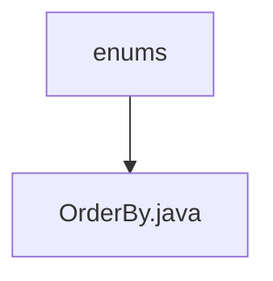

# Basic Information

|      |      |
|------|------|
| Name | enums |
| Language | .java |
| Code Path | WeFe/common/java/common-data-mysql/src/main/java/com/welab/wefe/common/data/mysql/enums |
| Package Name | docs.common.java.common-data-mysql.src.main.java.com.welab.wefe.common.data.mysql.enums |
| Brief Description | The OrderBy enumeration defines two sorting methods: ascending (asc) and descending (desc). |

# Description

This is an enumeration type named OrderBy, which includes two enum values: "asc" for ascending order and "desc" for descending order. Each enum value has corresponding comments explaining its meaning. This enumeration is used to indicate the sorting direction, with a concise and clear structure.

### Package Internal Structure View

This flowchart illustrates the hierarchy of enum classes in the MySQL common data module of the WeFe project. The top-level node is the "enums" directory, which contains a child node "OrderBy.java" enum file representing the enumeration definition for sorting methods. The structure is concise and clear, reflecting the organization of enum classes in the project.

# File List

| Name   | Type  | Description |
|-------|------|-------------|
| [OrderBy.java](OrderBy.md) | file | The OrderBy enumeration defines two sorting methods: ascending order (asc) and descending order (desc). |

