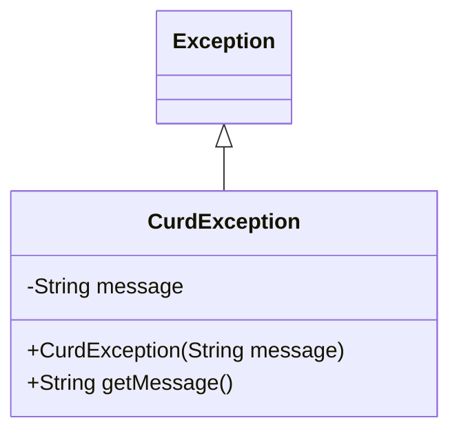
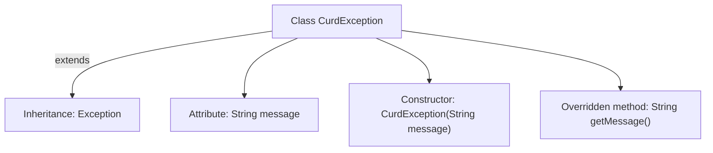

# Basic Information

|      |      |
|------|------|
| Name | CurdException |
| Language | .java |
| Code Path | WeFe/common/java/common-data-mysql/src/main/java/com/welab/wefe/common/data/mysql/exception/CurdException.java |
| Package Name | com.welab.wefe.common.data.mysql.exception |
| Dependencies | [] |
| Brief Description | Custom exception class CurdException, inherits from Exception, contains a message attribute and constructor, overrides getMessage to return the message. |

# Description

The content defines a custom exception class named `CurdException`, which inherits from the `Exception` class. This class includes a private string field `message` for storing exception information, and initializes this field through its constructor. It also overrides the `getMessage` method of the parent class to return the stored exception information. This custom exception class is primarily used to handle error conditions in specific business logic.

# Class Summary

| Name   | Type  | Description |
|-------|------|-------------|
| CurdException | class | Custom exception class `CurdException`, extending `Exception`, containing a `message` attribute and constructor, overriding `getMessage` to return the `message`. |

## Class CurdException

|      |      |
|------|------|
| Access Modifier | public |
| Type | class |
| Name | CurdException |
| Description | Custom exception class `CurdException`, extending `Exception`, containing a `message` attribute and constructor, overriding `getMessage` to return the `message`. |

### UML Class Diagram

This class diagram illustrates a custom exception class CurdException, which inherits from the standard Java Exception class. The diagram clearly shows the class inheritance relationship (CurdException is a subclass of Exception) and the internal structure of the class, including a private String field message, a public constructor CurdException(String), and an overridden public method getMessage(). This exception class is specifically designed to handle error scenarios in CRUD operations, where detailed exception descriptions can be obtained through the error message passed during construction. The class diagram succinctly presents the core structure and inheritance relationship of this exception class.

### Internal Method Call Graph

This flowchart illustrates the structure of the CurdException class, a custom exception class inheriting from Exception. The diagram contains four key elements: inheritance relationship, private attribute message, parameterized constructor, and overridden getMessage() method. The exception class receives error messages via its constructor for storage, then returns them through the overridden getMessage() method, providing custom exception handling capabilities for programs. The overall design is concise and complies with Java exception handling standards.

### Field List

| Name  | Type  | Description |
|-------|-------|------|
| message | String | private String variable message |

### Method List

| Name  | Type  | Description |
|-------|-------|------|
| getMessage | String | Rewrite the getMessage method to return the message string. |

