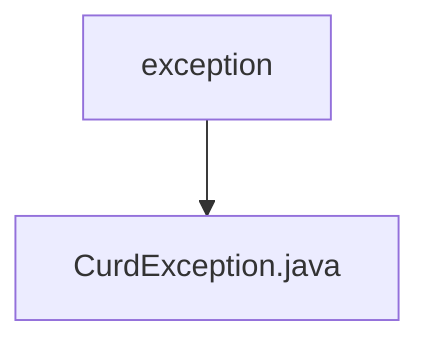

# Basic Information

|      |      |
|------|------|
| Name | exception |
| Language | .java |
| Code Path | WeFe/common/java/common-data-mysql/src/main/java/com/welab/wefe/common/data/mysql/exception |
| Package Name | docs.common.java.common-data-mysql.src.main.java.com.welab.wefe.common.data.mysql.exception |
| Brief Description | Custom exception class `CurdException`, which extends `Exception`, contains a `message` attribute and a constructor, and overrides `getMessage` to return the `message`. |

# Description

The content defines a custom exception class named `CurdException`, which inherits from the `Exception` class. This class includes a private string field `message` for storing exception information, initialized via the constructor. It also overrides the `getMessage` method of the parent class to return the stored exception message. This custom exception class is primarily used to handle error conditions in specific business logic.

### Package Internal Structure View

This flowchart illustrates the exception handling class hierarchy in the common-data-mysql module of the WeFe project. The root node is the exception package, which contains the concrete implementation of the CurdException class for handling exceptions during database CRUD operations. The entire structure is concise and clear, reflecting the single responsibility design principle of the exception classes.

# File List

| Name   | Type  | Description |
|-------|------|-------------|
| [CurdException.java](CurdException.md) | file | Custom exception class `CurdException`, extending `Exception`, containing a `message` attribute and constructor, overriding `getMessage` to return the `message`. |

