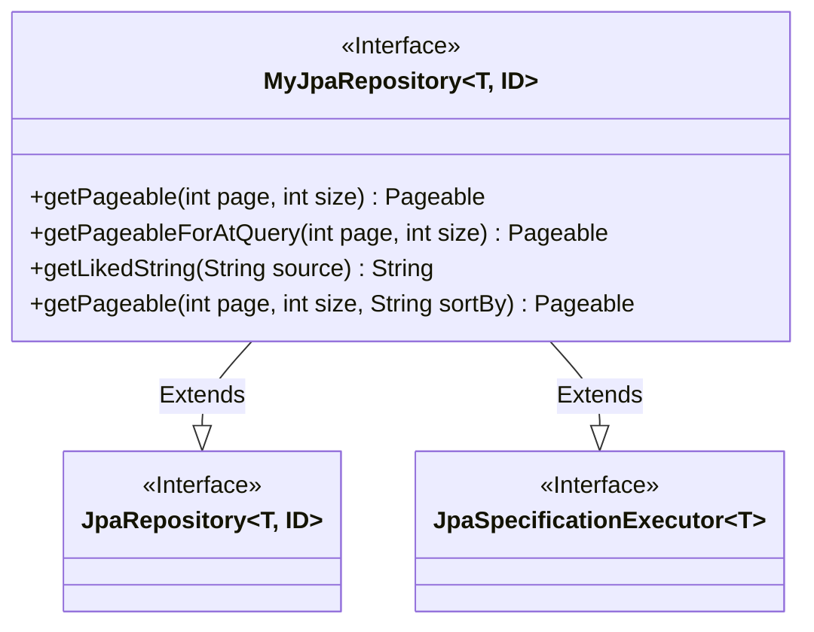
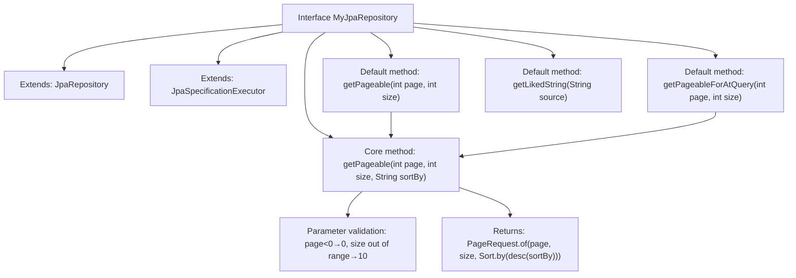

# Basic Information

|      |      |
|------|------|
| Name | MyJpaRepository |
| Language | .java |
| Code Path | WeFe/common/java/common-data-mysql/src/main/java/com/welab/wefe/common/data/mysql/repository/MyJpaRepository.java |
| Package Name | com.welab.wefe.common.data.mysql.repository |
| Dependencies | ['com.welab.wefe.common.constant.Constant', 'org.springframework.data.domain.PageRequest', 'org.springframework.data.domain.Pageable', 'org.springframework.data.domain.Sort', 'org.springframework.data.jpa.repository.JpaRepository', 'org.springframework.data.jpa.repository.JpaSpecificationExecutor'] |
| Brief Description | Customize JPA repository interfaces to provide default methods for paginated queries and string fuzzy matching, supporting dynamic sorting and parameter validation. |

# Description

The interface `MyJpaRepository` extends `JpaRepository` and `JpaSpecificationExecutor`, providing default methods for paginated queries and string processing. It includes four default methods: `getPageable` generates a pagination object based on page number, size, and sort field, defaulting to descending order by `created_time`; `getPageableForAtQuery` invokes `getPageable` with constant field sorting; `getLikedString` adds wildcards to strings; and the core method `getPageable` validates pagination parameters and creates a pagination request object. All methods incorporate parameter validation logic to ensure the validity of pagination parameters.

# Class Summary

| Name   | Type  | Description |
|-------|------|-------------|
| MyJpaRepository | interface | The MyJpaRepository interface extends both JpaRepository and JpaSpecificationExecutor, providing default pagination methods and fuzzy query string processing. The pagination methods support page number, size, and sorting fields, with automatic boundary value handling. |

## Class MyJpaRepository

|      |      |
|------|------|
| Access Modifier | public |
| Type | interface |
| Name | MyJpaRepository |
| Description | The MyJpaRepository interface extends both JpaRepository and JpaSpecificationExecutor, providing default pagination methods and fuzzy query string processing. The pagination methods support page number, size, and sorting fields, with automatic boundary value handling. |

### UML Class Diagram

This code defines a generic interface `MyJpaRepository<T, ID>` that extends Spring Data JPA's `JpaRepository` and `JpaSpecificationExecutor` interfaces. The interface provides four default methods primarily for pagination queries and string processing: the `getPageable` method creates pagination request objects and handles invalid parameters; `getPageableForAtQuery` is a pagination method for specific scenarios; `getLikedString` generates fuzzy query strings. Through generics, the interface supports different entity types and IDs, demonstrating the extensible design of Spring Data JPA.

### Internal Method Call Graph

This flowchart illustrates the inheritance relationships and default method invocation chain of the MyJpaRepository interface. The interface extends JpaRepository and JpaSpecificationExecutor, providing four default methods. Both getPageable(page,size) and getPageableForAtQuery invoke the core method getPageable(page,size,sortBy). The core method includes parameter validation logic and ultimately constructs a pagination request object. All methods revolve around pagination query functionality, offering different sorting field default values through method overloading.

### Field List

| Name  | Type  | Description |
|-------|-------|------|

### Method List

| Name  | Type  | Description |
|-------|-------|------|
| getPageableForAtQuery | Pageable | This method returns a paginable object, used to specify the page number and page size during queries, with default sorting by creation time. |
| getPageable | Pageable | The method getPageable accepts page number and size parameters, returning a paginated object sorted by creation time by default. |
| getLikedString | String | The method getLikedString takes a string source and returns a new string with percent signs added at both the beginning and the end. |
| getPageable | Pageable | The method `getPageable` accepts a page number, page size, and sort field, with the default page number being no less than 0 and the page size limited between 10 and 1000. It returns a pagination request object sorted in descending order by the specified field. |

