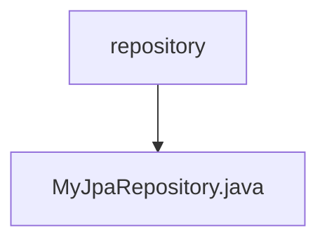

# Basic Information

|      |      |
|------|------|
| Name | repository |
| Language | .java |
| Code Path | WeFe/common/java/common-data-mysql/src/main/java/com/welab/wefe/common/data/mysql/repository |
| Package Name | docs.common.java.common-data-mysql.src.main.java.com.welab.wefe.common.data.mysql.repository |
| Brief Description | Customize JPA repository interfaces to provide default methods for paginated queries and string fuzzy matching, supporting dynamic sorting and parameter validation. |

# Description

The interface `MyJpaRepository` extends `JpaRepository` and `JpaSpecificationExecutor`, providing default methods for paginated queries and string processing. It includes four default methods: `getPageable` generates a pagination object based on page number, size, and sort field, defaulting to descending order by `created_time`; `getPageableForAtQuery` calls `getPageable` and sorts using constant fields; `getLikedString` adds wildcards to strings; the core method `getPageable` validates pagination parameters and creates a pagination request object. All methods include parameter validation logic to ensure pagination parameters are valid.

### Package Internal Structure View

This flowchart illustrates the hierarchical relationship between the repository folder and the MyJpaRepository.java file. As a parent directory, repository contains a specific Java class file MyJpaRepository.java. Such structure is commonly seen in the repository layer implementation of Maven projects, used for defining data access interfaces.

# File List

| Name   | Type  | Description |
|-------|------|-------------|
| [MyJpaRepository.java](MyJpaRepository.md) | file | Customize the JPA repository interface to provide default methods for paginated queries and string fuzzy matching, supporting dynamic sorting and parameter validation. |

