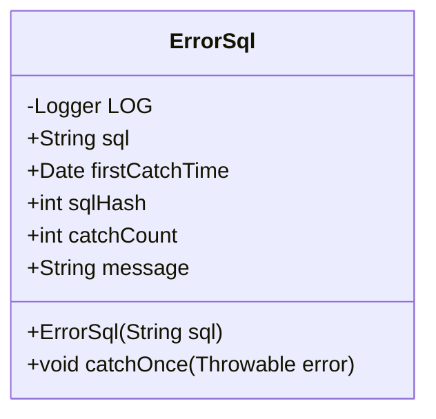
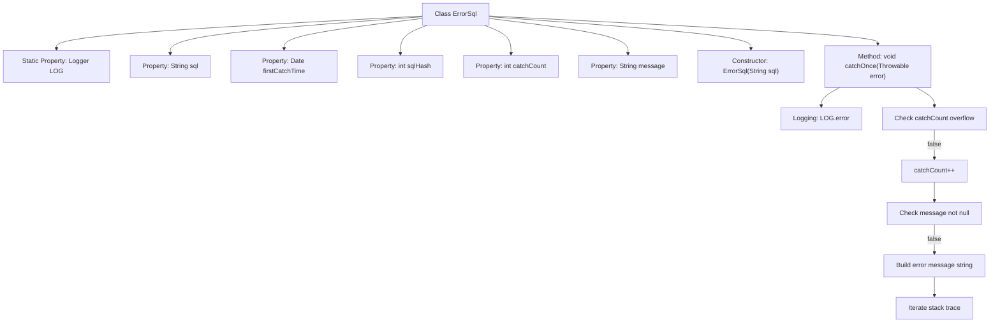

# Basic Information

|      |      |
|------|------|
| Name | ErrorSql |
| Language | .java |
| Code Path | WeFe/common/java/common-data-mysql/src/main/java/com/welab/wefe/common/data/mysql/sql_monitor/ErrorSql.java |
| Package Name | com.welab.wefe.common.data.mysql.sql_monitor |
| Dependencies | ['org.slf4j.Logger', 'org.slf4j.LoggerFactory', 'java.util.Date'] |
| Brief Description | The ErrorSql class records erroneous SQL information, including the SQL statement, first capture time, hash value, capture count, and error details. The catchOnce method captures exceptions and updates error information along with the capture count. |

# Description

The ErrorSql class is used to record SQL error information, including the SQL statement, first capture time, SQL hash value, capture count, and error message. The first capture time defaults to the current time, and the SQL hash value is generated from the SQL statement. The catchOnce method is used to capture errors, log error messages, and increment the capture count. If the capture count exceeds the maximum value, it stops. The error message includes the exception class name, message, and stack trace, which is generated only during the first capture.

# Class Summary

| Name   | Type  | Description |
|-------|------|-------------|
| ErrorSql | class | The ErrorSql class records erroneous SQL information, including the SQL statement, first capture time, hash value, capture count, and error message. The catchOnce method captures errors and updates the count and message. |

## Class ErrorSql

|      |      |
|------|------|
| Access Modifier | public |
| Type | class |
| Name | ErrorSql |
| Description | The ErrorSql class records erroneous SQL information, including the SQL statement, first capture time, hash value, capture count, and error message. The catchOnce method captures errors and updates the count and message. |

### UML Class Diagram

This code defines an `ErrorSql` class used to record information related to SQL execution errors. The class includes attributes such as the SQL statement, first capture time, SQL hash value, capture count, and error message. The `catchOnce` method is used to log error information, including the exception type, message, and stack trace, and records the error via logging. This class is primarily employed to track and analyze errors occurring during SQL execution.

### Internal Method Call Graph

This flowchart illustrates the structure of the ErrorSql class and its key method invocation relationships. The class contains 5 member variables and 2 core methods, where the catchOnce method implements the core error-handling logic: first logging the error, then checking for counter overflow, incrementing the count if no overflow occurs, and finally constructing a detailed error message including exception type, message, and stack trace when the message is empty. The flow controls different execution paths through conditional branching.

### Field List

| Name  | Type  | Description |
|-------|-------|------|
| message | String | Declare a public string variable named message. |
| sqlHash | int | The variable sqlHash, of type public int, is used to store SQL hash values. |
| firstCatchTime = new Date() | Date | Define the public variable firstCatchTime, initialized as the current datetime object. |
| sql | String | Defined a public string variable sql. |
| catchCount | int | The variable catchCount records the number of captures and is of integer type. |
| LOG = LoggerFactory.getLogger(ErrorSql.class) | Logger | Define a private static log constant LOG for the ErrorSql class, using LoggerFactory to obtain the log instance. |

### Method List

| Name  | Type  | Description |
|-------|-------|------|
| catchOnce | void | Capture SQL errors and log them. If the maximum capture count is not reached and the message is empty, generate a detailed message including the error class and stack trace. |

