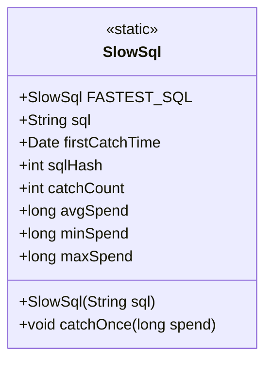
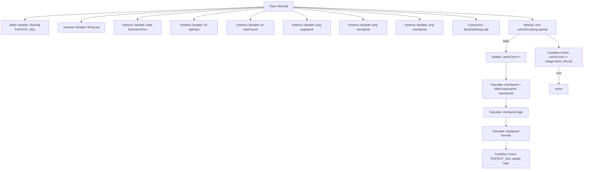

# Basic Information

|      |      |
|------|------|
| Name | SlowSql |
| Language | .java |
| Code Path | WeFe/common/java/common-data-mysql/src/main/java/com/welab/wefe/common/data/mysql/sql_monitor/SlowSql.java |
| Package Name | com.welab.wefe.common.data.mysql.sql_monitor |
| Dependencies | ['java.util.Date'] |
| Brief Description | The SlowSql class records slow SQL information, including the SQL statement, first capture time, hash value, capture count, and average/minimum/maximum execution time. It provides a capture method to update statistics and record the globally fastest slow SQL. |

# Description

The SlowSql class is used to record statistical information of slow SQL queries. This class includes a static variable FASTEST_SQL, which tracks the instance with the shortest average execution time among all slow SQL queries. Each instance stores the SQL statement string, first capture time, SQL hash value, capture count, average execution time, minimum execution time, and maximum execution time. The constructor initializes the SQL statement and its hash value. The catchOnce method updates the capture count and execution time statistics, including maximum, minimum, and average execution times, while maintaining the FASTEST_SQL global variable. Updates cease when the capture count reaches the maximum value.

# Class Summary

| Name   | Type  | Description |
|-------|------|-------------|
| SlowSql | class | The SlowSql class records slow SQL information, including the SQL statement, first capture time, hash value, capture count, and average/minimum/maximum execution time. The catchOnce method updates statistics and records the globally fastest slow SQL. |

## Class SlowSql

|      |      |
|------|------|
| Access Modifier | public |
| Type | class |
| Name | SlowSql |
| Description | The SlowSql class records slow SQL information, including the SQL statement, first capture time, hash value, capture count, and average/minimum/maximum execution time. The catchOnce method updates statistics and records the globally fastest slow SQL. |

### UML Class Diagram

This code defines a SlowSql class for recording statistical information about slow SQL queries. The class includes a static variable FASTEST_SQL to track the slow SQL instance with the shortest average execution time. Instance variables consist of the SQL statement, first capture time, hash value, capture count, and various execution time statistics (average, minimum, maximum). The catchOnce method updates SQL execution statistics and maintains the reference to FASTEST_SQL. This class is primarily used for monitoring and optimizing database query performance.

### Internal Method Call Graph

This flowchart illustrates the complete structure of the SlowSql class, including static variables, instance variables, constructors, and the core business method catchOnce. The catchOnce method processes SQL performance data through 5 steps: first checking the capture count limit, then updating the count, maximum execution time, minimum execution time, and average execution time, and finally maintaining the global fastest slow SQL record. All time calculations employ overflow-proof designs and ensure data validity through conditional checks. The flowchart clearly presents class member relationships and internal method logic branches.

### Field List

| Name  | Type  | Description |
|-------|-------|------|
| FASTEST_SQL | SlowSql | Declare a public static constant FASTEST_SQL of type SlowSql. |
| avgSpend | long | Public Long variable, representing average cost. |
| sqlHash | int | The variable sqlHash, of integer type, is used to store SQL hash values. |
| firstCatchTime = new Date() | Date | Define the public variable firstCatchTime, initialized as the current datetime object. |
| sql | String | Declare a public string variable sql to store SQL statements. |
| maxSpend | long | Declare a public long integer variable maxSpend to store the maximum spending value. |
| minSpend | long | Define a long integer variable minSpend, representing the minimum cost. |
| catchCount | int | The integer variable catchCount is used to record the number of captures. |

### Method List

| Name  | Type  | Description |
|-------|-------|------|
| catchOnce | void | The method `catchOnce` measures SQL execution time: it updates the maximum, minimum, and average durations, and records the globally fastest SQL. If `catchCount` exceeds the limit, it returns directly. |

