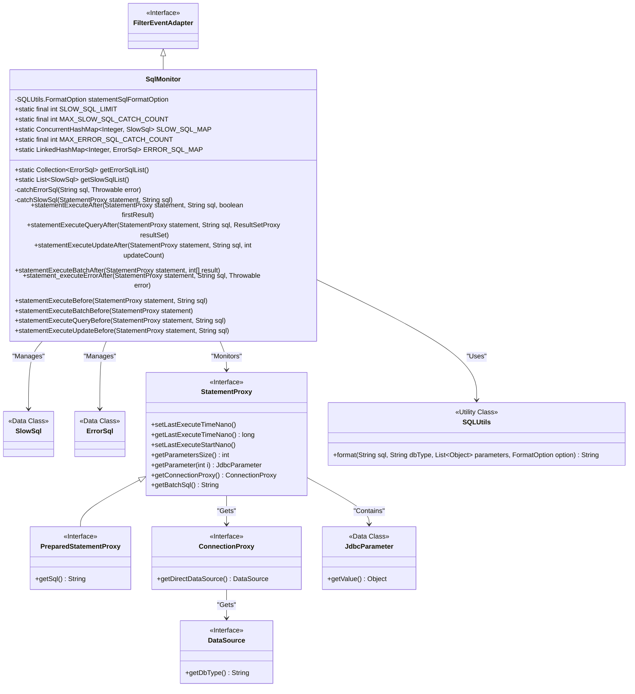

# Basic Information

|      |      |
|------|------|
| Name | SqlMonitor |
| Language | .java |
| Code Path | WeFe/common/java/common-data-mysql/src/main/java/com/welab/wefe/common/data/mysql/sql_monitor/SqlMonitor.java |
| Package Name | com.welab.wefe.common.data.mysql.sql_monitor |
| Dependencies | ['com.alibaba.druid.filter.FilterEventAdapter', 'com.alibaba.druid.proxy.jdbc.JdbcParameter', 'com.alibaba.druid.proxy.jdbc.PreparedStatementProxy', 'com.alibaba.druid.proxy.jdbc.ResultSetProxy', 'com.alibaba.druid.proxy.jdbc.StatementProxy', 'com.alibaba.druid.sql.SQLUtils', 'java.util', 'java.util.concurrent.ConcurrentHashMap'] |
| Brief Description | The SqlMonitor class monitors SQL execution, capturing slow SQL queries (execution time ≥100ms) and failed SQL queries, with an upper limit of 100 entries each. Slow SQL queries are sorted by execution time, while failed SQL queries record error messages. Through hook methods, it logs timestamps before and after SQL execution and triggers the capture logic. |

# Description

The SqlMonitor class inherits from FilterEventAdapter and is used to monitor SQL execution. It defines the criteria for identifying slow SQL and failed SQL, with a slow SQL threshold of 100 milliseconds and a maximum capture limit of 100 entries for each. It uses ConcurrentHashMap to store slow SQL and LinkedHashMap to store failed SQL. Methods are provided to retrieve lists of slow SQL and failed SQL, with the slow SQL list sorted in descending order by average execution time. By overriding multiple methods before and after statement execution, it captures slow SQL and failed SQL. When capturing slow SQL, it checks whether the execution time meets the threshold and maintains the upper limit on quantity. For failed SQL captures, it formats parameterized SQL. All SQL execution times are measured with nanosecond-level precision.

# Class Summary

| Name   | Type  | Description |
|-------|------|-------------|
| SqlMonitor | class | The SqlMonitor class is designed to monitor SQL execution, capturing slow SQL queries (those taking longer than 100ms) and failed SQL queries, with a limit of 100 entries for each. Slow SQL queries are sorted by execution time, while failed SQL queries record error messages. Monitoring is implemented by overriding StatementProxy methods. |

## Class SqlMonitor

|      |      |
|------|------|
| Access Modifier | public |
| Type | class |
| Name | SqlMonitor |
| Description | The SqlMonitor class is designed to monitor SQL execution, capturing slow SQL queries (those taking longer than 100ms) and failed SQL queries, with a limit of 100 entries for each. Slow SQL queries are sorted by execution time, while failed SQL queries record error messages. Monitoring is implemented by overriding StatementProxy methods. |

### UML Class Diagram

### Internal Method Call Graph

```mermaid
graph TD
    A["Class SqlMonitor"]
    B["Property: FormatOption statementSqlFormatOption"]
    C["Constant: SLOW_SQL_LIMIT=100"]
    D["Constant: MAX_SLOW_SQL_CATCH_COUNT=100"]
    E["Static Collection: SLOW_SQL_MAP<SlowSql>"]
    F["Constant: MAX_ERROR_SQL_CATCH_COUNT=100"]
    G["Static Collection: ERROR_SQL_MAP<ErrorSql>"]
    H["Method: getErrorSqlList()"]
    I["Method: getSlowSqlList()"]
    J["Private Method: catchErrorSql(sql, error)"]
    K["Private Method: catchSlowSql(statement, sql)"]
    L["Override Method: statementExecuteAfter()"]
    M["Override Method: statementExecuteQueryAfter()"]
    N["Override Method: statementExecuteUpdateAfter()"]
    O["Override Method: statementExecuteBatchAfter()"]
    P["Override Method: statement_executeErrorAfter()"]
    Q["Override Method: statementExecuteBefore()"]
    R["Override Method: statementExecuteBatchBefore()"]
    S["Override Method: statementExecuteQueryBefore()"]
    T["Override Method: statementExecuteUpdateBefore()"]
    
    A --> B
    A --> C
    A --> D
    A --> E
    A --> F
    A --> G
    A --> H
    A --> I
    A --> J
    A --> K
    A --> L
    A --> M
    A --> N
    A --> O
    A --> P
    A --> Q
    A --> R
    A --> S
    A --> T
    
    L --> K
    M --> K
    N --> K
    O --> K
    P --> J
```

This code represents an SQL monitoring class primarily used for capturing and analyzing slow SQL queries and failed SQL executions. It stores SQL records in static collections with sorting and filtering capabilities. Core logic includes: recording timestamps before/after execution to calculate duration, identifying slow SQL based on thresholds; storing formatted error SQL; covering different SQL operation types (query/update/batch) through multiple override methods. It employs thread-safe collections for data storage and implements capacity control mechanisms to prevent memory overflow.

### Field List

| Name  | Type  | Description |
|-------|-------|------|
| ERROR_SQL_MAP = new LinkedHashMap<>() | LinkedHashMap<Integer, ErrorSql> | A static LinkedHashMap variable ERROR_SQL_MAP, with Integer as the key and ErrorSql object as the value, is used to store error SQL information. |
| SLOW_SQL_MAP = new ConcurrentHashMap<>() | ConcurrentHashMap<Integer, SlowSql> | Static concurrent hash map with integer keys and slow SQL objects as values, used for thread-safe storage. |
| MAX_SLOW_SQL_CATCH_COUNT = 100 | int | The private static constant MAX_SLOW_SQL_CATCH_COUNT has a value of 100, which is used to limit the number of slow SQL captures. |
| SLOW_SQL_LIMIT = 100 | int | Define the slow SQL threshold constant with a value of 100. |
| statementSqlFormatOption = new SQLUtils.FormatOption(false, true) | SQLUtils.FormatOption | The private variable statementSqlFormatOption is initialized as an instance of SQLUtils.FormatOption with parameters false and true. |
| MAX_ERROR_SQL_CATCH_COUNT = 100 | int | The private static constant MAX_ERROR_SQL_CATCH_COUNT, with a value of 100, represents the maximum limit for SQL error capture attempts. |

### Method List

| Name  | Type  | Description |
|-------|-------|------|
| getErrorSqlList | Collection<ErrorSql> | Method to retrieve the list of erroneous SQLs, returning all values in ERROR_SQL_MAP. |
| getSlowSqlList | List<SlowSql> | This method retrieves the list of slow SQL queries and returns them sorted in descending order by average execution time. |
| statementExecuteBatchAfter | void | The method `statementExecuteBatchAfter` is triggered after batch execution, retrieving SQL statements and capturing slow queries. For `PreparedStatementProxy`, it retrieves `getSql`; otherwise, it retrieves `getBatchSql`. |
| statementExecuteQueryAfter | void | Method override, capturing slow SQL after executing a query, with parameters being StatementProxy, SQL statement, and ResultSetProxy. |
| statementExecuteAfter | void | Method override, capturing slow queries after executing SQL, with parameters being the Statement proxy object, SQL statement, and whether it's the first result. |
| catchErrorSql | void | The method `catchErrorSql` captures erroneous SQL statements. If a record with the same hash value already exists, it updates the error; otherwise, it adds a new record if the upper limit has not been reached. |
| catchSlowSql | void | Method captures slow SQL, calculates execution time, and skips if it does not meet the slow SQL criteria. If the SQL count exceeds the limit and the current SQL is not slow enough, it skips; otherwise, it removes the least slow SQL before recording. Updates SQL execution time and statistics. |
| statementExecuteUpdateAfter | void | Method override, capture slow queries after executing SQL updates, parameters include Statement proxy, SQL statement, and update count. |
| statement_executeErrorAfter | void | The method `statement_executeErrorAfter` handles post-SQL execution errors: it retrieves parameters, formats the SQL, and finally captures the erroneous SQL and exceptions. |
| statementExecuteBefore | void | The method records the start time before executing the SQL. |
| statementExecuteBatchBefore | void | Method override, record the start time of the Statement before batch execution. |
| statementExecuteQueryBefore | void | Method override, records the start time of the Statement before executing the query. |
| statementExecuteUpdateBefore | void | The method records the start time before executing the SQL update. |

