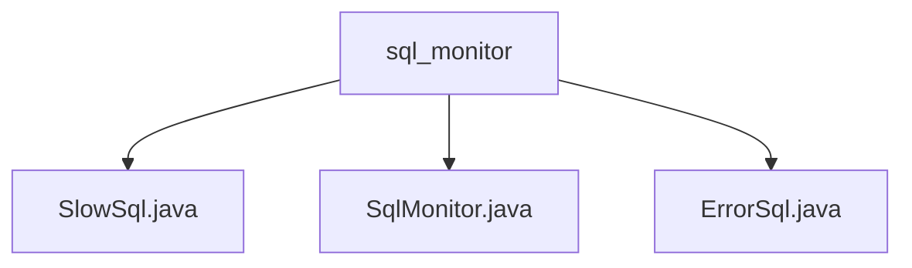

# Basic Information

|      |      |
|------|------|
| Name | sql_monitor |
| Language | .java |
| Code Path | WeFe/common/java/common-data-mysql/src/main/java/com/welab/wefe/common/data/mysql/sql_monitor |
| Package Name | docs.common.java.common-data-mysql.src.main.java.com.welab.wefe.common.data.mysql.sql_monitor |
| Brief Description | The SlowSql class records slow SQL statistics, including SQL statements and execution time, while maintaining the fastest SQL instance. The SqlMonitor class monitors SQL execution, capturing slow and failed SQLs, with configurable thresholds and limits. The ErrorSql class logs SQL error details, including error messages and capture counts. |

# Description

## Overview  
This module focuses on SQL execution monitoring, with its core responsibilities being capturing slow SQL and failed SQL, and performing statistical analysis. The interface specifications include: a slow SQL threshold of 100ms, a maximum capture limit of 100 entries; failed SQL requires parameterized statement formatting and error detail recording. Key data structures include SlowSql (recording time consumption statistics), ErrorSql (storing error information), and two ConcurrentHashMap instances for storage. The only external dependency is the Java standard library. For example, SlowSql maintains a global record of the fastest SQL, while ErrorSql preserves exception stack traces.  

## Main Business Scenarios  
The module intercepts SQL execution via FilterEventAdapter to achieve end-to-end monitoring. The business process is as follows: timing begins before SQL execution, and upon completion, it determines whether the query is slow or failed, updating the SlowSql or ErrorSql instances accordingly. The interaction model resembles an event bus, where callback methods trigger statistical logic. Typical applications include performance optimization (analyzing slow SQL patterns) and fault diagnosis (tracking failed SQL). For instance, SqlMonitor overrides statement-related methods to achieve nanosecond-level timing statistics and upper limit control.

### Package Internal Structure View

This flowchart illustrates three Java files under the sql_monitor directory: SlowSql.java, SqlMonitor.java, and ErrorSql.java. All three files reside directly within the sql_monitor directory at the same hierarchical level, with no deeper nesting structure. Each file maintains a direct parent-child relationship with the sql_monitor directory, clearly reflecting the file organization structure within the project.

# File List

| Name   | Type  | Description |
|-------|------|-------------|
| [SlowSql.java](SlowSql.md) | file | The SlowSql class records slow SQL information, including the SQL statement, first capture time, hash value, capture count, and average/minimum/maximum execution time. It provides a capture method to update statistics and record the globally fastest slow SQL. |
| [SqlMonitor.java](SqlMonitor.md) | file | The SqlMonitor class monitors SQL execution, capturing slow SQL queries (duration ≥100ms) and failed SQL queries, with an upper limit of 100 entries each. Slow SQL queries are sorted by duration, while failed SQL queries record error messages. It utilizes hook methods to log timestamps before and after SQL execution and triggers the capture logic. |
| [ErrorSql.java](ErrorSql.md) | file | The ErrorSql class records erroneous SQL information, including the SQL statement, first capture time, hash value, capture count, and error details. The catchOnce method captures exceptions and updates error information along with the capture count. |

