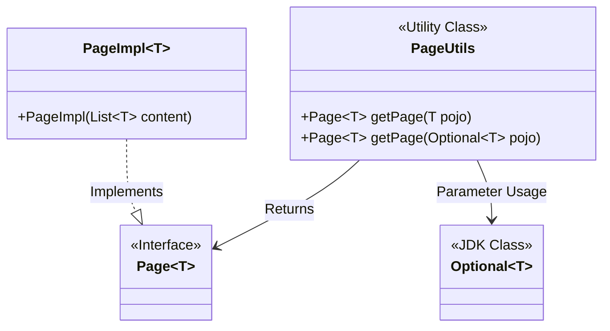
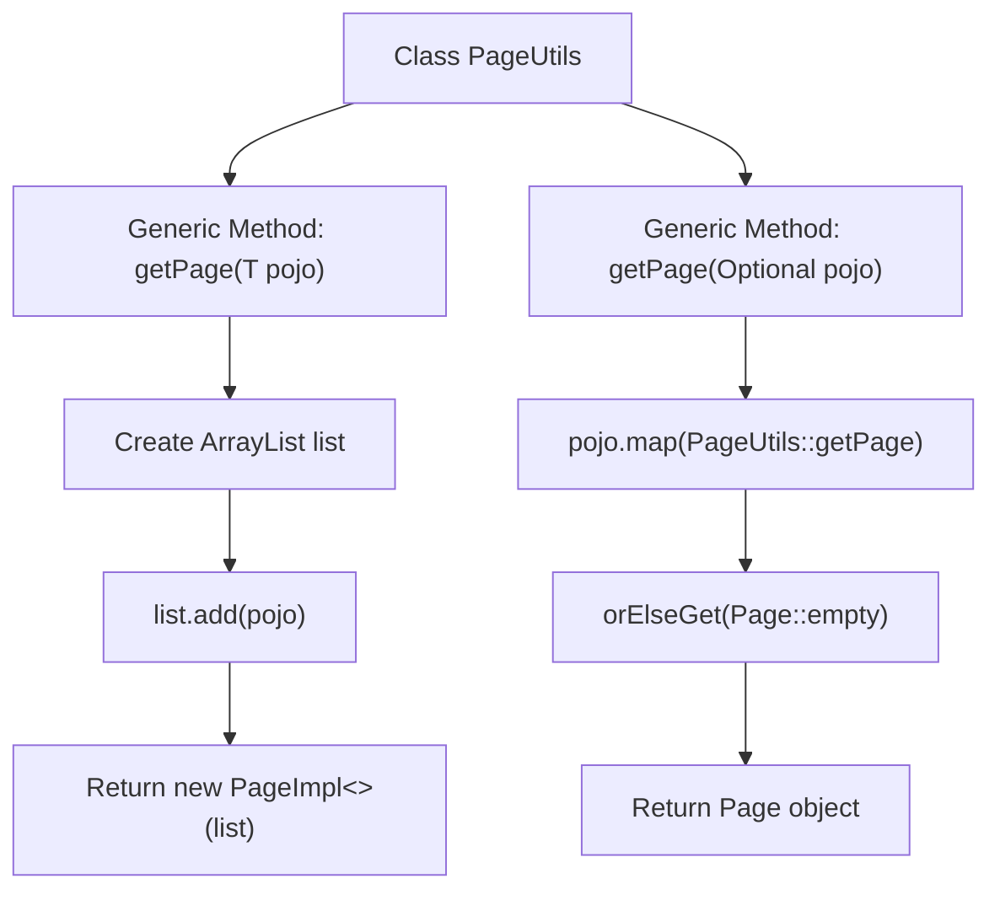

# Basic Information

|      |      |
|------|------|
| Name | PageUtils |
| Language | .java |
| Code Path | WeFe/common/java/common-data-mysql/src/main/java/com/welab/wefe/common/data/mysql/utils/PageUtils.java |
| Package Name | com.welab.wefe.common.data.mysql.utils |
| Dependencies | ['org.springframework.data.domain.Page', 'org.springframework.data.domain.PageImpl', 'java.util.ArrayList', 'java.util.List', 'java.util.Optional'] |
| Brief Description | The PageUtils class provides two static methods to convert a single object or Optional object into a paginated object, facilitating unified ID queries. |

# Description

The PageUtils class provides two static methods for obtaining pagination objects. The first method, getPage, accepts a single object parameter, encapsulates it into a list, and returns a PageImpl object containing that list. The second method, getPage, accepts an Optional object parameter; if the Optional has a value, it calls the first method to return a pagination object, otherwise it returns an empty pagination object. These two methods are primarily used to uniformly handle pagination scenarios for single objects when querying by ID.

# Class Summary

| Name   | Type  | Description |
|-------|------|-------------|
| PageUtils | class | The PageUtils class provides two static methods to convert a single object or Optional object into a paginated object, facilitating unified ID queries. |

## Class PageUtils

|      |      |
|------|------|
| Access Modifier | public |
| Type | class |
| Name | PageUtils |
| Description | The PageUtils class provides two static methods to convert a single object or Optional object into a paginated object, facilitating unified ID queries. |

### UML Class Diagram

This code demonstrates a pagination utility class PageUtils, which provides two static methods to convert either a single object or an Optional object into a Page pagination object. The class diagram clearly illustrates the relationships between PageUtils, the Page interface, its implementation class PageImpl, and JDK's Optional class. The utility class supports generic type T through parameterized methods, where PageImpl is the standard implementation of Spring Data Commons' Page interface for wrapping single data into paginated structures. The map operation of Optional enables null-safe conversion, reflecting edge case handling considerations.

### Internal Method Call Graph

This code demonstrates a PageUtils utility class containing two generic methods for creating pagination objects. The first method, getPage(T pojo), wraps a single object into a List and creates a PageImpl pagination instance. The second method, getPage(Optional<T> pojo), handles potentially empty optional objects by invoking the first method through Optional's map operation, returning an empty page when the object is null. The flowchart clearly illustrates the internal call relationships and data processing flow of the two methods, showcasing the conversion logic from simple objects to pagination objects.

### Field List

| Name  | Type  | Description |
|-------|-------|------|

### Method List

| Name  | Type  | Description |
|-------|-------|------|
| getPage | Page<T> | The static method getPage accepts an Optional<T> parameter, converts it to a Page object if a value is present, otherwise returns an empty Page. |
| getPage | Page<T> | The static method `getPage` accepts a generic object `pojo`, encapsulates it into a single-element list, and returns a `PageImpl` pagination object. |

