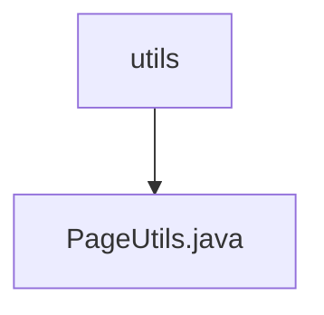

# Basic Information

|      |      |
|------|------|
| Name | utils |
| Language | .java |
| Code Path | WeFe/common/java/common-data-mysql/src/main/java/com/welab/wefe/common/data/mysql/utils |
| Package Name | docs.common.java.common-data-mysql.src.main.java.com.welab.wefe.common.data.mysql.utils |
| Brief Description | The PageUtils class provides two static methods to convert a single object or Optional object into a paginated object, facilitating unified ID queries. |

# Description

The PageUtils class provides two static methods for obtaining pagination objects. The first method, getPage, accepts a single object parameter, encapsulates it into a list, and returns a PageImpl object containing that list. The second method, getPage, accepts an Optional object parameter; if the Optional has a value, it calls the first method to return a pagination object, otherwise it returns an empty pagination object. These two methods are primarily used to uniformly handle pagination scenarios for single objects when querying by ID.

### Package Internal Structure View

This flowchart illustrates the structure of the utils utility package under the common-data-mysql module in the WeFe project, which includes a core pagination utility class, PageUtils.java. The parent node is utils, and PageUtils.java serves as its child node, demonstrating a simple single-layer file structure relationship. It is designed as a utility class for handling MySQL database pagination operations.

# File List

| Name   | Type  | Description |
|-------|------|-------------|
| [PageUtils.java](PageUtils.md) | file | The PageUtils class provides two static methods to convert a single object or Optional object into a paginated object, facilitating unified ID queries. |

