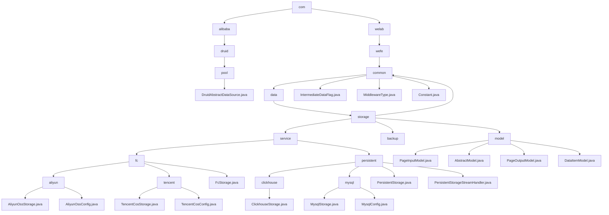

# Basic Information

|      |      |
|------|------|
| Name | com |
| Language | .java |
| Code Path | WeFe/common/java/common-data-storage/src/main/java/com |
| Package Name | docs.common.java.common-data-storage.src.main.java.com |
| Brief Description | DruidAbstractDataSource is the core abstract class of the Druid connection pool, providing fundamental functionalities such as connection pool configuration, monitoring, and thread safety. The multi-cloud storage module supports unified operations across heterogeneous databases, including capabilities like sharding, pagination, and stream processing, while relying on mainstream cloud SDKs and JDBC drivers. |

# Description

## Overview  
The core responsibility of this module is to achieve unified data storage and management across cloud platforms and multiple databases, integrating connection pool control and dynamic sharding capabilities. DruidAbstractDataSource serves as the base class for the connection pool, providing thread-safe configurations (such as maxActive for controlling connection count) and JMX monitoring. The data storage module encapsulates CRUD operations and paginated queries, resembling the adapter pattern. Key data structures include sharding strategies, connection configurations (e.g., ClickhouseConfig), and generic key-value pairs. External dependencies include the Druid connection pool, cloud platform SDKs (Alibaba Cloud/Tencent Cloud), and JDBC drivers. For example, Druid uses testWhileIdle to detect connection validity, while the data module employs hashKeyToPartition to implement dynamic sharding.  

## Primary Business Scenarios  
The module is suitable for hybrid cloud storage and heterogeneous database scenarios. A typical workflow involves configuration initialization → sharding/serialization → multi-threaded or stream processing → monitoring callbacks. The Druid connection pool supports high-concurrency request management, while the data module provides paginated queries (e.g., PageInputModel) and key-value storage (e.g., DataItemModel). The interaction mode is configuration-driven, such as Alibaba Cloud OTS partitioning by hash or MySQL querying via pagination parameters. Integration cases span from Druid connection pool initialization to getByStream stream processing, forming an end-to-end data solution.

### Package Internal Structure View

This flowchart illustrates the Java package structure of the common-data-storage module in the WeFe project. Starting from the root directory 'com', it branches into two main paths: 'alibaba' and 'welab'. The 'alibaba' branch includes classes related to the Druid connection pool, while the 'welab' branch details the hierarchical structure of the data storage service, encompassing common components, storage services (with implementations for Alibaba Cloud and Tencent Cloud), persistent storage (such as MySQL and ClickHouse), and submodules like data models.

# File List

| Name   | Type  | Description |
|-------|------|-------------|
| [welab](welab/_module.md) | package | Module 1: Define common data storage configurations, including serialization patterns, middleware types, and database connections, dependent on MySQL drivers.  Module 2: Unify multi-cloud platforms and multi-database storage, supporting batch operations and dynamic sharding, dependent on cloud SDKs and JDBC.  Module 3: Provide a basic pagination query model, including pagination input/output and key-value pair structures, suitable for scenarios such as logs. |
| [alibaba](alibaba/_module.md) | package | DruidAbstractDataSource is the abstract base class of the Druid connection pool, implementing the DataSource interface and JMX management capabilities. It defines the core configuration parameters of the connection pool, including connection count control (initialSize/maxActive/minIdle), timeout settings (maxWait), validation queries (validationQuery), idle detection (timeBetweenEvictionRunsMillis), and more. It supports features such as filter chains, SQL monitoring, and connection leak detection, while tracking connection and statement execution statistics through atomic variables. |

