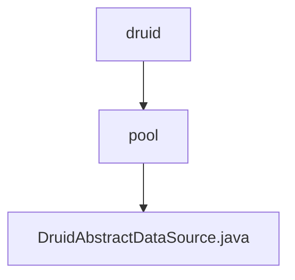

# Basic Information

|      |      |
|------|------|
| Name | druid |
| Language | .java |
| Code Path | WeFe/common/java/common-data-storage/src/main/java/com/alibaba/druid |
| Package Name | docs.common.java.common-data-storage.src.main.java.com.alibaba.druid |
| Brief Description | DruidAbstractDataSource is the abstract base class of the Druid connection pool, implementing the DataSource interface and JMX management capabilities. It defines the core configuration parameters of the connection pool, including connection count control (initialSize/maxActive/minIdle), timeout settings (maxWait), validation queries (validationQuery), idle detection (timeBetweenEvictionRunsMillis), and more. It supports features such as filter chains, SQL monitoring, and connection leak detection, and uses atomic variables to track connection and statement execution statistics. |

# Description

DruidAbstractDataSource is an abstract class that implements the DruidAbstractDataSourceMBean, DataSource, DataSourceProxy, and Serializable interfaces. Serving as the core base class for the Druid connection pool, it encapsulates a wide range of connection pool configuration parameters and runtime state metrics. Key features include: connection pool size control (initialSize/maxActive/minIdle), connection acquisition timeout (maxWait), connection validity detection (validationQuery/testWhileIdle), idle connection reclamation policy (timeBetweenEvictionRunsMillis/minEvictableIdleTimeMillis), monitoring statistics (executeCount/commitCount/rollbackCount), filter mechanism (filters), and abnormal connection handling (exceptionSorter). The class defines the core processes for connection creation, destruction, and validation, ensuring thread safety through atomic variables and locking mechanisms. It also supports JMX monitoring, providing extensive runtime statistical information. Subclasses are required to implement specific connection pool management logic.

### Package Internal Structure View

This flowchart illustrates the hierarchical structure of the Druid database connection pool module. The root node is the `druid` directory, which contains the `pool` subdirectory. Within the `pool` directory resides the core class file `DruidAbstractDataSource.java`. This structure demonstrates a clear hierarchical relationship from the base package to the concrete implementation class, adhering to the common package organization approach in Java projects.

# File List

| Name   | Type  | Description |
|-------|------|-------------|
| [pool](pool/_module.md) | package | DruidAbstractDataSource is the abstract base class of the Druid connection pool, implementing the DataSource interface and JMX management capabilities. It defines the core configuration parameters of the connection pool, including connection count control (initialSize/maxActive/minIdle), timeout settings (maxWait), validation query (validationQuery), idle detection (timeBetweenEvictionRunsMillis), and more. It supports features such as filter chains, SQL monitoring, and connection leak detection, while tracking connection and statement execution statistics through atomic variables. |

