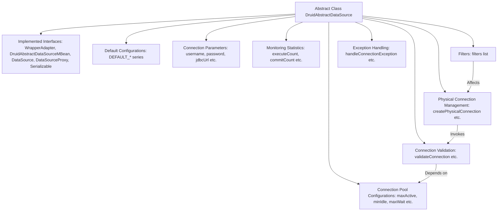
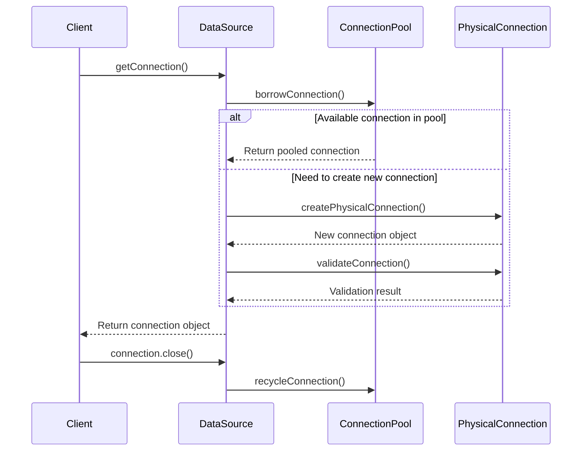

# Basic Information

|      |      |
|------|------|
| Name | DruidAbstractDataSource |
| Language | .java |
| Code Path | WeFe/common/java/common-data-storage/src/main/java/com/alibaba/druid/pool/DruidAbstractDataSource.java |
| Package Name | com.alibaba.druid.pool |
| Dependencies | ['com.alibaba.druid.DruidRuntimeException', 'com.alibaba.druid.filter.Filter', 'com.alibaba.druid.filter.FilterChainImpl', 'com.alibaba.druid.filter.FilterManager', 'com.alibaba.druid.pool.vendor.NullExceptionSorter', 'com.alibaba.druid.proxy.jdbc.DataSourceProxy', 'com.alibaba.druid.proxy.jdbc.TransactionInfo', 'com.alibaba.druid.stat.JdbcDataSourceStat', 'com.alibaba.druid.stat.JdbcSqlStat', 'com.alibaba.druid.stat.JdbcStatManager', 'com.alibaba.druid.support.logging.Log', 'com.alibaba.druid.support.logging.LogFactory', 'com.alibaba.druid.util', 'javax.management.JMException', 'javax.management.ObjectName', 'javax.management.openmbean.CompositeDataSupport', 'javax.security.auth.callback.NameCallback', 'javax.security.auth.callback.PasswordCallback', 'javax.sql.DataSource', 'java.io.PrintWriter', 'java.io.Serializable', 'java.sql', 'java.util.Date', 'java.util', 'java.util.concurrent.CopyOnWriteArrayList', 'java.util.concurrent.ScheduledExecutorService', 'java.util.concurrent.atomic.AtomicIntegerFieldUpdater', 'java.util.concurrent.atomic.AtomicLongFieldUpdater', 'java.util.concurrent.locks.Condition', 'java.util.concurrent.locks.ReentrantLock', 'java.util.logging.Logger'] |
| Brief Description | DruidAbstractDataSource is the abstract base class of the Druid connection pool, implementing the DataSource interface and JMX management capabilities. It defines the core configuration parameters of the connection pool, including connection count control (initialSize/maxActive/minIdle), timeout settings (maxWait), validation queries (validationQuery), idle detection (timeBetweenEvictionRunsMillis), and more. It supports features such as filter chains, SQL monitoring, and connection leak detection, while tracking connection and statement execution statistics through atomic variables. |

# Description

DruidAbstractDataSource is an abstract class that implements the DruidAbstractDataSourceMBean, DataSource, DataSourceProxy, and Serializable interfaces. Serving as the core base class for the Druid connection pool, it encapsulates a large number of connection pool configuration parameters and runtime state metrics. Key features include: connection pool size control (initialSize/maxActive/minIdle), connection acquisition timeout (maxWait), connection validity detection (validationQuery/testWhileIdle), idle connection reclamation policy (timeBetweenEvictionRunsMillis/minEvictableIdleTimeMillis), monitoring statistics (executeCount/commitCount/rollbackCount), filter mechanism (filters), and abnormal connection handling (exceptionSorter). The class defines the core processes for connection creation, destruction, and validation, ensuring thread safety through atomic variables and locking mechanisms. It also supports JMX monitoring, providing extensive runtime statistics. Subclasses are required to implement specific connection pool management logic.

# Class Summary

| Name   | Type  | Description |
|-------|------|-------------|
| DruidAbstractDataSource | class | DruidAbstractDataSource is the abstract base class of the Druid connection pool, implementing the DataSource interface and JMX management capabilities. It defines core connection pool configuration parameters such as maximum connections, minimum idle connections, validation queries, and manages connection creation, validation, and recycling logic. It supports filter extensions, monitoring statistics, fault handling mechanisms, and provides rich performance metrics and status monitoring interfaces. |


## Class DruidAbstractDataSource

|      |      |
|------|------|
| Access Modifier | public abstract |
| Type | class |
| Name | DruidAbstractDataSource |
| Description | DruidAbstractDataSource is the abstract base class of the Druid connection pool, implementing the DataSource interface and JMX management capabilities. It defines core connection pool configuration parameters such as maximum connections, minimum idle connections, validation queries, and manages connection creation, validation, and recycling logic. It supports filter extensions, monitoring statistics, fault handling mechanisms, and provides rich performance metrics and status monitoring interfaces. |


### UML Class Diagram

```mermaid
classDiagram
    class DruidAbstractDataSource {
        <<abstract>>
        -serialVersionUID: long = 1L
        -LOG: Log
        -DEFAULT_*: static final int/long/boolean/String
        -volatile defaultAutoCommit: boolean
        -volatile defaultReadOnly: Boolean
        -volatile defaultTransactionIsolation: Integer
        -volatile defaultCatalog: String
        -name: String
        -volatile username: String
        -volatile password: String
        -volatile jdbcUrl: String
        -volatile driverClass: String
        -volatile driverClassLoader: ClassLoader
        -volatile connectProperties: Properties
        -volatile passwordCallback: PasswordCallback
        -volatile userCallback: NameCallback
        -volatile initialSize: int
        -volatile maxActive: int
        -volatile minIdle: int
        -volatile maxIdle: int
        -volatile maxWait: long
        -notFullTimeoutRetryCount: int
        -volatile validationQuery: String
        -volatile validationQueryTimeout: int
        -volatile testOnBorrow: boolean
        -volatile testOnReturn: boolean
        -volatile testWhileIdle: boolean
        -volatile poolPreparedStatements: boolean
        -volatile sharePreparedStatements: boolean
        -volatile maxPoolPreparedStatementPerConnectionSize: int
        -volatile inited: boolean
        -volatile initExceptionThrow: boolean
        -logWriter: PrintWriter
        -filters: List~Filter~
        -clearFiltersEnable: boolean
        -volatile exceptionSorter: ExceptionSorter
        -driver: Driver
        -volatile queryTimeout: int
        -volatile transactionQueryTimeout: int
        -createTimespan: long
        -volatile maxWaitThreadCount: int
        -volatile accessToUnderlyingConnectionAllowed: boolean
        -volatile timeBetweenEvictionRunsMillis: long
        -volatile numTestsPerEvictionRun: int
        -volatile minEvictableIdleTimeMillis: long
        -volatile maxEvictableIdleTimeMillis: long
        -volatile keepAliveBetweenTimeMillis: long
        -volatile phyTimeoutMillis: long
        -volatile phyMaxUseCount: long
        -volatile removeAbandoned: boolean
        -volatile removeAbandonedTimeoutMillis: long
        -volatile logAbandoned: boolean
        -volatile maxOpenPreparedStatements: int
        -volatile connectionInitSqls: List~String~
        -volatile dbType: String
        -volatile timeBetweenConnectErrorMillis: long
        -volatile validConnectionChecker: ValidConnectionChecker
        -activeConnections: Map~DruidPooledConnection, Object~
        -PRESENT: static final Object
        -id: long
        -connectionErrorRetryAttempts: int
        -breakAfterAcquireFailure: boolean
        -transactionThresholdMillis: long
        -createdTime: Date
        -initedTime: Date
        -volatile errorCount: long
        -volatile dupCloseCount: long
        -volatile startTransactionCount: long
        -volatile commitCount: long
        -volatile rollbackCount: long
        -volatile cachedPreparedStatementHitCount: long
        -volatile preparedStatementCount: long
        -volatile closedPreparedStatementCount: long
        -volatile cachedPreparedStatementCount: long
        -volatile cachedPreparedStatementDeleteCount: long
        -volatile cachedPreparedStatementMissCount: long
        -transactionHistogram: Histogram
        -dupCloseLogEnable: boolean
        -objectName: ObjectName
        -volatile executeCount: long
        -volatile executeQueryCount: long
        -volatile executeUpdateCount: long
        -volatile executeBatchCount: long
        -volatile createError: Throwable
        -volatile lastError: Throwable
        -volatile lastErrorTimeMillis: long
        -volatile lastCreateError: Throwable
        -volatile lastCreateErrorTimeMillis: long
        -volatile lastCreateStartTimeMillis: long
        -isOracle: boolean
        -isMySql: boolean
        -useOracleImplicitCache: boolean
        -lock: ReentrantLock
        -notEmpty: Condition
        -empty: Condition
        -activeConnectionLock: ReentrantLock
        -volatile createErrorCount: int
        -volatile creatingCount: int
        -volatile directCreateCount: int
        -volatile createCount: long
        -volatile destroyCount: long
        -volatile createStartNanos: long
        -useUnfairLock: Boolean
        -useLocalSessionState: boolean
        -timeBetweenLogStatsMillis: long
        -statLogger: DruidDataSourceStatLogger
        -asyncCloseConnectionEnable: boolean
        -maxCreateTaskCount: int
        -failFast: boolean
        -volatile failContinuous: int
        -volatile failContinuousTimeMillis: long
        -destroyScheduler: ScheduledExecutorService
        -createScheduler: ScheduledExecutorService
        -initVariants: boolean
        -initGlobalVariants: boolean
        -volatile onFatalError: boolean
        -volatile onFatalErrorMaxActive: int
        -volatile fatalErrorCount: int
        -volatile fatalErrorCountLastShrink: int
        -volatile lastFatalErrorTimeMillis: long
        -volatile lastFatalErrorSql: String
        -volatile lastFatalError: Throwable
        -volatile connectionIdSeed: long
        -volatile statementIdSeed: long
        -volatile resultSetIdSeed: long
        -volatile transactionIdSeed: long
        -volatile metaDataIdSeed: long

        +DruidAbstractDataSource(boolean lockFair)
        +isUseLocalSessionState(): boolean
        +setUseLocalSessionState(boolean): void
        +getStatLogger(): DruidDataSourceStatLogger
        +setStatLoggerClassName(String): void
        +setStatLogger(DruidDataSourceStatLogger): void
        +getTimeBetweenLogStatsMillis(): long
        +setTimeBetweenLogStatsMillis(long): void
        +isOracle(): boolean
        +setOracle(boolean): void
        +isUseUnfairLock(): boolean
        +setUseUnfairLock(boolean): void
        +isUseOracleImplicitCache(): boolean
        +setUseOracleImplicitCache(boolean): void
        +getLastCreateError(): Throwable
        +getLastError(): Throwable
        +getLastErrorTimeMillis(): long
        +getLastErrorTime(): Date
        +getLastCreateErrorTimeMillis(): long
        +getLastCreateErrorTime(): Date
        +getTransactionQueryTimeout(): int
        +setTransactionQueryTimeout(int): void
        +getExecuteCount(): long
        +getExecuteUpdateCount(): long
        +getExecuteQueryCount(): long
        +getExecuteBatchCount(): long
        +getAndResetExecuteCount(): long
        +getExecuteCount2(): long
        +incrementExecuteCount(): void
        +incrementExecuteUpdateCount(): void
        +incrementExecuteQueryCount(): void
        +incrementExecuteBatchCount(): void
        +isDupCloseLogEnable(): boolean
        +setDupCloseLogEnable(boolean): void
        +getObjectName(): ObjectName
        +setObjectName(ObjectName): void
        +getTransactionHistogram(): Histogram
        +incrementCachedPreparedStatementCount(): void
        +decrementCachedPreparedStatementCount(): void
        +incrementCachedPreparedStatementDeleteCount(): void
        +incrementCachedPreparedStatementMissCount(): void
        +getCachedPreparedStatementMissCount(): long
        +getCachedPreparedStatementAccessCount(): long
        +getCachedPreparedStatementDeleteCount(): long
        +getCachedPreparedStatementCount(): long
        +incrementClosedPreparedStatementCount(): void
        +getClosedPreparedStatementCount(): long
        +incrementPreparedStatementCount(): void
        +getPreparedStatementCount(): long
        +incrementCachedPreparedStatementHitCount(): void
        +getCachedPreparedStatementHitCount(): long
        +getTransactionThresholdMillis(): long
        +setTransactionThresholdMillis(long): void
        +logTransaction(TransactionInfo): abstract void
        +getTransactionHistogramValues(): long[]
        +getTransactionHistogramRanges(): long[]
        +getCommitCount(): long
        +incrementCommitCount(): void
        +getRollbackCount(): long
        +incrementRollbackCount(): void
        +getStartTransactionCount(): long
        +incrementStartTransactionCount(): void
        +isBreakAfterAcquireFailure(): boolean
        +setBreakAfterAcquireFailure(boolean): void
        +getConnectionErrorRetryAttempts(): int
        +setConnectionErrorRetryAttempts(int): void
        +getDupCloseCount(): long
        +getMaxPoolPreparedStatementPerConnectionSize(): int
        +setMaxPoolPreparedStatementPerConnectionSize(int): void
        +isSharePreparedStatements(): boolean
        +setSharePreparedStatements(boolean): void
        +incrementDupCloseCount(): void
        +getValidConnectionChecker(): ValidConnectionChecker
        +setValidConnectionChecker(ValidConnectionChecker): void
        +getValidConnectionCheckerClassName(): String
        +setValidConnectionCheckerClassName(String): void
        +getDbType(): String
        +setDbType(String): void
        +addConnectionProperty(String, String): void
        +getConnectionInitSqls(): Collection~String~
        +setConnectionInitSqls(Collection~? extends Object~): void
        +getTimeBetweenConnectErrorMillis(): long
        +setTimeBetweenConnectErrorMillis(long): void
        +getMaxOpenPreparedStatements(): int
        +setMaxOpenPreparedStatements(int): void
        +isLogAbandoned(): boolean
        +setLogAbandoned(boolean): void
        +getRemoveAbandonedTimeout(): int
        +setRemoveAbandonedTimeout(int): void
        +setRemoveAbandonedTimeoutMillis(long): void
        +getRemoveAbandonedTimeoutMillis(): long
        +isRemoveAbandoned(): boolean
        +setRemoveAbandoned(boolean): void
        +getMinEvictableIdleTimeMillis(): long
        +setMinEvictableIdleTimeMillis(long): void
        +getKeepAliveBetweenTimeMillis(): long
        +setKeepAliveBetweenTimeMillis(long): void
        +getMaxEvictableIdleTimeMillis(): long
        +setMaxEvictableIdleTimeMillis(long): void
        +getPhyTimeoutMillis(): long
        +setPhyTimeoutMillis(long): void
        +getPhyMaxUseCount(): long
        +setPhyMaxUseCount(long): void
        +getNumTestsPerEvictionRun(): int
        +setNumTestsPerEvictionRun(int): void
        +getTimeBetweenEvictionRunsMillis(): long
        +setTimeBetweenEvictionRunsMillis(long): void
        +getMaxWaitThreadCount(): int
        +setMaxWaitThreadCount(int): void
        +getValidationQuery(): String
        +setValidationQuery(String): void
        +getValidationQueryTimeout(): int
        +setValidationQueryTimeout(int): void
        +isAccessToUnderlyingConnectionAllowed(): boolean
        +setAccessToUnderlyingConnectionAllowed(boolean): void
        +isTestOnBorrow(): boolean
        +setTestOnBorrow(boolean): void
        +isTestOnReturn(): boolean
        +setTestOnReturn(boolean): void
        +isTestWhileIdle(): boolean
        +setTestWhileIdle(boolean): void
        +isDefaultAutoCommit(): boolean
        +setDefaultAutoCommit(boolean): void
        +getDefaultReadOnly(): Boolean
        +setDefaultReadOnly(Boolean): void
        +getDefaultTransactionIsolation(): Integer
        +setDefaultTransactionIsolation(Integer): void
        +getDefaultCatalog(): String
        +setDefaultCatalog(String): void
        +getPasswordCallback(): PasswordCallback
        +setPasswordCallback(PasswordCallback): void
        +setPasswordCallbackClassName(String): void
        +getUserCallback(): NameCallback
        +setUserCallback(NameCallback): void
        +isInitVariants(): boolean
        +setInitVariants(boolean): void
        +isInitGlobalVariants(): boolean
        +setInitGlobalVariants(boolean): void
        +getQueryTimeout(): int
        +setQueryTimeout(int): void
        +getName(): String
        +setName(String): void
        +isPoolPreparedStatements(): boolean
        +setPoolPreparedStatements(boolean): abstract void
        +getMaxWait(): long
        +setMaxWait(long): void
        +getNotFullTimeoutRetryCount(): int
        +setNotFullTimeoutRetryCount(int): void
        +getMinIdle(): int
        +setMinIdle(int): void
        +getMaxIdle(): int
        +setMaxIdle(int): void
        +getInitialSize(): int
        +setInitialSize(int): void
        +getCreateErrorCount(): long
        +getMaxActive(): int
        +setMaxActive(int): abstract void
        +getUsername(): String
        +setUsername(String): void
        +getPassword(): String
        +setPassword(String): void
        +getConnectProperties(): Properties
        +setConnectProperties(Properties): abstract void
        +setConnectionProperties(String): void
        +getUrl(): String
        +getRawJdbcUrl(): String
        +setUrl(String): void
        +getDriverClassName(): String
        +setDriverClassName(String): void
        +getDriverClassLoader(): ClassLoader
        +setDriverClassLoader(ClassLoader): void
        +getLogWriter(): PrintWriter
        +setLogWriter(PrintWriter): void
        +setLoginTimeout(int): void
        +getLoginTimeout(): int
        +getDriver(): Driver
        +setDriver(Driver): void
        +getDriverMajorVersion(): int
        +getDriverMinorVersion(): int
        +getExceptionSorter(): ExceptionSorter
        +getExceptionSorterClassName(): String
        +setExceptionSorter(ExceptionSorter): void
        +setExceptionSorterClassName(String): void
        +setExceptionSorter(String): void
        +getProxyFilters(): List~Filter~
        +setProxyFilters(List~Filter~): void
        +getFilterClasses(): String[]
        +setFilters(String): void
        +addFilters(String): void
        +clearFilters(): void
        +validateConnection(Connection): void
        +testConnectionInternal(Connection): boolean
        +testConnectionInternal(DruidConnectionHolder, Connection): boolean
        +getActiveConnections(): Set~DruidPooledConnection~
        +getActiveConnectionStackTrace(): List~String~
        +getCreateTimespanNano(): long
        +getCreateTimespanMillis(): long
        +getRawDriver(): Driver
        +isClearFiltersEnable(): boolean
        +setClearFiltersEnable(boolean): void
        +createConnectionId(): long
        +createStatementId(): long
        +createMetaDataId(): long
        +createResultSetId(): long
        +createTransactionId(): long
        +initStatement(DruidPooledConnection, Statement): void
        +handleConnectionException(DruidPooledConnection, Throwable): void
        +handleConnectionException(DruidPooledConnection, Throwable, String): abstract void
        +recycle(DruidPooledConnection): abstract void
        +createPhysicalConnection(String, Properties): Connection
        +createPhysicalConnection(): PhysicalConnectionInfo
        +setCreateError(Throwable): void
        +isFailContinuous(): boolean
        +setFailContinuous(boolean): void
        +initPhysicalConnection(Connection): void
        +initPhysicalConnection(Connection, Map~String, Object~, Map~String, Object~): void
        +getActivePeak(): abstract int
        +getCompositeData(): CompositeDataSupport
        +getID(): long
        +getCreatedTime(): Date
        +getRawDriverMajorVersion(): abstract int
        +getRawDriverMinorVersion(): abstract int
        +getProperties(): abstract String
        +getParentLogger(): Logger
        +closePreapredStatement(PreparedStatementHolder): void
        +cloneTo(DruidAbstractDataSource): void
        +discardConnection(Connection): abstract void
        +discardConnection(DruidConnectionHolder): void
        +isAsyncCloseConnectionEnable(): boolean
        +setAsyncCloseConnectionEnable(boolean): void
        +getCreateScheduler(): ScheduledExecutorService
        +setCreateScheduler(ScheduledExecutorService): void
        +getDestroyScheduler(): ScheduledExecutorService
        +setDestroyScheduler(ScheduledExecutorService): void
        +isInited(): boolean
        +getMaxCreateTaskCount(): int
        +setMaxCreateTaskCount(int): void
        +isFailFast(): boolean
        +setFailFast(boolean): void
        +getOnFatalErrorMaxActive(): int
        +setOnFatalErrorMaxActive(int): void
        +isOnFatalError(): boolean
        +isInitExceptionThrow(): boolean
        +setInitExceptionThrow(boolean): void
    }

    class PhysicalConnectionInfo {
        -connection: Connection
        -connectStartNanos: long
        -connectedNanos: long
        -initedNanos: long
        -validatedNanos: long
        -vairiables: Map~String, Object~
        -globalVairiables: Map~String, Object~
        -createTaskId: long

        +PhysicalConnectionInfo(Connection, long, long, long, long)
        +PhysicalConnectionInfo(Connection, long, long, long, long, Map~String, Object~, Map~String, Object~)
        +getPhysicalConnection(): Connection
        +getConnectStartNanos(): long
        +getConnectedNanos(): long
        +getInitedNanos(): long
        +getValidatedNanos


### Internal Method Call Graph





This code represents the core abstract class of Druid connection pool, with main functionalities including: 1) Managing basic configuration parameters for database connections; 2) Implementing complete lifecycle management for connection creation, validation, and recycling; 3) Providing comprehensive monitoring and statistical features; 4) Supporting functional extensions through filter chains. The flowchart illustrates the main components and their interactions within the class, while the sequence diagram depicts the typical process of obtaining and releasing connections. The code ensures thread safety through precise concurrency control and atomic operations, and incorporates robust exception handling mechanisms.

### Field List

| Name  | Type  | Description |
|-------|-------|------|
| activeConnectionLock = new ReentrantLock() | ReentrantLock | Create a reentrant lock object `activeConnectionLock` for thread synchronization control. |
| lastErrorTimeMillis | long | Protected mutable long integer variable, recording the timestamp (in milliseconds) of the last error occurrence. |
| empty | Condition | Protected empty condition variable. |
| logAbandoned | boolean | A protected mutable boolean value indicating whether to log deprecated states. |
| lastFatalErrorSql = null | String | Declare a protected volatile string variable lastFatalErrorSql with an initial value of null. |
| executeBatchCountUpdater = AtomicLongFieldUpdater.newUpdater(DruidAbstractDataSource.class, "executeBatchCount") | AtomicLongFieldUpdater<DruidAbstractDataSource> | The DruidAbstractDataSource class defines an atomic long field updater named executeBatchCountUpdater, which is used to update the executeBatchCount field in a thread-safe manner. |
| removeAbandonedTimeoutMillis = 300 * 1000 | long | The variable removeAbandonedTimeoutMillis is set to 300,000 milliseconds (5 minutes), with the volatile modifier ensuring visibility across multiple threads. |
| password | String | Declare a protected volatile string type variable password. |
| maxOpenPreparedStatements = -1 | int | The protected mutable integer variable `maxOpenPreparedStatements`, with a default value of -1, is used to control the maximum number of prepared statements. |
| onFatalError = false | boolean | Declare a protected volatile boolean variable onFatalError with an initial value of false. |
| executeUpdateCountUpdater = AtomicLongFieldUpdater.newUpdater(DruidAbstractDataSource.class, "executeUpdateCount") | AtomicLongFieldUpdater<DruidAbstractDataSource> | The DruidAbstractDataSource class defines an atomic long field updater for thread-safe updates to the executeUpdateCount field. |
| lastError | Throwable | Protected volatile exception variable, recording the last error. |
| notEmpty | Condition | Protective Condition Non-null Check |
| dupCloseCount = 0L | long | Protected volatile long variable, recording the number of repeated closures, with an initial value of 0. |
| DEFAULT_NUM_TESTS_PER_EVICTION_RUN = 3 | int | The static constant DEFAULT_NUM_TESTS_PER_EVICTION_RUN has a default value of 3, indicating the default number of tests per eviction run. |
| DEFAULT_MAX_EVICTABLE_IDLE_TIME_MILLIS = 1000L * 60L * 60L * 7 | long | Define the default maximum recyclable idle time as 7 hours, in milliseconds. |
| closedPreparedStatementCountUpdater = AtomicLongFieldUpdater.newUpdater(DruidAbstractDataSource.class, "closedPreparedStatementCount") | AtomicLongFieldUpdater<DruidAbstractDataSource> | The atomic updater for the closedPreparedStatementCount field in the DruidAbstractDataSource class. |
| maxCreateTaskCount = 3 | int | The maximum number of tasks that can be created is limited to 3. |
| accessToUnderlyingConnectionAllowed = true | boolean | A boolean flag that allows direct access to the underlying connection, volatile ensures thread visibility. |
| username | String | Declare a protected mutable string-type variable username that supports multi-threaded access. |
| transactionQueryTimeout | int | Protected volatile integer variable for transaction query timeout setting. |
| DEFAULT_TIME_BETWEEN_CONNECT_ERROR_MILLIS = 500 | long | The static constant DEFAULT_TIME_BETWEEN_CONNECT_ERROR_MILLIS defines the connection error interval time as 500 milliseconds. |
| preparedStatementCountUpdater = AtomicLongFieldUpdater.newUpdater(DruidAbstractDataSource.class, "preparedStatementCount") | AtomicLongFieldUpdater<DruidAbstractDataSource> | The DruidAbstractDataSource class uses AtomicLongFieldUpdater to update the preparedStatementCount field. |
| startTransactionCount = 0L | long | Declare a protected volatile long variable startTransactionCount with an initial value of 0L. |
| DEFAULT_INITIAL_SIZE = 0 | int | Define the static constant DEFAULT_INITIAL_SIZE with an initial value of 0. |
| LOG = LogFactory.getLog(DruidAbstractDataSource.class) | Log | The DruidAbstractDataSource class defines a static immutable log object LOG for recording log information. |
| destroyCount = 0L | long | Protected volatile long variable, initialized to 0, used to record the number of destruction occurrences. |
| poolPreparedStatements = false | boolean | Declare a protected volatile boolean variable poolPreparedStatements with an initial value of false. |
| cachedPreparedStatementHitCount = 0L | long | This is a protected volatile long variable used to cache the hit count of prepared statements, with an initial value of 0. |
| createCount = 0L | long | Declare a protected volatile long variable createCount with an initial value of 0L. |
| testWhileIdle = DEFAULT_WHILE_IDLE | boolean | The protected mutable boolean variable `testWhileIdle`, with a default value of `DEFAULT_WHILE_IDLE`. |
| commitCountUpdater = AtomicLongFieldUpdater.newUpdater(DruidAbstractDataSource.class, "commitCount") | AtomicLongFieldUpdater<DruidAbstractDataSource> | The DruidAbstractDataSource class defines an atomic long field updater named commitCountUpdater, which is used to update the commitCount field in a thread-safe manner. |
| rollbackCount = 0L | long | Declare a protected volatile long variable rollbackCount with an initial value of 0. |
| logWriter = new PrintWriter(System.out) | PrintWriter | Create a protected PrintWriter instance named logWriter with the system standard output as its target. |
| directCreateCount = 0 | int | The protected volatile integer variable directCreateCount has an initial value of 0. |
| timeBetweenLogStatsMillis | long | Log statistics interval time (milliseconds) |
| createError | Throwable | Declare a protected volatile exception variable createError. |
| destroyCountUpdater = AtomicLongFieldUpdater.newUpdater(DruidAbstractDataSource.class, "destroyCount") | AtomicLongFieldUpdater<DruidAbstractDataSource> | The static AtomicLongFieldUpdater instance in the DruidAbstractDataSource class used for atomically updating the destroyCount field. |
| transactionIdSeedUpdater = AtomicLongFieldUpdater.newUpdater(DruidAbstractDataSource.class, "transactionIdSeed") | AtomicLongFieldUpdater<DruidAbstractDataSource> | The atomic updater for the transactionIdSeed field in the DruidAbstractDataSource class, used for thread-safe operations. |
| notFullTimeoutRetryCount = 0 | int | Protect the variable `notFullTimeoutRetryCount`, with an initial value of 0, used to record the number of timeout retries. |
| createdTime = new Date() | Date | Define an immutable Date type variable named createdTime, initialized to the current time. |
| maxWait = DEFAULT_MAX_WAIT | long | Declare a protected volatile long variable maxWait with an initial value of DEFAULT_MAX_WAIT. |
| transactionThresholdMillis = 0L | long | Transaction processing time threshold, default is 0 milliseconds. |
| resultSetIdSeedUpdater = AtomicLongFieldUpdater.newUpdater(DruidAbstractDataSource.class, "resultSetIdSeed") | AtomicLongFieldUpdater<DruidAbstractDataSource> | The atomic updater for the resultSetIdSeed field in the DruidAbstractDataSource class, used for thread-safe operations. |
| maxIdle = DEFAULT_MAX_IDLE | int | The protected mutable integer variable maxIdle has a default value of DEFAULT_MAX_IDLE. |
| breakAfterAcquireFailure = false | boolean | The code defines a boolean variable `breakAfterAcquireFailure`, with an initial value of `false`, which controls whether to interrupt the operation after an acquisition failure. |
| statementIdSeedUpdater = AtomicLongFieldUpdater.newUpdater(DruidAbstractDataSource.class, "statementIdSeed") | AtomicLongFieldUpdater<DruidAbstractDataSource> | In the DruidAbstractDataSource class, an atomic long field updater named statementIdSeedUpdater is declared to update the statementIdSeed field in a thread-safe manner. |
| isMySql = false | boolean | This is a boolean variable declaration used to identify whether it is a MySQL database, with a default value of false. |
| isOracle = false | boolean | Declare a boolean variable isOracle with a default value of false, indicating a non-Oracle database state. |
| minIdle = DEFAULT_MIN_IDLE | int | The protected mutable integer variable minIdle has a default value of DEFAULT_MIN_IDLE. |
| connectionIdSeedUpdater = AtomicLongFieldUpdater.newUpdater(DruidAbstractDataSource.class, "connectionIdSeed") | AtomicLongFieldUpdater<DruidAbstractDataSource> | The atomic updater for the connectionIdSeed field in the DruidAbstractDataSource class, used for thread-safe operations. |
| initedTime | Date | Declare a protected Date type variable named initedTime. |
| lastCreateStartTimeMillis | long | Protected volatile long variable, recording the start time of the last creation operation (in milliseconds). |
| id | long | Declare a protected long integer variable id. |
| validationQuery = DEFAULT_VALIDATION_QUERY | String | Declare a protected volatile string variable validationQuery with an initial value of DEFAULT_VALIDATION_QUERY. |
| useOracleImplicitCache = true | boolean | The code defines a boolean guard variable that controls whether Oracle implicit caching is enabled, with a default value of true. |
| maxActive = DEFAULT_MAX_ACTIVE_SIZE | int | Declare a protected volatile integer variable maxActive with an initial value of DEFAULT_MAX_ACTIVE_SIZE. |
| metaDataIdSeed = 80000L | long | The protected variable-length integer variable metaDataIdSeed, with an initial value of 80000L. |
| lastCreateErrorTimeMillis | long | Protected volatile long variable, recording the timestamp (in milliseconds) of the last error creation. |
| PRESENT = new Object() | Object | Define a protected static immutable object PRESENT for shared reference. |
| initialSize = DEFAULT_INITIAL_SIZE | int | Declare a protected volatile integer variable initialSize with an initial value of DEFAULT_INITIAL_SIZE. |
| transactionIdSeed = 60000L | long | The variable `transactionIdSeed` has an initial value of `60000L`, is modified with `volatile` to ensure visibility across multiple threads, and is restricted to subclass access with the `protected` modifier. |
| lastCreateError | Throwable | Protected mutable variable, records the most recent creation error. |
| activeConnections = new IdentityHashMap<DruidPooledConnection, Object>() | Map<DruidPooledConnection, Object> | Using IdentityHashMap to store DruidPooledConnection and its associated objects, ensuring concurrent access protection. |
| validConnectionChecker = null | ValidConnectionChecker | Protected volatile validation connection checker, initially empty. |
| statementIdSeed = 20000L | long | The protected variable-length long integer variable statementIdSeed, with an initial value of 20000L. |
| connectionErrorRetryAttempts = 1 | int | The default number of connection error retries is 1. |
| inited = false | boolean | Declare a protected volatile boolean variable inited with an initial value of false. |
| createStartNanosUpdater = AtomicLongFieldUpdater.newUpdater(DruidAbstractDataSource.class, "createStartNanos") | AtomicLongFieldUpdater<DruidAbstractDataSource> | Using AtomicLongFieldUpdater to provide atomic update capability for the createStartNanos field of the DruidAbstractDataSource class. |
| errorCount = 0L | long | Declare a protected mutable long integer variable errorCount with an initial value of 0. |
| connectProperties = new Properties() | Properties | Declare a protected volatile collection object. |
| connectionIdSeed = 10000L | long | Declare a protected volatile long variable connectionIdSeed with an initial value of 10000L. |
| timeBetweenConnectErrorMillis = DEFAULT_TIME_BETWEEN_CONNECT_ERROR_MILLIS | long | Declare a protected volatile long variable timeBetweenConnectErrorMillis, initialized to the default connection error interval in milliseconds. |
| driverClassLoader | ClassLoader | Protected volatile class loader, used for driving class loading. |
| validationQueryTimeout = -1 | int | Database connection validation query timeout duration, default -1 indicates no limit, volatile ensures visibility across multiple threads. |
| lock | ReentrantLock | Protective reentrant lock variable. |
| lastFatalError = null | Throwable | Declare a protected volatile variable lastFatalError to store the most recent fatal error, with an initial value of null. |
| driverClass | String | Declare a protected volatile string variable driverClass. |
| passwordCallback | PasswordCallback | Protected volatile password callback object. |
| executeCountUpdater = AtomicLongFieldUpdater.newUpdater(DruidAbstractDataSource.class, "executeCount") | AtomicLongFieldUpdater<DruidAbstractDataSource> | The DruidAbstractDataSource class defines an atomic long field updater named executeCountUpdater, which is used to update the executeCount field in a thread-safe manner. |
| resultSetIdSeed = 50000L | long | Protected variable-length long integer with an initial value of 50000L, used as a seed for generating result set IDs. |
| jdbcUrl | String | Protected volatile string type database connection address. |
| errorCountUpdater = AtomicLongFieldUpdater.newUpdater(DruidAbstractDataSource.class, "errorCount") | AtomicLongFieldUpdater<DruidAbstractDataSource> | The atomic updater for the errorCount field in the DruidAbstractDataSource class, used for thread-safe operations. |
| initGlobalVariants = false | boolean | Initialize the global variable flag with a default value of false. |
| phyMaxUseCount = -1 | long | Declare a protected volatile long variable phyMaxUseCount with an initial value of -1. |
| onFatalErrorMaxActive = 0 | int | Protected volatile integer variable used to record the maximum active count of fatal errors, with an initial value of 0. |
| initVariants = false | boolean | Initialize the variant flag with a default value of false. |
| defaultCatalog = null | String | Declare a protected volatile string variable defaultCatalog with an initial value of null. |
| phyTimeoutMillis = DEFAULT_PHY_TIMEOUT_MILLIS | long | Declare a protected volatile long variable phyTimeoutMillis, initialized to the default physical timeout in milliseconds. |
| failContinuousUpdater = AtomicIntegerFieldUpdater.newUpdater(DruidAbstractDataSource.class, "failContinuous") | AtomicIntegerFieldUpdater<DruidAbstractDataSource> | The atomic updater for the failContinuous field in the DruidAbstractDataSource class, used for thread-safe operations. |
| defaultTransactionIsolation | Integer | A protected volatile integer type variable representing the default transaction isolation level. |
| name | String | Declare a protected string variable name. |
| executeCount = 0L | long | Declare a protected volatile long variable executeCount with an initial value of 0, used to record the number of executions. |
| keepAliveBetweenTimeMillis = DEFAULT_TIME_BETWEEN_EVICTION_RUNS_MILLIS * 2 | long | Protected variable-length integer variable, with a default value of twice the default recycle interval, used to control the survival detection interval. |
| objectName | ObjectName | Private object name variable `objectName`. |
| connectionInitSqls | List<String> | Declare a protected volatile list to store SQL initialization statements of string type. |
| failContinuousTimeMillisUpdater = AtomicLongFieldUpdater.newUpdater(DruidAbstractDataSource.class, "failContinuousTimeMillis") | AtomicLongFieldUpdater<DruidAbstractDataSource> | The atomic updater for the failContinuousTimeMillis field in the DruidAbstractDataSource class, used for thread-safe operations. |
| userCallback | NameCallback | The protected volatile NameCallback type member variable userCallback. |
| defaultReadOnly | Boolean | Protected volatile boolean variable indicating the default read-only state. |
| DEFAULT_MAX_WAIT = -1 | int | The static constant DEFAULT_MAX_WAIT has a value of -1, indicating unlimited waiting by default. |
| maxEvictableIdleTimeMillis = DEFAULT_MAX_EVICTABLE_IDLE_TIME_MILLIS | long | The variable `maxEvictableIdleTimeMillis` is a protected volatile long, with a default value of `DEFAULT_MAX_EVICTABLE_IDLE_TIME_MILLIS`. |
| dupCloseLogEnable = false | boolean | The private boolean variable dupCloseLogEnable defaults to false, which controls whether the duplicate close log feature is enabled. |
| removeAbandoned | boolean | Protected volatile boolean variable indicating whether to remove abandoned resources. |
| createScheduler | ScheduledExecutorService | Create a protected scheduled task execution service. |
| fatalErrorCount = 0 | int | Declare a protected volatile integer variable fatalErrorCount with an initial value of 0. |
| defaultAutoCommit = true | boolean | Declare a protected volatile boolean variable defaultAutoCommit with an initial value of true. |
| executeQueryCount = 0L | long | The variable executeQueryCount is used to record the number of query executions, with a type of long, and volatile ensures thread visibility. |
| transactionHistogram = new Histogram(1,            10,            100,            1000,            10 * 1000,            100 * 1000) | Histogram | Define a protected final histogram object `transactionHistogram` to record transaction time distribution, with bucket ranges from 1 microsecond to 100 milliseconds. |
| minEvictableIdleTimeMillis = DEFAULT_MIN_EVICTABLE_IDLE_TIME_MILLIS | long | The variable minEvictableIdleTimeMillis is a protected volatile long with a default value of DEFAULT_MIN_EVICTABLE_IDLE_TIME_MILLIS. |
| destroyScheduler | ScheduledExecutorService | A scheduled task executor service with protection type, used for destruction operations. |
| DEFAULT_PHY_TIMEOUT_MILLIS = -1 | long | The static constant DEFAULT_PHY_TIMEOUT_MILLIS sets the default timeout millisecond value to -1. |
| cachedPreparedStatementMissCountUpdater = AtomicLongFieldUpdater.newUpdater(DruidAbstractDataSource.class, "cachedPreparedStatementMissCount") | AtomicLongFieldUpdater<DruidAbstractDataSource> | The atomic updater for the cachedPreparedStatementMissCount field in the DruidAbstractDataSource class, used for thread-safe operations. |
| failContinuousTimeMillis = 0L | long | Protected variable-length long integer variable, recording consecutive failure time in milliseconds, initial value is 0. |
| DEFAULT_TEST_ON_RETURN = false | boolean | The static constant DEFAULT_TEST_ON_RETURN has a default value of false and cannot be modified. |
| maxWaitThreadCount = -1 | int | Declare a protected volatile integer variable maxWaitThreadCount with an initial value of -1. |
| DEFAULT_MIN_EVICTABLE_IDLE_TIME_MILLIS = 1000L * 60L * 30L | long | The static constant DEFAULT_MIN_EVICTABLE_IDLE_TIME_MILLIS has a default value of 30 minutes (1800000 milliseconds). |
| cachedPreparedStatementCountUpdater = AtomicLongFieldUpdater.newUpdater(DruidAbstractDataSource.class, "cachedPreparedStatementCount") | AtomicLongFieldUpdater<DruidAbstractDataSource> | The atomic long updater for the cachedPreparedStatementCount field in the DruidAbstractDataSource class. |
| executeUpdateCount = 0L | long | The protected mutable long integer variable executeUpdateCount, with an initial value of 0. |
| fatalErrorCountLastShrink = 0 | int | The variable `fatalErrorCountLastShrink` is used to record the number of fatal errors during the last shrink operation. The `protected` modifier indicates it is visible to subclasses, while `volatile` ensures thread visibility. |
| failFast = false | boolean | The class member variable `failFast`, of boolean type with a default value of `false`, controls whether to fail fast. |
| asyncCloseConnectionEnable = false | boolean | The asynchronous connection closing feature is disabled by default. |
| queryTimeout | int | Protected volatile integer variable used to set the query timeout duration. |
| DEFAULT_TIME_BETWEEN_EVICTION_RUNS_MILLIS = 60 * 1000L | long | Define the static constant DEFAULT_TIME_BETWEEN_EVICTION_RUNS_MILLIS with a default value of 60 seconds (60000 milliseconds). |
| cachedPreparedStatementHitCountUpdater = AtomicLongFieldUpdater.newUpdater(DruidAbstractDataSource.class, "cachedPreparedStatementHitCount") | AtomicLongFieldUpdater<DruidAbstractDataSource> | Static utility for atomically updating the cachedPreparedStatementHitCount field in the DruidAbstractDataSource class. |
| cachedPreparedStatementDeleteCountUpdater = AtomicLongFieldUpdater.newUpdater(DruidAbstractDataSource.class, "cachedPreparedStatementDeleteCount") | AtomicLongFieldUpdater<DruidAbstractDataSource> | Create an atomic long updater for the cachedPreparedStatementDeleteCount field of the DruidAbstractDataSource class. |
| statLogger = new DruidDataSourceStatLoggerImpl() | DruidDataSourceStatLogger | Instantiation of the Druid data source status recorder, using the default implementation class DruidDataSourceStatLoggerImpl. |
| failContinuous = 0 | int | Protected volatile integer variable, recording the number of consecutive failures. |
| driver | Driver | Declare a protected Driver type variable named driver. |
| executeBatchCount = 0L | long | Declare a protected volatile long variable executeBatchCount with an initial value of 0L. |
| lastFatalErrorTimeMillis = 0 | long | Declare a protected volatile long variable to record the time (in milliseconds) of the last fatal error occurrence. |
| useUnfairLock = null | Boolean | The private boolean variable `useUnfairLock`, initially set to null, controls whether to use an unfair lock. |
| rollbackCountUpdater = AtomicLongFieldUpdater.newUpdater(DruidAbstractDataSource.class, "rollbackCount") | AtomicLongFieldUpdater<DruidAbstractDataSource> | The atomic updater for the rollbackCount field in the DruidAbstractDataSource class, used for thread-safe operations. |
| exceptionSorter = null | ExceptionSorter | Declare a protected volatile exception sorter variable with an initial value of null. |
| createTimespan | long | Create a long integer variable for time interval. |
| dbType | String | Declare a protected volatile string variable dbType to store the database type. |
| timeBetweenEvictionRunsMillis = DEFAULT_TIME_BETWEEN_EVICTION_RUNS_MILLIS | long | Protected volatile long variable, default value DEFAULT_TIME_BETWEEN_EVICTION_RUNS_MILLIS, used to control the interval time between eviction tasks. |
| executeQueryCountUpdater = AtomicLongFieldUpdater.newUpdater(DruidAbstractDataSource.class, "executeQueryCount") | AtomicLongFieldUpdater<DruidAbstractDataSource> | The DruidAbstractDataSource class defines an atomic long field updater named executeQueryCountUpdater, which is used to update the executeQueryCount field in a thread-safe manner. |
| clearFiltersEnable = true | boolean | Allow clearing filters, enabled by default. |
| createCountUpdater = AtomicLongFieldUpdater.newUpdater(DruidAbstractDataSource.class, "createCount") | AtomicLongFieldUpdater<DruidAbstractDataSource> | In the DruidAbstractDataSource class, an atomic long field updater named createCountUpdater is created to update the createCount field in a thread-safe manner. |
| dupCloseCountUpdater = AtomicLongFieldUpdater.newUpdater(DruidAbstractDataSource.class, "dupCloseCount") | AtomicLongFieldUpdater<DruidAbstractDataSource> | The DruidAbstractDataSource class defines an atomic long field updater, dupCloseCountUpdater, for thread-safe updates to the dupCloseCount field. |
| cachedPreparedStatementMissCount = 0L | long | Protected volatile long variable, recording the number of cache precompiled statement misses. |
| filters = new CopyOnWriteArrayList<Filter>() | List<Filter> | Initialization of thread-safe filter lists. |
| directCreateCountUpdater = AtomicIntegerFieldUpdater.newUpdater(DruidAbstractDataSource.class, "directCreateCount") | AtomicIntegerFieldUpdater<DruidAbstractDataSource> | The atomic updater for the directCreateCount field in the DruidAbstractDataSource class. |
| initExceptionThrow = true | boolean | Declare a protected volatile boolean variable initExceptionThrow with an initial value of true. |
| cachedPreparedStatementDeleteCount = 0L | long | The variable cachedPreparedStatementDeleteCount is used to record the number of cached prepared delete statements, with a type of volatile long and an initial value of 0. |
| DEFAULT_MIN_IDLE = 0 | int | The default value of the public static constant DEFAULT_MIN_IDLE is 0. |
| DEFAULT_MAX_IDLE = 8 | int | The static constant DEFAULT_MAX_IDLE has a value of 8, indicating the default maximum idle number. |
| DEFAULT_WHILE_IDLE = true | boolean | The static constant DEFAULT_WHILE_IDLE, of type boolean, has a default value of true. |
| DEFAULT_VALIDATION_QUERY = null | String | Declare an immutable static string constant DEFAULT_VALIDATION_QUERY with an initial value of null. |
| creatingCountUpdater = AtomicIntegerFieldUpdater.newUpdater(DruidAbstractDataSource.class, "creatingCount") | AtomicIntegerFieldUpdater<DruidAbstractDataSource> | In the DruidAbstractDataSource class, an atomic integer field updater is created for thread-safe updates to the creatingCount field. |
| cachedPreparedStatementCount = 0L | long | Declare a protected volatile long variable cachedPreparedStatementCount with an initial value of 0. |
| startTransactionCountUpdater = AtomicLongFieldUpdater.newUpdater(DruidAbstractDataSource.class, "startTransactionCount") | AtomicLongFieldUpdater<DruidAbstractDataSource> | The DruidAbstractDataSource class defines an atomic long field updater for atomically updating the startTransactionCount field. |
| DEFAULT_MAX_ACTIVE_SIZE = 8 | int | Define the static constant DEFAULT_MAX_ACTIVE_SIZE with a default maximum active count of 8. |
| createErrorCountUpdater = AtomicIntegerFieldUpdater.newUpdater(DruidAbstractDataSource.class, "createErrorCount") | AtomicIntegerFieldUpdater<DruidAbstractDataSource> | In the DruidAbstractDataSource class, an atomic integer field updater named createErrorCountUpdater is created to atomically update the createErrorCount field. |
| maxPoolPreparedStatementPerConnectionSize = 10 | int | This is a protected volatile integer variable used to set the maximum number of prepared statements per connection pool, with a default value of 10. |
| useLocalSessionState = true | boolean | The code defines a boolean variable `useLocalSessionState`, with an initial value of `true`, which controls whether to use local session state. |
| numTestsPerEvictionRun = DEFAULT_NUM_TESTS_PER_EVICTION_RUN | int | Protected mutable integer variable, default test count controls the frequency of recycling operations. |
| createStartNanos = 0L | long | Declare a protected volatile long variable createStartNanos with an initial value of 0L. |
| sharePreparedStatements = false | boolean | Declare a protected volatile boolean variable sharePreparedStatements with an initial value of false. |
| DEFAULT_TEST_ON_BORROW = false | boolean | The static constant DEFAULT_TEST_ON_BORROW has a default value of false, indicating that borrowed objects are not tested by default. |
| preparedStatementCount = 0L | long | Declare a protected volatile long variable preparedStatementCount with an initial value of 0. |
| testOnReturn = DEFAULT_TEST_ON_RETURN | boolean | The variable `testOnReturn` is a protected volatile boolean type with a default value of `DEFAULT_TEST_ON_RETURN`. |
| serialVersionUID = 1L | long | Declare a private static final serial version ID with an initial value of 1L. |
| commitCount = 0L | long | Declare a protected volatile long variable commitCount with an initial value of 0. |
| closedPreparedStatementCount = 0L | long | Protected volatile long variable, recording the number of closed prepared statements, with an initial value of 0. |
| creatingCount = 0 | int | Declare a protected volatile integer variable creatingCount with an initial value of 0. |
| testOnBorrow = DEFAULT_TEST_ON_BORROW | boolean | The mutable boolean variable `testOnBorrow` is protected, with a default value of `DEFAULT_TEST_ON_BORROW`. |
| createErrorCount = 0 | int | Declare a protected volatile integer variable createErrorCount with an initial value of 0. |
| metaDataIdSeedUpdater = AtomicLongFieldUpdater.newUpdater(DruidAbstractDataSource.class, "metaDataIdSeed") | AtomicLongFieldUpdater<DruidAbstractDataSource> | The DruidAbstractDataSource class defines a static atomic long field updater, metaDataIdSeedUpdater, for atomically updating the metaDataIdSeed field. |

### Method List

| Name  | Type  | Description |
|-------|-------|------|
| isTestOnBorrow | boolean | The method returns a boolean value testOnBorrow, indicating whether to test on borrow. |
| isOnFatalError | boolean | The method isOnFatalError returns a boolean value onFatalError, indicating whether it is in a fatal error state. |
| getMaxWaitThreadCount | int | The method returns the maximum number of waiting threads. |
| setMinEvictableIdleTimeMillis | void | Set the minimum recyclable idle time, and report an error if it is less than 30,000 milliseconds. |
| setRemoveAbandoned | void | Set whether to remove abandoned objects, controlled by a boolean parameter. |
| isRemoveAbandoned | boolean | The method returns the boolean value of the removeAbandoned status. |
| isLogAbandoned | boolean | The method isLogAbandoned returns the boolean value logAbandoned, which is used to check whether abandoned states are logged. |
| getMaxOpenPreparedStatements | int | This method returns the maximum number of prepared statements in each connection pool. |
| setTimeBetweenConnectErrorMillis | void | Set the connection error retry interval (in milliseconds). |
| getTimeBetweenConnectErrorMillis | long | Interval time for connection error retrieval (milliseconds). |
| setConnectionInitSqls | void | Method settings connect to initialize SQL collection, filter null values and trim strings before storing them in a new list. Assign the value if non-null and valid; otherwise, set it to null. |
| setLogAbandoned | void | Set whether to log deprecated connections, the parameter is a boolean value. |
| setPasswordCallbackClassName | void | This method sets the password callback class name, loads the class and instantiates it, and logs an error and nullifies the callback object if it fails. |
| getConnectionInitSqls | Collection<String> | This method returns the initialization SQL set for the database connection. If the set is empty, it returns an empty list; otherwise, it returns the original set. |
| addConnectionProperty | void | This method is used to add connection attributes. If the attribute name and value already exist, it returns directly; if already initialized, it throws an exception; otherwise, it adds the attribute. |
| setDbType | void | The method for setting the database type assigns the input parameter dbType to the class's dbType property. |
| getValidationQuery | String | Methods to obtain the verification query string. |
| getRemoveAbandonedTimeout | int | This method converts the timeout duration in milliseconds to seconds and returns an integer value. |
| setValidConnectionCheckerClassName | void | This method is used to set the class name of the active connection checker. The checker object is loaded and instantiated via the class name, and an error log is recorded if the loading fails. |
| getValidConnectionCheckerClassName | String | The method returns the class name of a valid connection checker, or null if the checker is empty. |
| setValidConnectionChecker | void | This method is used to set the database connection validator, which accepts a ValidConnectionChecker object and assigns it to the corresponding property of the current instance. |
| setRemoveAbandonedTimeout | void | Set the abandoned connection timeout, converting the input seconds to milliseconds for storage. |
| incrementStartTransactionCount | void | The method `incrementStartTransactionCount` atomically increments the count of `startTransactionCountUpdater`. |
| setConnectionErrorRetryAttempts | void | A public method for setting the number of connection error retries. |
| getRemoveAbandonedTimeoutMillis | long | This method returns the timeout for removing stale connections, in milliseconds. |
| getStartTransactionCount | long | The method to obtain the starting count value of transactions returns a long integer data `startTransactionCount`. |
| incrementRollbackCount | void | The method `incrementRollbackCount` calls the `incrementAndGet` method of `rollbackCountUpdater` to increment the rollback count of the current object. |
| getRollbackCount | long | A public method to obtain the rollback count, which returns the value of the long integer variable rollbackCount. |
| getDupCloseCount | long | Method to obtain the duplicate close count, returns a long integer value dupCloseCount. |
| incrementCommitCount | void | The method `incrementCommitCount` calls `incrementAndGet` of `commitCountUpdater` to increment the count. |
| getTransactionHistogramRanges | long[] | This method returns an array of ranges for the transaction histogram. |
| getTransactionHistogramValues | long[] | The method returns the transaction histogram data in array format. |
| incrementDupCloseCount | void | This method is used to atomically increment the value of dupCloseCount through a thread-safe incrementAndGet operation. |
| getMaxPoolPreparedStatementPerConnectionSize | int | Get the maximum number of prepared statements per connection in the connection pool. |
| logTransaction | void | Abstract method `logTransaction`, used to record transaction information, with a parameter of type `TransactionInfo` object. |
| setTransactionThresholdMillis | void | Set the transaction processing time threshold (milliseconds). |
| getTransactionThresholdMillis | long | The method returns the transaction threshold in milliseconds. |
| getCachedPreparedStatementHitCount | long | Get the long integer value of the number of cache hits for prepared statements. |
| setMaxPoolPreparedStatementPerConnectionSize | void | Set the maximum prepared statement pool size for each connection. Pooling is enabled when the value is greater than 0, otherwise disabled, and the corresponding property value is updated. |
| incrementCachedPreparedStatementHitCount | void | The method is used to increment the cache hit count of prepared statements, achieving thread-safe incrementation via atomic updaters. |
| setMaxActive | void | Abstract method, set the maximum number of activities, with the parameter being maxActive. |
| setDestroyScheduler | void | This method is used to set up the destruction scheduler, throwing an exception if the data source has already been initialized, otherwise assigning the value. |
| validateConnection | void | Validate database connection validity: Check if the connection is closed, use validation queries or custom checkers to test the connection, handle exceptions and fatal error states, ensure thread safety, and release resources. |
| getPreparedStatementCount | long | Method to obtain the count of prepared statements, returns a long value preparedStatementCount. |
| setUseLocalSessionState | void | A boolean method to set whether to use local session state. |
| setName | void | This is a Java method used to set the name property of an object. The method accepts a string parameter name and assigns it to the name field of the current object. |
| incrementPreparedStatementCount | void | The method incrementPreparedStatementCount atomically increments the counter of preparedStatementCountUpdater. |
| getDestroyScheduler | ScheduledExecutorService | Retrieve the destroy scheduler method, which returns an instance of destroyScheduler of type ScheduledExecutorService. |
| setCreateError | void | The method `setCreateError` handles creation errors: if `ex` is null, it clears `createError`; otherwise, it increments the error count and records the error along with the timestamp. A lock is used to ensure thread safety. |
| getCachedPreparedStatementMissCount | long | Method to obtain the number of cache-prepared statement misses. |
| setMaxOpenPreparedStatements | void | Set the maximum number of prepared statements, and call the method to set the maximum number of prepared statements for each connection in the connection pool. |
| setCreateScheduler | void | The method `setCreateScheduler` is used to set the creation scheduler. If the data source has already been initialized, an exception will be thrown; otherwise, the value will be assigned. |
| getCachedPreparedStatementAccessCount | long | This method returns the total number of cached prepared statement accesses, which is the sum of hits and misses. |
| setQueryTimeout | void | Set the query timeout in seconds. |
| setDefaultCatalog | void | The method to set the default directory, with the parameter being the string defaultCatalog. |
| setProxyFilters | void | This method is used to set the proxy filter list, and if the parameter is not empty, all items will be added to the existing filters. |
| setExceptionSorter | void | Set up the exception classifier method, use the default classifier when handling null or empty strings, load the specified class and instantiate it when non-null, and log an error or throw an SQL exception if it fails. |
| setExceptionSorter | void | Method sets the exception classifier, assigning the input parameter to the member variable exceptionSorter. |
| getUsername | String | Public method to get the username, returns the username variable of string type. |
| setAsyncCloseConnectionEnable | void | Set the enabled state of the asynchronous connection closing feature. |
| incrementCachedPreparedStatementMissCount | void | The method is used to increment the cache miss count for prepared statements, achieving thread-safe incrementation via an atomic updater. |
| getExceptionSorterClassName | String | This method returns the class name of the exception classifier. If the exception classifier does not exist, it returns null. |
| getQueryTimeout | int | The method to obtain the query timeout duration returns the integer value of the variable queryTimeout. |
| getConnectionErrorRetryAttempts | int | Method to get the integer value of connection error retry count. |
| getProxyFilters | List<Filter> | This method returns a list of filters for proxy configuration. |
| decrementCachedPreparedStatementCount | void | The method `decrementCachedPreparedStatementCount` atomically decreases the count of cached prepared statements. |
| discardConnection | void | Discard the database connection in the specified Druid connection holder. |
| getDriverMinorVersion | int | The method `getDriverMinorVersion` checks if the driver is null. If it is null, it returns -1; otherwise, it returns the minor version number of the driver. |
| setPasswordCallback | void | Set a password callback function for handling password-related operations. |
| incrementCachedPreparedStatementCount | void | The method `incrementCachedPreparedStatementCount` atomically increments the count of cached prepared statements. |
| getDriverMajorVersion | int | Method to obtain the driver's major version number: Returns -1 if the driver is null; otherwise, returns the driver's major version number. |
| getCachedPreparedStatementDeleteCount | long | Get the cached prepared statement deletion count. |
| getPasswordCallback | PasswordCallback | The method to obtain the password callback object returns the `passwordCallback` member variable. |
| setStatLoggerClassName | void | This method dynamically loads a Druid data source statistics logger instance of the specified class name through reflection, throwing an illegal argument exception if it fails. |
| getTransactionHistogram | Histogram | Method for obtaining transaction histogram data. |
| cloneTo | void | This method copies the property values of the current data source object to the target object, including key attributes such as connection configuration, connection pool parameters, validation settings, timeout control, and exception handling. |
| closePreapredStatement | void | Close the precompiled statement resources, count the number of closures, and update the cache count. Return directly if the statement is empty. |
| getDriver | Driver | Methods to obtain the current driver instance. |
| getDefaultCatalog | String | Methods to obtain the default directory, returns the default directory value. |
| setUserCallback | void | Set the user callback method, assigning the passed NameCallback object to the class's userCallback member variable. |
| getObjectName | ObjectName | Methods to obtain the object name, returns objectName. |
| getParentLogger | Logger | The method getParentLogger throws SQLFeatureNotSupportedException, indicating that this feature is not supported. |
| getLoginTimeout | int | Rewrite the getLoginTimeout method to directly return the login timeout setting of DriverManager. |
| setDefaultTransactionIsolation | void | Methods for setting the default transaction isolation level, with the parameter being of integer type. |
| getCachedPreparedStatementCount | long | Get the number of cached prepared statements. |
| setDupCloseLogEnable | void | Method to enable/disable the duplicate closure log, controlled by parameters. |
| getProperties | String | Abstract method, returns attribute information of string type. |
| setLoginTimeout | void | Rewrite the setLoginTimeout method to invoke DriverManager for setting the login timeout to the specified number of seconds. |
| getDefaultTransactionIsolation | Integer | Method to obtain the default transaction isolation level, with the return value being of integer type. |
| isDupCloseLogEnable | boolean | The method isDupCloseLogEnable returns a boolean value dupCloseLogEnable, indicating whether duplicate close logging is enabled. |
| getRawDriverMinorVersion | int | Retrieve the original minor version number of the driver. The abstract method requires implementation by subclasses. |
| setLogWriter | void | Java Method: Set the log output stream, parameter is a PrintWriter object, may throw SQLException. |
| getFilterClasses | String[] | Retrieve the list of proxy filter class names and return a string array. Traverse the filter configuration list, extract the class name of each filter, and store it in the array. |
| setDefaultReadOnly | void | Method to set the default read-only property, with a boolean parameter defaultReadOnly. |
| incrementExecuteBatchCount | void | The method `incrementExecuteBatchCount` is used to increment the value of the `executeBatchCount` variable by 1. |
| getRawDriverMajorVersion | int | Abstract method, retrieves the driver's major version number, returns an integer value. |
| getLogWriter | PrintWriter | The method getLogWriter returns the logWriter object. |
| getTimeBetweenLogStatsMillis | long | Get the log statistics interval time (milliseconds). |
| getDefaultReadOnly | Boolean | The method returns a default read-only state boolean value. |
| incrementClosedPreparedStatementCount | void | The method is used to increment the counter of closed prepared statements, achieving thread-safe operations through an atomic updater. |
| getCreatedTime | Date | Methods to obtain the creation time, returning the createdTime field of type Date. |
| setDriverClassLoader | void | Method to set the driver class loader, used to specify the class loader for the driver. |
| setTransactionQueryTimeout | void | The method to set the transaction query timeout, with the parameter being the timeout value, assigns it to the class variable transactionQueryTimeout. |
| setDefaultAutoCommit | void | The method to set the default auto-commit property, with a boolean parameter. |
| isDefaultAutoCommit | boolean | This method returns the default auto-commit status. |
| incrementExecuteCount | void | The method incrementExecuteCount atomically increments the counter of executeCountUpdater. |
| getCompositeData | CompositeDataSupport | The method getCompositeData returns a CompositeDataSupport object containing JDBC data source statistics, including various metrics for connections, statements, and result sets, such as counts, errors, time, etc. |
| createPhysicalConnection | Connection | This method creates a physical database connection, establishing a direct connection if no proxy filter exists, otherwise connecting through a filter chain, and updates the connection counter. It returns the established connection object. |
| setDriverClassName | void | Set the database driver class name, ensure the length does not exceed 256, handle Oracle driver compatibility, and return directly if the same class name is already initialized. |
| setUsername | void | This method is used to set the username. If the new username is the same as the current one, it returns directly; otherwise, it updates to the new value. The comment section indicates that the original plan was to prohibit modifications after initialization, but this feature has been disabled. |
| setFilters | void | The method `setFilters` accepts a string parameter `filters`. If the string starts with "!", it first clears the existing filters before adding the new ones; otherwise, it directly adds the filters. It may throw an `SQLException`. |
| setTestWhileIdle | void | Boolean parameter to set whether to test when idle. |
| setInitVariants | void | Set initialization variable method for updating the initVariants boolean value. |
| setBreakAfterAcquireFailure | void | Set the flag indicating whether to interrupt upon failure to retrieve. |
| getDriverClassName | String | Method to obtain the database driver class name, returns the value of the driverClass variable. |
| isTestWhileIdle | boolean | This method returns a boolean value testWhileIdle, indicating whether testing is performed while idle. |
| setUrl | void | The method `setUrl` is used to set the jdbcUrl. If the new value is the same as the current value, it returns directly. When the value is non-null, it trims leading and trailing spaces before assignment. The comments indicate that initial validation and URL prefix filtering were originally planned but have been disabled. |
| setTestOnReturn | void | Set the boolean method to test when returning. |
| recycle | void | Abstract method, recycling Druid connection pool connections, may throw SQL exceptions. |
| isFailContinuous | boolean | Check continuous failure status and return a boolean value. |
| getExecuteCount | long | This method returns the cumulative number of executions, including the total of normal executions, queries, updates, and batch operations. |
| isTestOnReturn | boolean | The method isTestOnReturn returns the state of the boolean value testOnReturn. |
| handleConnectionException | void | Abstract method, handles database connection exceptions, with parameters including connection object, exception, and SQL statement, may throw SQLException. |
| addFilters | void | This method is used to add filters, returning directly if the input is empty. Otherwise, it splits the string by commas and invokes the FilterManager to load and trim each filter item one by one. |
| getTransactionQueryTimeout | int | Get transaction query timeout: If not set (<=0), return the default query timeout; otherwise, return the specified transaction query timeout value. |
| getUrl | String | Methods to obtain the database connection URL, returning a jdbcUrl string. |
| getName | String | The method getName returns the object's name. If the name is not null, it returns the name; otherwise, it returns a default string with a hashcode in the format "DataSource-XXX". |
| isInitGlobalVariants | boolean | The method returns a boolean value indicating whether the global variable has been initialized. |
| handleConnectionException | void | Methods for handling database connection exceptions, accepting connection objects and exception parameters, and calling overloaded methods for processing. |
| getLastCreateErrorTime | Date | Get the time when the last error was created, or return null if there are no errors. |
| getExecuteUpdateCount | long | This is a Java method that returns the value of a long integer variable named executeUpdateCount. |
| initStatement | void | Initialize database statement settings, set query timeout based on transaction status. If not auto-commit, use transaction timeout; otherwise, use default timeout. |
| getLastCreateErrorTimeMillis | long | Get the timestamp (in milliseconds) of the last created error. |
| setAccessToUnderlyingConnectionAllowed | void | Set whether to allow access to the underlying connection, the parameter is a boolean value. |
| getPassword | String | Methods to obtain the password, directly return the password string. |
| setFailContinuous | void | The method `setFailContinuous` updates the continuous failure status and timestamp based on the parameter `fail`. If the status remains unchanged, it returns directly; otherwise, it sets the new status and logs the change. The log includes the data source ID and the status value. |
| createTransactionId | long | The method `createTransactionId` generates a unique transaction ID by atomically incrementing `transactionIdSeedUpdater`. |
| getLastErrorTime | Date | Method to get the last error time: Returns null if the timestamp is not a positive number, otherwise returns the corresponding Date object. |
| getMaxActive | int | The method to obtain the maximum number of activities, returns the maxActive value. |
| createResultSetId | long | Generate a unique result set ID, implemented based on an atomic increment counter. |
| getLastErrorTimeMillis | long | Get the millisecond value of the last error time. |
| getCreateErrorCount | long | Method to get the count of creation errors, returns a long integer value createErrorCount. |
| setPassword | void | This method is used to set a password. If the new password is the same as the current one, it returns directly; if the object has been initialized, it logs the event. Finally, it updates the password field. |
| createMetaDataId | long | This method generates unique metadata IDs through atomic increments, ensuring thread safety. |
| getExecuteQueryCount | long | Get the long integer value of query execution count. |
| setValidationQuery | void | The method for setting a database connection validation query, used to specify an SQL statement for verifying connection validity. |
| getLastError | Throwable | Get the most recent Throwable object. |
| setTimeBetweenEvictionRunsMillis | void | Set the interval (in milliseconds) for the idle object reclamation thread to run. |
| setInitialSize | void | The method `setInitialSize` sets the initial size. If already initialized, it throws an exception; otherwise, it updates the `initialSize` value. |
| createStatementId | long | The method createStatementId returns the incremented value of statementIdSeedUpdater. |
| setNumTestsPerEvictionRun | void | Deprecated method: Sets the number of tests to perform per eviction run. The parameter is numTestsPerEvictionRun. |
| getValidationQueryTimeout | int | Method to obtain the validation query timeout, returns the value of validationQueryTimeout. |
| setMaxIdle | void | Deprecated method setMaxIdle, log an error when setting maxIdle. |
| clearFilters | void | Method to clear filters: If clearing is allowed, empty all filters; otherwise, return directly. |
| setClearFiltersEnable | void | Set whether to enable the clear filter function, the parameter is a boolean value. |
| isUseOracleImplicitCache | boolean | The method isUseOracleImplicitCache returns a boolean value useOracleImplicitCache, indicating whether Oracle implicit caching is enabled. |
| getNumTestsPerEvictionRun | int | This is a Java method that returns the integer value of the member variable numTestsPerEvictionRun. |
| getExecuteBatchCount | long | The method returns the current value of executeBatchCount. |
| getRawJdbcUrl | String | This method returns the original URL string of the JDBC connection. |
| getMaxIdle | int | The method returns the value of maxIdle. |
| getConnectProperties | Properties | Method to obtain connection properties, returns a Properties-type connectProperties object. |
| isClearFiltersEnable | boolean | The method returns a boolean value clearFiltersEnable, indicating whether the clear filters feature is enabled. |
| setPhyMaxUseCount | void | The method to set the physical maximum usage count, with the parameter being a long integer phyMaxUseCount. |
| setMinIdle | void | This method sets the minimum number of idle connections. If the value equals the current value, it returns; if already initialized and greater than the maximum active number, it throws an error; if less than 0, it also throws an error; otherwise, it updates the value. |
| getRawDriver | Driver | The method getRawDriver returns the driver object. |
| isUseUnfairLock | boolean | This method checks whether the lock is an unfair lock, returning a boolean value. It returns true if the lock is unfair, otherwise false. |
| initPhysicalConnection | void | Initialize the database connection, configure auto-commit, read-only mode, transaction isolation level, and catalog. Execute initialization SQL, and retrieve MySQL or Alibaba Cloud ADS variables along with global variables. |
| getPhyMaxUseCount | long | Get the public method for the maximum physical usage count, which returns the value of the long integer variable phyMaxUseCount. |
| getMinIdle | int | The method returns the minimum number of idle connections, minIdle. |
| setOracle | void | The method `setOracle` sets whether it is an Oracle database, and throws an exception if already initialized. |
| getCreateTimespanMillis | long | This method converts the microsecond-level timestamp to millisecond-level and returns the timestamp of the creation time. |
| setTestOnBorrow | void | The method to set whether testing is performed when borrowing an object, with the parameter being a boolean value testOnBorrow. |
| getClosedPreparedStatementCount | long | Get the number of closed prepared statements. |
| setPhyTimeoutMillis | void | The method to set the physical timeout in milliseconds assigns the parameter phyTimeoutMillis to the class member variable phyTimeoutMillis. |
| setValidationQueryTimeout | void | Set the validation query timeout. If the database is SQL Server and the time is less than 0, an error will be reported; otherwise, assign the value. |
| incrementExecuteQueryCount | void | The method incrementExecuteQueryCount is used to increment the value of the executeQueryCount variable by 1. |
| getCreateTimespanNano | long | The method returns the nanosecond value of the creation timestamp. |
| isOracle | boolean | This is a Java method that returns the boolean value isOracle, used to check whether it is an Oracle database. |
| getAndResetExecuteCount | long | Get and reset execution count: Accumulate the values of the four counters and then reset them to zero. |
| setInitGlobalVariants | void | Set the boolean method for initializing global variables. |
| getPhyTimeoutMillis | long | The method returns a long integer value of phyTimeoutMillis. |
| setConnectProperties | void | Abstract method for setting connection properties, with a Properties object as the parameter. |
| getNotFullTimeoutRetryCount | int | This is a Java method that returns the value of the integer variable `notFullTimeoutRetryCount`. |
| isBreakAfterAcquireFailure | boolean | The method returns a boolean value indicating whether to abort after a failed retrieval. |
| getActiveConnectionStackTrace | List<String> | Get the stack trace information of active connections and return a list of strings. Traverse all active connections, convert the stack trace of each connection into a string, store it in the list, and return it. |
| setMaxEvictableIdleTimeMillis | void | Method for setting maximum idle time: Check if the time value is greater than 30,000 milliseconds and not less than the minimum idle time, otherwise report an error or throw an exception. |
| setInitExceptionThrow | void | This is a Java method used to set a boolean parameter that determines whether to throw initialization exceptions. |
| setMaxWait | void | The method `setMaxWait` is used to set the maximum wait time. If the new value is the same as the current value, it returns directly. When uninitialized and no lock type is specified, a fair lock and related condition variables are created. After initialization, modifying `maxWait` will log the change. Finally, `maxWait` is updated to the new value. |
| setMaxCreateTaskCount | void | Method for setting the maximum number of tasks to create: throws an exception if the parameter is less than 1, otherwise assigns the value. |
| getActivePeak | int | Abstract method getActivePeak, which returns an int type, is used to obtain the activity peak. |
| getActiveConnections | Set<DruidPooledConnection> | Retrieve the current set of active connections, using locks to ensure thread safety, and return a copy to prevent external modifications. |
| testConnectionInternal | boolean | The method `testConnectionInternal` is used to verify the validity of a database connection, check whether the connection is closed or timed out, handle idle MySQL connections, and reset the state in case of exceptions. It returns a boolean value indicating whether the connection is valid. |
| setKeepAliveBetweenTimeMillis | void | Set the long connection interval time, and report an error if it is less than 30,000 milliseconds; otherwise, assign the value. |
| setPoolPreparedStatements | void | Abstract method for setting whether to enable the prepared statement pool, with a boolean parameter. |
| setConnectionProperties | void | Method sets connection properties, clearing them if the input is empty. Otherwise, it splits key-value pairs by semicolons, separates keys and values with equal signs to store them in a Properties object. Keys without values are set as empty strings, and finally updates the connection properties. |
| isInited | boolean | Check if the object is initialized and return the boolean state of `inited`. |
| testConnectionInternal | boolean | Check if the database connection is valid by calling an internal method to test the connection status. |
| setUseUnfairLock | void | The method `setUseUnfairLock` sets the lock's fairness based on the parameter `useUnfairLock`. If uninitialized, it creates a new lock and condition variable, then updates the state. If already initialized and the parameter matches the current state, it returns directly. |
| getKeepAliveBetweenTimeMillis | long | The method getKeepAliveBetweenTimeMillis returns the value of the long variable keepAliveBetweenTimeMillis. |
| setTimeBetweenLogStatsMillis | void | Set the log statistics interval time (milliseconds). |
| isPoolPreparedStatements | boolean | The method returns a boolean value indicating whether the statement pooling is precompiled. |
| isFailFast | boolean | This is a Java method that returns the state of the boolean failFast. |
| setFailFast | void | Set fast-fail mode to control whether to terminate immediately upon error. |
| getOnFatalErrorMaxActive | int | Method to obtain the maximum active count for fatal errors, returns the value of the variable `onFatalErrorMaxActive`. |
| setOnFatalErrorMaxActive | void | The method to set the maximum number of active fatal errors, with the parameter being `onFatalErrorMaxActive`. |
| getDbType | String | This is a Java method that returns the value of the string variable dbType. |
| isInitVariants | boolean | The method returns a boolean value initVariants, indicating whether the variables have been initialized. |
| getCreateScheduler | ScheduledExecutorService | Get the scheduler instance that created the task. |
| getValidConnectionChecker | ValidConnectionChecker | Method to obtain an effective connection checker. |
| setSharePreparedStatements | void | Boolean method to set whether to share prepared statements. |
| getMinEvictableIdleTimeMillis | long | The method returns the minimum evictable idle time (in milliseconds). |
| isSharePreparedStatements | boolean | The method returns a boolean value indicating whether to share the prepared statement. |
| setRemoveAbandonedTimeoutMillis | void | Set the timeout for abandoned connections in milliseconds. |
| setMaxWaitThreadCount | void | The method to set the maximum waiting thread count, with the parameter as maxWaithThreadCount, assigns the value to the class variable maxWaitThreadCount. |
| getCommitCount | long | Methods to obtain the number of commits, returning the commitCount value. |
| setExceptionSorterClassName | void | Method for setting the exception classifier class name, which internally calls the setExceptionSorter method and may throw exceptions. |
| getUserCallback | NameCallback | Get the user callback method and return the userCallback object. |
| getStatLogger | DruidDataSourceStatLogger | Get the Druid data source statistics logger instance. |
| incrementCachedPreparedStatementDeleteCount | void | The method is used to increment the cache precompiled statement eviction count, achieving thread-safe operations through an atomic updater. |
| isAsyncCloseConnectionEnable | boolean | Method checks whether asynchronous connection closure is enabled: returns true if abandoned connection removal is enabled, otherwise returns the value of asyncCloseConnectionEnable. |
| getExceptionSorter | ExceptionSorter | Methods to obtain an exception classifier, returning an exceptionSorter object. |
| discardConnection | void | Abstract method for discarding the specified connection. |
| setDriver | void | Set the driver property of the current object to the specified driver instance. |
| setObjectName | void | This is a Java method used to set the name property of an object. The method accepts an ObjectName parameter and assigns it to the objectName field of the current object. |
| incrementExecuteUpdateCount | void | The method incrementExecuteUpdateCount is used to increment the count value of executeUpdateCount. |
| getDriverClassLoader | ClassLoader | Methods to obtain the driver class loader, returning the driverClassLoader object. |
| createPhysicalConnection | PhysicalConnectionInfo | This method establishes a physical database connection, handles user authentication, records connection time consumption, and closes the connection in case of exceptions. Upon success, it returns a connection information object containing the connection instance and timestamp. |
| setNotFullTimeoutRetryCount | void | The method to set the number of non-full timeout retries, with the parameter being notFullTimeoutRetryCount. |
| getExecuteCount2 | long | The method getExecuteCount2 returns the long integer value of executeCount. |
| getID | long | The method returns the id value of the current object. |
| getLastCreateError | Throwable | The method to retrieve the most recently created error, which returns the last created error object. |
| getTimeBetweenEvictionRunsMillis | long | Get the idle connection detection interval (in milliseconds). |
| getInitialSize | int | Public method to get the initial size, returns the initialSize value. |
| initPhysicalConnection | void | Initialize the physical database connection, call the overloaded method and pass empty parameters. |
| createConnectionId | long | Generate a unique connection ID, ensuring thread safety through atomic increment. |
| setUseOracleImplicitCache | void | Set the usage state of Oracle implicit cache. If the state changes and it is Oracle 10 driver with cache enabled, then set the memory release property; otherwise, remove this property. |
| getMaxEvictableIdleTimeMillis | long | Get the maximum reclaimable idle time (in milliseconds). |
| getMaxWait | long | Public method to obtain the maxWait value. |
| setStatLogger | void | Set up the data source statistics logger. |
| getMaxCreateTaskCount | int | This is a Java method that returns the value of the maxCreateTaskCount variable. |
| isInitExceptionThrow | boolean | The method isInitExceptionThrow returns the state of the boolean initExceptionThrow. |
| isAccessToUnderlyingConnectionAllowed | boolean | This method returns a boolean value indicating whether access to the underlying connection is allowed. |
| isUseLocalSessionState | boolean | The method returns a boolean value indicating whether to use the local session state. |


