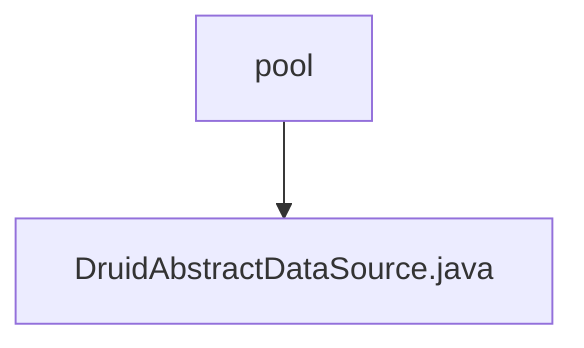

# Basic Information

|      |      |
|------|------|
| Name | pool |
| Language | .java |
| Code Path | WeFe/common/java/common-data-storage/src/main/java/com/alibaba/druid/pool |
| Package Name | docs.common.java.common-data-storage.src.main.java.com.alibaba.druid.pool |
| Brief Description | DruidAbstractDataSource is the abstract base class of the Druid connection pool, implementing the DataSource interface and JMX management capabilities. It defines the core configuration parameters of the connection pool, including connection count control (initialSize/maxActive/minIdle), timeout settings (maxWait), validation query (validationQuery), idle detection (timeBetweenEvictionRunsMillis), and more. It supports features such as filter chains, SQL monitoring, and connection leak detection, while tracking connection and statement execution statistics through atomic variables. |

# Description

DruidAbstractDataSource is an abstract class that implements the DruidAbstractDataSourceMBean, DataSource, DataSourceProxy, and Serializable interfaces. Serving as the core base class for the Druid connection pool, it encapsulates a wide range of connection pool configuration parameters and runtime state metrics. Key features include: connection pool size control (initialSize/maxActive/minIdle), connection acquisition timeout (maxWait), connection validity detection (validationQuery/testWhileIdle), idle connection reclamation policies (timeBetweenEvictionRunsMillis/minEvictableIdleTimeMillis), monitoring statistics (executeCount/commitCount/rollbackCount), filter mechanism (filters), and abnormal connection handling (exceptionSorter). The class defines the core processes for connection creation, destruction, and validation, ensuring thread safety through atomic variables and locking mechanisms. It also supports JMX monitoring, providing extensive runtime statistical information. Subclasses are required to implement specific connection pool management logic.

### Package Internal Structure View

This flowchart illustrates the core class relationships within the Druid connection pool module. The root node "pool" represents the base package path of the Druid connection pool, which includes a key abstract class "DruidAbstractDataSource.java"—the foundational abstract class for Druid data source implementations. The entire structure clearly and concisely presents the hierarchical relationship between the most critical classes and packages in this module, aligning with the two provided path details.

# File List

| Name   | Type  | Description |
|-------|------|-------------|
| [DruidAbstractDataSource.java](DruidAbstractDataSource.md) | file | DruidAbstractDataSource is the abstract base class of the Druid connection pool, implementing the DataSource interface and JMX management capabilities. It defines the core configuration parameters of the connection pool, including connection count control (initialSize/maxActive/minIdle), timeout settings (maxWait), validation query (validationQuery), idle detection (timeBetweenEvictionRunsMillis), etc. It supports features such as filter chains, SQL monitoring, and connection leak detection, and tracks connection and statement execution statistics using atomic variables. |

