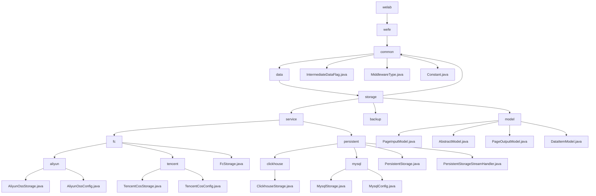

# Basic Information

|      |      |
|------|------|
| Name | welab |
| Language | .java |
| Code Path | WeFe/common/java/common-data-storage/src/main/java/com/welab |
| Package Name | docs.common.java.common-data-storage.src.main.java.com.welab |
| Brief Description | Module 1: Define common data storage configurations, including serialization patterns, middleware types, and database connections, dependent on MySQL drivers.  Module 2: Unify multi-cloud platforms and multi-database storage, supporting batch operations and dynamic sharding, dependent on cloud SDKs and JDBC.  Module 3: Provide a basic pagination query model, including pagination input/output and key-value pair structures, suitable for scenarios such as logs. |

# Description

## Overview  
The core responsibility of this module is to implement unified data storage across multiple cloud platforms and databases, supporting batch operations, dynamic sharding, and cross-platform persistence, while providing basic model support for ORM-like functionality. The interface specification aggregates static constants, enumeration types, standard CRUD operations, and pagination query APIs, resembling an adapter pattern. Key data structures include sharding strategies, connection configurations (e.g., ClickhouseConfig), pagination parameters, and generic key-value pairs. External dependencies encompass mainstream cloud SDKs (Alibaba Cloud/Tencent Cloud), JDBC drivers, and the Druid connection pool. For example, Alibaba Cloud dynamically shards via `hashKeyToPartition`, while ClickHouse supports stream processing.  

## Key Business Scenarios  
The module is suitable for hybrid scenarios involving multi-cloud storage and heterogeneous databases. Typical workflows include configuration initialization → data sharding/serialization → multi-threaded or stream processing → callback tracking. It supports paginated queries (e.g., passing parameters via `PageInputModel`) and key-value storage (e.g., `DataItemModel`). The interaction mode is uniformly configuration-driven, such as Alibaba Cloud OTS using hash partitioning or MySQL pagination queries. Integration cases range from `initWithAliyun` cloud initialization to `getByStream` stream processing, forming an end-to-end solution.

### Package Internal Structure View

This flowchart illustrates the complete hierarchical structure of the common-data-storage module in the WeFe project, starting from the root directory welab and expanding level by level to the final implementation classes. The core is divided into four submodules under the storage directory: common contains basic enumeration classes, service implements storage services (divided into fc and persistent categories), backup is the backup module, and model defines data models. The fc service is further subdivided into Alibaba Cloud and Tencent Cloud implementations, while persistent includes Clickhouse and MySQL database storage solutions.

# File List

| Name   | Type  | Description |
|-------|------|-------------|
| [wefe](wefe/_module.md) | package | Module 1: Define common configurations for data storage, including serialization modes, middleware types, and database connections, dependent on MySQL drivers.  Module 2: Unify multi-cloud platforms and multi-database storage, supporting batch operations and dynamic sharding, dependent on cloud SDKs and JDBC.  Module 3: Provide a basic model for paginated queries, including pagination input/output and key-value pair structures, suitable for scenarios such as logging. |

