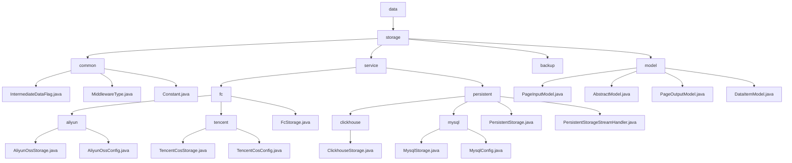

# Basic Information

|      |      |
|------|------|
| Name | data |
| Language | .java |
| Code Path | WeFe/common/java/common-data-storage/src/main/java/com/welab/wefe/common/data |
| Package Name | docs.common.java.common-data-storage.src.main.java.com.welab.wefe.common.data |
| Brief Description | Module 1: Define common configurations for data storage, including serialization patterns, middleware types, and database connections, dependent on MySQL drivers.  Module 2: Unify multi-cloud platforms and multi-database storage, supporting batch operations and dynamic sharding, dependent on cloud SDK and JDBC.  Module 3: Provide a basic pagination query model, including pagination input/output and key-value pair structures, suitable for scenarios such as logs. |

# Description

## Overview  
The core responsibility of this module is to achieve unified data storage across multi-cloud platforms and multiple databases, supporting batch operations, dynamic sharding, and cross-platform persistence, while providing basic model support for ORM-like functionality. The interface specification aggregates static constants, enumerated types, standard CRUD operations, and pagination query APIs, resembling an adapter pattern. Key data structures include sharding strategies, connection configurations (e.g., ClickhouseConfig), pagination parameters, and generic key-value pairs. External dependencies cover mainstream cloud SDKs (Alibaba Cloud/Tencent Cloud), JDBC drivers, and the Druid connection pool. For example, Alibaba Cloud dynamically shards via `hashKeyToPartition`, while ClickHouse supports stream processing.  

## Primary Business Scenarios  
The module is suitable for hybrid scenarios involving multi-cloud storage and heterogeneous databases. Typical workflows include configuration initialization → data sharding/serialization → multi-threaded or stream processing → callback tracking. It supports paginated queries (e.g., `PageInputModel` for parameter passing) and key-value storage (e.g., `DataItemModel`). The interaction mode is uniformly configuration-driven, such as Alibaba Cloud OTS for hash partitioning and MySQL for paginated queries. Integration cases range from `initWithAliyun` cloud initialization to `getByStream` stream processing, forming an end-to-end solution.

### Package Internal Structure View

This flowchart illustrates the hierarchical structure of the WeFe data storage module, starting from the top-level data directory and progressively expanding into the storage subdirectory and its various service components. It includes common base classes, fc file storage services, persistent storage services, backup modules, and data models. The fc service is further divided into Alibaba Cloud and Tencent Cloud implementations, the persistent service supports ClickHouse and MySQL database storage, and the model includes pagination and basic data model classes.

# File List

| Name   | Type  | Description |
|-------|------|-------------|
| [storage](storage/_module.md) | package | Module 1: Define common configurations for data storage, including serialization patterns, middleware types, and database connections, dependent on MySQL drivers.  Module 2: Unify multi-cloud platforms and multi-database storage, supporting batch operations and dynamic sharding, dependent on cloud SDKs and JDBC.  Module 3: Provide a basic model for paginated queries, including pagination input/output and key-value pair structures, suitable for scenarios such as logging. |

