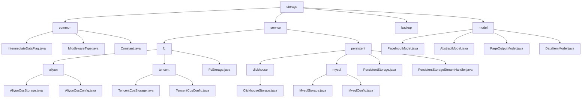

# Basic Information

|      |      |
|------|------|
| Name | storage |
| Language | .java |
| Code Path | WeFe/common/java/common-data-storage/src/main/java/com/welab/wefe/common/data/storage |
| Package Name | docs.common.java.common-data-storage.src.main.java.com.welab.wefe.common.data.storage |
| Brief Description | Module 1: Define common configurations for data storage, including serialization patterns, middleware types, and database connections, dependent on MySQL drivers.  Module 2: Unify multi-cloud platforms and multi-database storage, supporting batch operations and dynamic sharding, dependent on cloud SDKs and JDBC.  Module 3: Provide a basic model for paginated queries, including pagination input/output and key-value pair structures, suitable for scenarios such as logging. |

# Description

## Overview  
The core responsibility of this module is to achieve unified data storage across multiple cloud platforms and databases, supporting batch operations, dynamic sharding, and cross-platform persistence, while providing basic model support for ORM-like functionality. The interface specification aggregates static constants, enumeration types, standard CRUD operations, and pagination query APIs, resembling the adapter pattern. Key data structures include sharding strategies, connection configurations (e.g., ClickhouseConfig), pagination parameters, and generic key-value pairs. External dependencies encompass mainstream cloud SDKs (Alibaba Cloud/Tencent Cloud), JDBC drivers, and the Druid connection pool. For example, Alibaba Cloud dynamically shards via hashKeyToPartition, while ClickHouse supports stream processing.  

## Primary Business Scenarios  
The module is suitable for hybrid scenarios involving multi-cloud storage and heterogeneous databases. Typical workflows include configuration initialization → data sharding/serialization → multi-threaded or stream processing → callback tracking. It supports paginated queries (e.g., PageInputModel for parameter passing) and key-value storage (e.g., DataItemModel). The interaction mode is uniformly configuration-driven, such as Alibaba Cloud OTS using hash partitioning and MySQL paginated queries. Integration cases range from initWithAliyun cloud initialization to getByStream stream processing, forming an end-to-end solution.

### Package Internal Structure View

This flowchart illustrates the complete hierarchical structure of a data storage module, starting from the top-level storage directory and branching into four main subdirectories: common, service, backup, and model. The service branch is further divided into two submodules: fc (file storage) and persistent (persistent storage). The fc module includes specific implementations for Alibaba Cloud and Tencent Cloud, while the persistent module contains implementations for ClickHouse and MySQL. The model branch encompasses various data model class files. The entire structure clearly demonstrates a modular design philosophy, facilitating extensibility and maintainability.

# File List

| Name   | Type  | Description |
|-------|------|-------------|
| [backup](backup/_module.md) | package |  |
| [model](model/_module.md) | package | The PageInputModel encapsulates pagination parameters pageSize and pageNum. The AbstractModel abstract class manages the eventDate field. The generic PageOutputModel class stores paginated result data. The generic DataItemModel class encapsulates key-value pair data. |
| [service](service/_module.md) | package | The multi-cloud storage module supports Alibaba Cloud OSS/OTS and Tencent Cloud COS, providing a unified interface `putAll` to enable multi-threaded uploads, sharding, and callbacks. It relies on various cloud SDKs and serialization tools.  The multi-database module supports ClickHouse and MySQL, offering CRUD operations, batch processing, and table management. Unified interfaces include `put`, `get`, `delete`, etc., and depend on JDBC drivers and connection pools. |
| [common](common/_module.md) | package | The IntermediateDataFlag class defines two serialization type constants. The MiddlewareType enumeration includes only the redis type. The Constant class contains database driver and name constants. |

