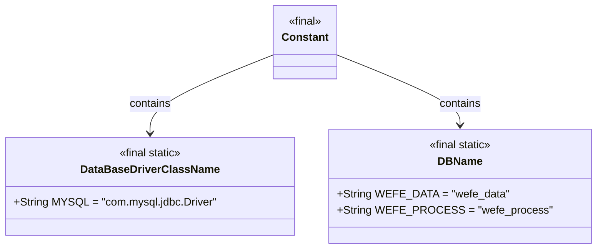
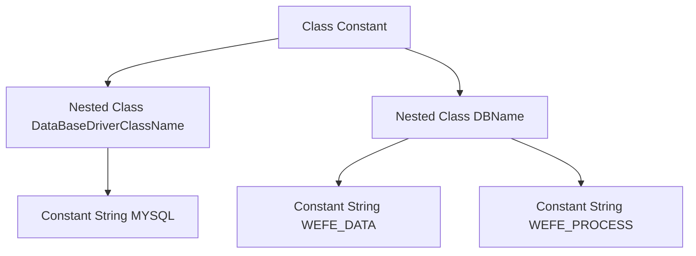

# Basic Information

|      |      |
|------|------|
| Name | Constant |
| Language | .java |
| Code Path | WeFe/common/java/common-data-storage/src/main/java/com/welab/wefe/common/data/storage/common/Constant.java |
| Package Name | com.welab.wefe.common.data.storage.common |
| Dependencies | [] |
| Brief Description | Java constant class defines database driver name (MySQL) and database names (wefe_data, wefe_process). |

# Description

The code defines a public class named `Constant`, which contains two static inner classes. The inner class `DataBaseDriverClassName` defines a constant string `"com.mysql.jdbc.Driver"` representing the MySQL database driver class name. The inner class `DBName` defines two constant strings for database names: `"wefe_data"` and `"wefe_process"`. All fields are public, static, and final, serving as immutable configurations for database-related information.

# Class Summary

| Name   | Type  | Description |
|-------|------|-------------|
| Constant | class | You are a professional translation assistant. Please accurately translate the following content into the target language.  Please strictly adhere to the following guidelines:  1. Maintain consistency with the original text in semantics, context, and style.  2. Preserve the original hierarchical structure and numbering system in full.  3. Strictly retain all formatting elements from the original text, such as code block identifiers (```text/```, ```mermaid/```), etc.  4. Translate only natural language content; do not perform format adjustments/content additions/explanatory processing.  5. Output only the translated result of the original text, without any additional prompt information.  Content to be translated:  The Java class `Constant` defines database drivers and name constants, including the MySQL driver class name and two database names: `wefe_data` and `wefe_process`.  Target language code: en |


## Class Constant

|      |      |
|------|------|
| Access Modifier | public |
| Type | class |
| Name | Constant |
| Description | You are a professional translation assistant. Please accurately translate the following content into the target language.  Please strictly adhere to the following guidelines:  1. Maintain consistency with the original text in semantics, context, and style.  2. Preserve the original hierarchical structure and numbering system in full.  3. Strictly retain all formatting elements from the original text, such as code block identifiers (```text/```, ```mermaid/```), etc.  4. Translate only natural language content; do not perform format adjustments/content additions/explanatory processing.  5. Output only the translated result of the original text, without any additional prompt information.  Content to be translated:  The Java class `Constant` defines database drivers and name constants, including the MySQL driver class name and two database names: `wefe_data` and `wefe_process`.  Target language code: en |


### UML Class Diagram



This diagram illustrates the structure of a constant utility class named Constant, which contains two static nested classes: DataBaseDriverClassName and DBName. DataBaseDriverClassName defines a string constant for the MySQL driver class name, while DBName stores two database name constants. All classes and fields are marked as final static to ensure immutability and global accessibility. This design pattern is commonly used for centralized management of constant configurations in applications.


### Internal Method Call Graph



This flowchart illustrates the static nested structure of the Constant class, which contains two final static inner classes: DataBaseDriverClassName and DBName. DataBaseDriverClassName defines a MySQL driver string constant, while DBName includes two database name constants. All elements are marked as public final static, indicating immutable global constants. Solid lines connect classes with their nested classes, and constants appear as leaf nodes attached to their respective classes.

### Field List

| Name  | Type  | Description |
|-------|-------|------|

### Method List

| Name  | Type  | Description |
|-------|-------|------|


