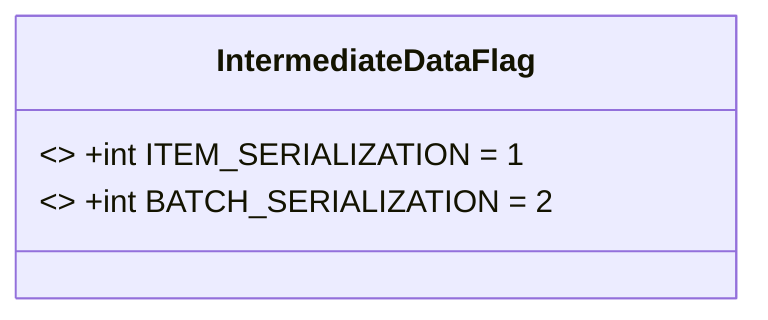
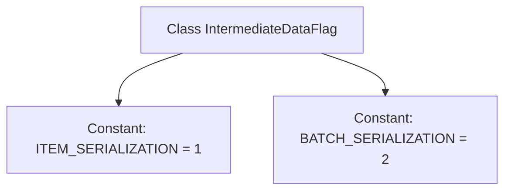

# Basic Information

|      |      |
|------|------|
| Name | IntermediateDataFlag |
| Language | .java |
| Code Path | WeFe/common/java/common-data-storage/src/main/java/com/welab/wefe/common/data/storage/common/IntermediateDataFlag.java |
| Package Name | com.welab.wefe.common.data.storage.common |
| Dependencies | [] |
| Brief Description | The IntermediateDataFlag class defines two static constants: ITEM_SERIALIZATION and BATCH_SERIALIZATION, representing the serialization types respectively. |

# Description

IntermediateDataFlag is a Java class that defines two static constants for identifying data serialization types. ITEM_SERIALIZATION with a value of 1 indicates single-item serialization, while BATCH_SERIALIZATION with a value of 2 represents batch serialization. These constants are used to distinguish between different serialization modes.

# Class Summary

| Name   | Type  | Description |
|-------|------|-------------|
| IntermediateDataFlag | class | The IntermediateDataFlag class defines two static constants: ITEM_SERIALIZATION (value 1) and BATCH_SERIALIZATION (value 2), which are used to identify serialization types. |

## Class IntermediateDataFlag

|      |      |
|------|------|
| Access Modifier | public |
| Type | class |
| Name | IntermediateDataFlag |
| Description | The IntermediateDataFlag class defines two static constants: ITEM_SERIALIZATION (value 1) and BATCH_SERIALIZATION (value 2), which are used to identify serialization types. |

### UML Class Diagram

This code defines a class named `IntermediateDataFlag`, containing two public static constants `ITEM_SERIALIZATION` and `BATCH_SERIALIZATION`, representing two modes of data serialization. The class diagram shows these constants declared as `final` with fixed values, serving as alternatives to flags or enumeration types in the program. Such a class is typically used in configuration or state identification scenarios, ensuring code readability and type safety through constant values.

### Internal Method Call Graph

This code defines a class named `IntermediateDataFlag`, which contains two static constants: `ITEM_SERIALIZATION` and `BATCH_SERIALIZATION`, assigned the values 1 and 2, respectively. This class may be used to identify or distinguish between different types of data serialization methods, where `ITEM_SERIALIZATION` represents serialization of individual items, and `BATCH_SERIALIZATION` represents batch serialization. Through these two constants, the two serialization modes can be clearly referenced and differentiated in the code.

### Field List

| Name  | Type  | Description |
|-------|-------|------|
| BATCH_SERIALIZATION = 2 | int | The constant BATCH_SERIALIZATION has a value of 2, which is used for batch serialization operations. |
| ITEM_SERIALIZATION = 1 | int | Define a static constant ITEM_SERIALIZATION with a value of 1, which cannot be modified. |

### Method List

| Name  | Type  | Description |
|-------|-------|------|

