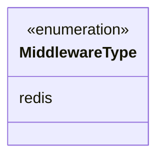
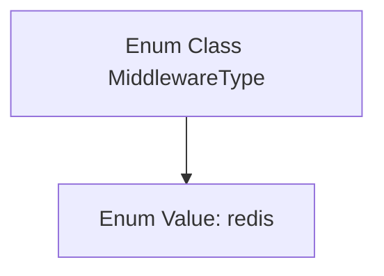

# Basic Information

|      |      |
|------|------|
| Name | MiddlewareType |
| Language | .java |
| Code Path | WeFe/common/java/common-data-storage/src/main/java/com/welab/wefe/common/data/storage/common/MiddlewareType.java |
| Package Name | com.welab.wefe.common.data.storage.common |
| Dependencies | [] |
| Brief Description | The enumeration type MiddlewareType defines the types of middleware, currently including only redis. |

# Description

The content defines a public enumeration type named MiddlewareType, which contains only one enumeration value: redis. This enumeration may be used to identify or categorize different types of middleware, with currently only the redis middleware type supported. The design of the enumeration is concise and clear, providing the system with an extensible foundation for defining middleware types.

# Class Summary

| Name   | Type  | Description |
|-------|------|-------------|
| MiddlewareType | enum | Middleware type enumeration, currently only redis is supported. |

## Class MiddlewareType

|      |      |
|------|------|
| Access Modifier | public |
| Type | enum |
| Name | MiddlewareType |
| Description | Middleware type enumeration, currently only redis is supported. |

### UML Class Diagram

This code defines an enumeration type named MiddlewareType, currently containing only one enum value: redis. In class diagrams, enumeration types are marked with <<enumeration>> to indicate a fixed set of values. This design is typically used to represent limited, predefined options in a system, such as different types of middleware here. Using enumerations can improve code readability and type safety.

### Internal Method Call Graph

This code defines a simple enum class MiddlewareType containing only one enum value: redis. In Java, an enum is a special data type used to define a fixed set of constants. In this example, the MiddlewareType enum might be used to identify middleware types, currently supporting only the redis type. Enum classes are typically employed as replacements for constant definitions, offering better type safety and readability. The structure of this enum is very simple, with no defined methods or additional attributes.

### Field List

| Name  | Type  | Description |
|-------|-------|------|

### Method List

| Name  | Type  | Description |
|-------|-------|------|

