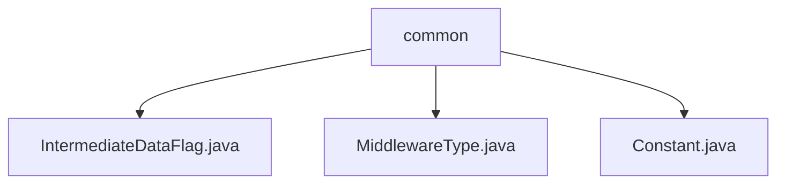

# Basic Information

|      |      |
|------|------|
| Name | common |
| Language | .java |
| Code Path | WeFe/common/java/common-data-storage/src/main/java/com/welab/wefe/common/data/storage/common |
| Package Name | docs.common.java.common-data-storage.src.main.java.com.welab.wefe.common.data.storage.common |
| Brief Description | The IntermediateDataFlag class defines two serialization type constants. The MiddlewareType enumeration includes only the redis type. The Constant class contains database driver and name constants. |

# Description

## Overview  
The core responsibility of this module is to provide general definitions and configurations related to data storage, including serialization mode identifiers, middleware type enumerations, and database connection information. The interface specifications cover static constants (e.g., ITEM_SERIALIZATION), enumerated types (e.g., MiddlewareType.redis), and database configuration classes (e.g., Constant.DataBaseDriverClassName). Key data structures include the integer flag bits of IntermediateDataFlag, single enumeration values of MiddlewareType, and string constants defined in Constant (e.g., "wefe_data"). External dependencies are limited to the MySQL driver (referenced via JDBC class name). For example, BATCH_SERIALIZATION is used in batch data processing scenarios.

## Key Business Scenarios  
The module supports basic configurations and type differentiation for data storage. Typical applications include serialization mode selection (e.g., single or batch processing), middleware type identification (currently only Redis), and database connection initialization (e.g., MySQL driver loading). The interaction mode is achieved through direct constant references, similar to the configuration center pattern. Functional completeness is reflected in covering critical aspects of data storage, such as quickly locating database instances via the DBName constant. All API types are statically defined, with integration examples including driver class name configuration ("com.mysql.jdbc.Driver") and database name mapping ("wefe_process").

### Package Internal Structure View

This flowchart illustrates three Java files under the common directory: IntermediateDataFlag.java, MiddlewareType.java, and Constant.java. All three files are directly subordinate to the common directory without any deeper subdirectory structure. The diagram clearly presents the hierarchical relationship between common as the parent node and the three file child nodes, accurately reflecting the actual structure of the path information.

# File List

| Name   | Type  | Description |
|-------|------|-------------|
| [IntermediateDataFlag.java](IntermediateDataFlag.md) | file | The IntermediateDataFlag class defines two static constants: ITEM_SERIALIZATION and BATCH_SERIALIZATION, representing the serialization types respectively. |
| [MiddlewareType.java](MiddlewareType.md) | file | The enumeration type MiddlewareType defines the types of middleware, currently including only redis. |
| [Constant.java](Constant.md) | file | Java constant class defines database driver name (MySQL) and database names (wefe_data, wefe_process). |

